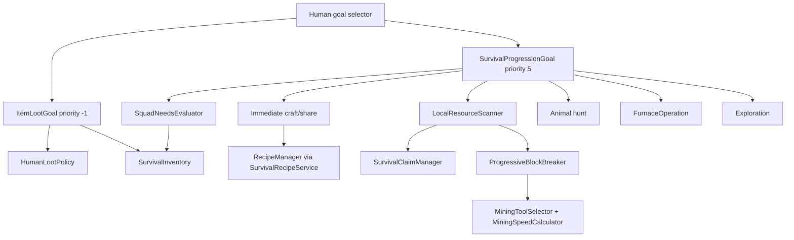

# Survival Progression — referencia técnica y código completo

> **Estado:** instantánea del árbol de trabajo del 12 de agosto de 2026.  
> **Autoridad:** el código, recursos y pruebas incluidos literalmente más abajo son la fuente de verdad.  
> **Audiencia:** mantenedores y desarrolladores que necesiten entender, depurar, revisar o continuar la feature sin reconstruir el contexto de la conversación.

## Alcance

Este documento describe la progresión de supervivencia de los `Human` de Hostile Humans para Forge 1.20.1: evaluación de necesidades de escuadrón, búsqueda y reclamación de recursos, rotura progresiva, recogida y apilado de drops, caza, crafteo, estaciones, fundición, intercambio, selección de equipo, inventario de 36 slots, cadencia de decisiones, escenarios manuales y GameTests.

No cubre como parte de esta feature Nether, enchanting, potions, Stronghold, End, campamentos ni raids. Algunos archivos completos de integración contienen otros comportamientos preexistentes porque se incluyen sin recortes para conservar contexto compilable.

## Arquitectura resumida

La ejecución de supervivencia utiliza un controlador por humano y una máquina
de estados explícita. `SurvivalProgressionGoal` actúa como adaptador de Forge:
el planner selecciona un intent inmutable y el controlador mantiene el ciclo
`ASSESSING → PLANNING → ACQUIRE → NAVIGATE → ACT → COLLECT/WAIT → VERIFY`.
Los fallos entran en `BACKOFF`, y el combate o peligro crítico entra en
`SUSPENDED`; ningún estado se representa con `null`. Tras recargar el mundo se
descarta la tarea activa y se vuelve a planificar desde el inventario y el
mundo persistidos.



## Flujo de decisión

1. `Human.registerGoals()` registra `ItemLootGoal` con prioridad `-1` y `SurvivalProgressionGoal` con prioridad `5`.
2. La progresión solo se ejecuta en servidor, con el humano vivo, sin target hostil, sin estado crítico, sin investigar sonidos y sin amenaza fresca de escuadrón.
3. Se evalúan necesidades compartidas mediante una caché por dimensión y UUID de escuadrón. La caché comparte **necesidades agregadas**, no el estado mutable de cada goal.
4. Compartir materiales y craftear son acciones inmediatas. Las búsquedas costosas se limitan mediante `nextDecisionTick` y se desfasan por UUID.
5. Los recursos locales se buscan en un único barrido volumétrico para todas las necesidades pendientes. Solo se aceptan bloques expuestos, cosechables, no reclamados y con posición de interacción navegable.
6. La rotura muestra crack progress y swing de mano. Al completar, aplica durabilidad y genera drops reales.
7. `ItemLootGoal` valida utilidad, espacio, pickup delay y que el final de la ruta quede dentro del alcance vertical y tridimensional real. Al llegar inserta explícitamente y apila; los objetivos sin progreso se ignoran temporalmente.
8. La caza mantiene su propia navegación y cooldown. Los ataques se desfasan por UUID para reducir colisiones con los frames de invulnerabilidad de la presa.
9. Al completar o invalidar acciones, el siguiente cálculo puede adelantarse al tick siguiente.

Las consultas de supervivencia comparten un presupuesto por dimensión y tick
(`survivalPathBudgetPerTick` y `survivalScanBudgetPerTick`). Los claims se
limpian como máximo una vez cada 20 ticks por dimensión, no durante cada
candidato del scan. Loot físico pasa por `LootCollector`, que conserva utilidad,
pickup delay, inserción parcial e invalidación de necesidades en un único punto.

## Inventario

`HumanData.INVENTORY_SIZE` es `36`, equivalente a los 36 slots principales de un jugador (27 de almacenamiento + 9 de hotbar, sin contar armadura/offhand). La carga NBT conserva compatibilidad con listas anteriores más cortas; los slots nuevos permanecen vacíos. Inserción, stacking, loot y búsquedas recorren el tamaño dinámico.

## Prioridades y concurrencia

- El goal de loot tiene prioridad superior a supervivencia para retirar drops útiles antes de continuar.
- Los claims impiden que dos humanos rompan el mismo bloque o usen conflictivamente una estación.
- No se reclama una presa de forma exclusiva: varios humanos pueden cooperar. Sus cooldowns iniciales y ciclos de decisión se desfasan con UUID.
- `SquadNeedsEvaluator` comparte una fotografía de necesidades del grupo; `mode`, target, breaker, cooldowns, navegación y memoria de drops pertenecen a cada instancia de goal.

## Crafteo y recetas

`SurvivalRecipeService` usa `RecipeManager`, simula consumo y remainders, valida capacidad y solo después muta inventario. Las tres recetas namespaced garantizan el mínimo de progresión incluso en el runtime observado que registra solo siete recetas: logs a planks, planks a sticks y planks a crafting table. Tras fabricar un arco, el goal mantiene una reserva de 24 flechas cuando hay plumas, pedernal y palos disponibles; si faltan plumas, una gallina se convierte en una oportunidad de caza aunque la reserva de comida ya esté cubierta.

## Verificación y limitaciones conocidas

Comandos deterministas usados durante el desarrollo:

```bash
./gradlew compileJava processResources
git diff --check
./gradlew runGameTestServer
```

- Compilación y procesamiento de recursos han pasado.
- `git diff --check` ha pasado.
- El código fuente actual contiene 143 declaraciones `@GameTest` en 10 clases; el conteo efectivo debe ser el número esperado no-cero que imprime Forge en cada ejecución del servidor dedicado. La validación debe repetirse después de cambios transversales; avisos de mods opcionales y errores de POI de fixtures no pertenecen al contrato de supervivencia.
- El cliente carga y el mundo abre. En logs aparecen problemas ajenos a esta feature: `libflite.so` ausente, tags con referencias vanilla inexistentes y loot tables que requieren Farmer's Delight no instalado.
- Los escenarios manuales se ejecutan con `/function hostile_humans:debug/<nombre>`.

## Escenarios disponibles

- `survival_early`: inicio con madera y piedra.
- `survival_iron`: progresión hacia hierro.
- `survival_food`: caza, drops y alimento.
- `survival_ranged`: arco, flechas y materiales.
- `survival_gapple`: política de golden apple.
- `survival_overworld_expedition`: recorrido integrado de superficie.
- `survival_cave_expedition`: minería y progresión en cuevas.
- `survival_cooperation_lab`: claims, sharing y división de trabajo.
- `survival_interruptions`: interrupción por amenaza y reanudación.
- `survival_interruptions_start`: auxiliar programado por el escenario anterior.

## Inspección de inventario en juego

Los operadores pueden inspeccionar el estado persistente del NPC más cercano con:

```text
/hostilehumans inventory
/hostilehumans inventory <radius>
```

El radio predeterminado es 32 bloques y el máximo es 128. El comando muestra el
UUID, posición, distancia, manos, armadura y todos los slots no vacíos del
inventario de `HumanData`, que es el inventario usado por la progresión de
supervivencia.

## Índice de código incluido

Todos los archivos enumerados a continuación se reproducen **completos**, desde su primera hasta su última línea. Esto incluye archivos grandes de integración (`Human.java`, `HumanData.java`, `Config.java`) para que la referencia no oculte contratos alrededor de la feature.

### Core de progresión
- [`src/main/java/com/craftix/hostile_humans/entity/ai/survival/SquadNeed.java`](#srcmainjavacomcraftixhostile-humansentityaisurvivalsquadneedjava)
- [`src/main/java/com/craftix/hostile_humans/entity/ai/survival/SquadNeeds.java`](#srcmainjavacomcraftixhostile-humansentityaisurvivalsquadneedsjava)
- [`src/main/java/com/craftix/hostile_humans/entity/ai/survival/SquadNeedsEvaluator.java`](#srcmainjavacomcraftixhostile-humansentityaisurvivalsquadneedsevaluatorjava)
- [`src/main/java/com/craftix/hostile_humans/entity/ai/survival/SurvivalInventory.java`](#srcmainjavacomcraftixhostile-humansentityaisurvivalsurvivalinventoryjava)
- [`src/main/java/com/craftix/hostile_humans/entity/ai/survival/SurvivalClaimManager.java`](#srcmainjavacomcraftixhostile-humansentityaisurvivalsurvivalclaimmanagerjava)
- [`src/main/java/com/craftix/hostile_humans/entity/ai/survival/LocalResourceScanner.java`](#srcmainjavacomcraftixhostile-humansentityaisurvivallocalresourcescannerjava)
- [`src/main/java/com/craftix/hostile_humans/entity/ai/survival/ProgressiveBlockBreaker.java`](#srcmainjavacomcraftixhostile-humansentityaisurvivalprogressiveblockbreakerjava)
- [`src/main/java/com/craftix/hostile_humans/entity/ai/survival/SurvivalRecipeService.java`](#srcmainjavacomcraftixhostile-humansentityaisurvivalsurvivalrecipeservicejava)
- [`src/main/java/com/craftix/hostile_humans/entity/ai/survival/FurnaceOperation.java`](#srcmainjavacomcraftixhostile-humansentityaisurvivalfurnaceoperationjava)
- [`src/main/java/com/craftix/hostile_humans/entity/ai/survival/SquadMaterialSharing.java`](#srcmainjavacomcraftixhostile-humansentityaisurvivalsquadmaterialsharingjava)
- [`src/main/java/com/craftix/hostile_humans/entity/ai/survival/GearUpgradePolicy.java`](#srcmainjavacomcraftixhostile-humansentityaisurvivalgearupgradepolicyjava)
- [`src/main/java/com/craftix/hostile_humans/entity/ai/survival/SurvivalProgressionGoal.java`](#srcmainjavacomcraftixhostile-humansentityaisurvivalsurvivalprogressiongoaljava)

### Loot, acciones de mundo e integración
- [`src/main/java/com/craftix/hostile_humans/entity/ai/goal/ItemLootGoal.java`](#srcmainjavacomcraftixhostile-humansentityaigoalitemlootgoaljava)
- [`src/main/java/com/craftix/hostile_humans/entity/type/human/HumanLootPolicy.java`](#srcmainjavacomcraftixhostile-humansentitytypehumanhumanlootpolicyjava)
- [`src/main/java/com/craftix/hostile_humans/entity/type/human/PickUpLoot.java`](#srcmainjavacomcraftixhostile-humansentitytypehumanpickuplootjava)
- [`src/main/java/com/craftix/hostile_humans/entity/ai/action/MiningSpeedCalculator.java`](#srcmainjavacomcraftixhostile-humansentityaiactionminingspeedcalculatorjava)
- [`src/main/java/com/craftix/hostile_humans/entity/ai/action/MiningToolSelector.java`](#srcmainjavacomcraftixhostile-humansentityaiactionminingtoolselectorjava)
- [`src/main/java/com/craftix/hostile_humans/entity/ai/action/WorldActionResult.java`](#srcmainjavacomcraftixhostile-humansentityaiactionworldactionresultjava)
- [`src/main/java/com/craftix/hostile_humans/entity/ai/action/WorldActionSupport.java`](#srcmainjavacomcraftixhostile-humansentityaiactionworldactionsupportjava)
- [`src/main/java/com/craftix/hostile_humans/entity/ai/action/BreakObstacleAction.java`](#srcmainjavacomcraftixhostile-humansentityaiactionbreakobstacleactionjava)
- [`src/main/java/com/craftix/hostile_humans/entity/data/HumanData.java`](#srcmainjavacomcraftixhostile-humansentitydatahumandatajava)
- [`src/main/java/com/craftix/hostile_humans/entity/entities/Human.java`](#srcmainjavacomcraftixhostile-humansentityentitieshumanjava)
- [`src/main/java/com/craftix/hostile_humans/Config.java`](#srcmainjavacomcraftixhostile-humansconfigjava)

### Pruebas
- [`src/main/java/com/craftix/hostile_humans/gametest/HumanSurvivalProgressionGameTest.java`](#srcmainjavacomcraftixhostile-humansgametesthumansurvivalprogressiongametestjava)
- [`src/main/java/com/craftix/hostile_humans/gametest/HumanChestLootGameTest.java`](#srcmainjavacomcraftixhostile-humansgametesthumanchestlootgametestjava)
- [`src/main/java/com/craftix/hostile_humans/gametest/HumanEquipmentGameTest.java`](#srcmainjavacomcraftixhostile-humansgametesthumanequipmentgametestjava)

### Recetas y tags
- [`src/main/resources/data/hostile_humans/recipes/survival_oak_planks.json`](#srcmainresourcesdatahostile-humansrecipessurvival-oak-planksjson)
- [`src/main/resources/data/hostile_humans/recipes/survival_stick.json`](#srcmainresourcesdatahostile-humansrecipessurvival-stickjson)
- [`src/main/resources/data/hostile_humans/recipes/survival_crafting_table.json`](#srcmainresourcesdatahostile-humansrecipessurvival-crafting-tablejson)
- [`src/main/resources/data/hostile_humans/tags/blocks/navigation_breakable.json`](#srcmainresourcesdatahostile-humanstagsblocksnavigation-breakablejson)
- [`src/main/resources/data/hostile_humans/tags/blocks/never_break.json`](#srcmainresourcesdatahostile-humanstagsblocksnever-breakjson)
- [`src/main/resources/data/hostile_humans/tags/items/primary_melee_weapons.json`](#srcmainresourcesdatahostile-humanstagsitemsprimary-melee-weaponsjson)
- [`src/main/resources/data/hostile_humans/tags/items/fallback_melee_tools.json`](#srcmainresourcesdatahostile-humanstagsitemsfallback-melee-toolsjson)
- [`src/main/resources/data/hostile_humans/tags/items/never_use_as_melee_weapon.json`](#srcmainresourcesdatahostile-humanstagsitemsnever-use-as-melee-weaponjson)

### Escenarios de depuración
- [`src/main/resources/data/hostile_humans/functions/debug/survival_early.mcfunction`](#srcmainresourcesdatahostile-humansfunctionsdebugsurvival-earlymcfunction)
- [`src/main/resources/data/hostile_humans/functions/debug/survival_iron.mcfunction`](#srcmainresourcesdatahostile-humansfunctionsdebugsurvival-ironmcfunction)
- [`src/main/resources/data/hostile_humans/functions/debug/survival_food.mcfunction`](#srcmainresourcesdatahostile-humansfunctionsdebugsurvival-foodmcfunction)
- [`src/main/resources/data/hostile_humans/functions/debug/survival_ranged.mcfunction`](#srcmainresourcesdatahostile-humansfunctionsdebugsurvival-rangedmcfunction)
- [`src/main/resources/data/hostile_humans/functions/debug/survival_gapple.mcfunction`](#srcmainresourcesdatahostile-humansfunctionsdebugsurvival-gapplemcfunction)
- [`src/main/resources/data/hostile_humans/functions/debug/survival_overworld_expedition.mcfunction`](#srcmainresourcesdatahostile-humansfunctionsdebugsurvival-overworld-expeditionmcfunction)
- [`src/main/resources/data/hostile_humans/functions/debug/survival_cave_expedition.mcfunction`](#srcmainresourcesdatahostile-humansfunctionsdebugsurvival-cave-expeditionmcfunction)
- [`src/main/resources/data/hostile_humans/functions/debug/survival_cooperation_lab.mcfunction`](#srcmainresourcesdatahostile-humansfunctionsdebugsurvival-cooperation-labmcfunction)
- [`src/main/resources/data/hostile_humans/functions/debug/survival_interruptions.mcfunction`](#srcmainresourcesdatahostile-humansfunctionsdebugsurvival-interruptionsmcfunction)
- [`src/main/resources/data/hostile_humans/functions/debug/survival_interruptions_start.mcfunction`](#srcmainresourcesdatahostile-humansfunctionsdebugsurvival-interruptions-startmcfunction)

---

# Código fuente completo

## Core de progresión

### `src/main/java/com/craftix/hostile_humans/entity/ai/survival/SquadNeed.java`

```java
package com.craftix.hostile_humans.entity.ai.survival;

public enum SquadNeed {
    FOOD,
    WOOD,
    FUEL,
    STONE,
    IRON,
    GOLD,
    DIAMOND,
    STRING,
    FEATHERS,
    FLINT,
    APPLES
}
```

### `src/main/java/com/craftix/hostile_humans/entity/ai/survival/SquadNeeds.java`

```java
package com.craftix.hostile_humans.entity.ai.survival;

import java.util.Collections;
import java.util.EnumMap;
import java.util.Map;
import java.util.Optional;

public final class SquadNeeds {
    private final EnumMap<SquadNeed, Integer> deficits;

    public SquadNeeds(Map<SquadNeed, Integer> deficits) {
        this.deficits = new EnumMap<>(SquadNeed.class);
        deficits.forEach((need, deficit) -> {
            if (deficit > 0) this.deficits.put(need, deficit);
        });
    }

    public boolean needs(SquadNeed need) {
        return deficits.getOrDefault(need, 0) > 0;
    }

    public int deficit(SquadNeed need) {
        return deficits.getOrDefault(need, 0);
    }

    public Map<SquadNeed, Integer> deficits() {
        return Collections.unmodifiableMap(deficits);
    }

    public Optional<SquadNeed> highestPriority() {
        for (SquadNeed need : SquadNeed.values()) if (needs(need)) return Optional.of(need);
        return Optional.empty();
    }
}
```

### `src/main/java/com/craftix/hostile_humans/entity/ai/survival/SquadNeedsEvaluator.java`

```java
package com.craftix.hostile_humans.entity.ai.survival;

import com.craftix.hostile_humans.Config;
import com.craftix.hostile_humans.HumanUtil;
import com.craftix.hostile_humans.entity.ai.squad.SquadManager;
import com.craftix.hostile_humans.entity.entities.Human;
import net.minecraft.resources.ResourceKey;
import net.minecraft.tags.ItemTags;
import net.minecraft.world.item.ArmorItem;
import net.minecraft.world.item.AxeItem;
import net.minecraft.world.item.BowItem;
import net.minecraft.world.item.ItemStack;
import net.minecraft.world.item.Items;
import net.minecraft.world.item.PickaxeItem;
import net.minecraft.world.item.SwordItem;
import net.minecraft.world.level.Level;

import java.util.ArrayList;
import java.util.EnumMap;
import java.util.HashMap;
import java.util.List;
import java.util.Map;
import java.util.UUID;

public final class SquadNeedsEvaluator {
    private static final int FOOD_PER_MEMBER = 12;
    private static final int ARROWS_PER_BOW = 24;
    private static final int WOOD_UNITS_PER_MEMBER = 12;
    private static final Map<Key, Cached> CACHE = new HashMap<>();

    private SquadNeedsEvaluator() {}

    public static SquadNeeds evaluate(Human source) {
        UUID squad = source.getSquadId() == null ? source.getUUID() : source.getSquadId();
        Key key = new Key(source.level().dimension(), squad);
        long now = source.level().getGameTime();
        Cached cached = CACHE.get(key);
        if (cached != null && now < cached.expiresAt) return cached.needs;
        List<Human> members = new ArrayList<>();
        members.add(source);
        members.addAll(SquadManager.nearbyMembers(source));
        SquadNeeds needs = calculate(members);
        CACHE.put(key, new Cached(needs, now + Config.needsEvaluationIntervalTicks.get()));
        return needs;
    }

    public static void invalidate(Human source) {
        UUID squad = source.getSquadId() == null ? source.getUUID() : source.getSquadId();
        CACHE.remove(new Key(source.level().dimension(), squad));
    }

    public static SquadNeeds calculate(List<Human> members) {
        EnumMap<SquadNeed, Integer> deficits = new EnumMap<>(SquadNeed.class);
        int food = sum(members, stack -> stack.getFoodProperties(null) != null && !isRawFood(stack) ? stack.getCount() : 0);
        put(deficits, SquadNeed.FOOD, members.size() * FOOD_PER_MEMBER - food);

        int wood = sum(members, stack -> stack.is(ItemTags.LOGS) ? stack.getCount() * 4
                : stack.is(ItemTags.PLANKS) || stack.is(Items.STICK) ? stack.getCount() : 0);
        boolean missingBasicTool = members.stream().anyMatch(member -> !hasTool(member, PickaxeItem.class) || !hasTool(member, AxeItem.class));
        put(deficits, SquadNeed.WOOD, Math.max(missingBasicTool ? 4 : 0, members.size() * WOOD_UNITS_PER_MEMBER - wood));

        int rawFood = sum(members, stack -> isRawFood(stack) ? stack.getCount() : 0);
        int rawOre = sum(members, stack -> stack.is(Items.RAW_IRON) || stack.is(Items.RAW_GOLD) ? stack.getCount() : 0);
        int fuel = sum(members, stack -> stack.is(Items.COAL) || stack.is(Items.CHARCOAL) ? stack.getCount() : 0);
        if (rawFood + rawOre > 0) put(deficits, SquadNeed.FUEL, Math.max(0, 2 - fuel));

        boolean needsStonePickaxe = members.stream().anyMatch(member -> !SurvivalInventory.contains(member,
                stack -> stack.getItem() instanceof PickaxeItem pickaxe && pickaxe.getTier().getLevel() >= 1));
        if (needsStonePickaxe) put(deficits, SquadNeed.STONE, Math.max(0, 3 * members.size()
                - count(members, Items.COBBLESTONE) - count(members, Items.COBBLED_DEEPSLATE)));

        int ironGearMissing = 0;
        int diamondGearMissing = 0;
        for (Human member : members) {
            if (!hasTool(member, PickaxeItem.class) || !hasTool(member, SwordItem.class) || !hasTool(member, AxeItem.class)) ironGearMissing += 3;
            for (var slot : new net.minecraft.world.entity.EquipmentSlot[]{net.minecraft.world.entity.EquipmentSlot.HEAD,
                    net.minecraft.world.entity.EquipmentSlot.CHEST, net.minecraft.world.entity.EquipmentSlot.LEGS,
                    net.minecraft.world.entity.EquipmentSlot.FEET}) {
                ItemStack armor = member.getItemBySlot(slot);
                if (!(armor.getItem() instanceof ArmorItem)) ironGearMissing += 4;
                if (!(armor.getItem() instanceof ArmorItem armorItem)
                        || armorItem.getMaterial() != net.minecraft.world.item.ArmorMaterials.DIAMOND
                        && armorItem.getMaterial() != net.minecraft.world.item.ArmorMaterials.NETHERITE) diamondGearMissing++;
            }
        }
        int iron = count(members, Items.IRON_INGOT) + count(members, Items.RAW_IRON);
        put(deficits, SquadNeed.IRON, Math.max(0, ironGearMissing - iron));

        boolean canMineDiamond = members.stream().anyMatch(member -> SurvivalInventory.contains(member,
                stack -> stack.is(Items.IRON_PICKAXE) || stack.is(Items.DIAMOND_PICKAXE) || stack.is(Items.NETHERITE_PICKAXE)));
        if (canMineDiamond) put(deficits, SquadNeed.DIAMOND, Math.max(0, Math.min(3, diamondGearMissing) - count(members, Items.DIAMOND)));

        int apples = count(members, Items.APPLE);
        int gapples = count(members, Items.GOLDEN_APPLE);
        if (gapples < members.size()) {
            put(deficits, SquadNeed.APPLES, members.size() - gapples - apples);
            put(deficits, SquadNeed.GOLD, Math.max(0, members.size() - gapples - count(members, Items.GOLD_INGOT) / 8));
        }

        int missingBows = (int) members.stream().filter(member -> !SurvivalInventory.contains(member, HumanUtil::isRangedWeapon)).count();
        put(deficits, SquadNeed.STRING, Math.max(0, missingBows * 3 - count(members, Items.STRING)));
        int bowUsers = (int) members.stream().filter(member -> SurvivalInventory.contains(member, stack -> stack.getItem() instanceof BowItem)).count();
        int arrows = count(members, Items.ARROW);
        int arrowDeficit = bowUsers * ARROWS_PER_BOW - arrows;
        if (arrowDeficit > 0) {
            put(deficits, SquadNeed.FEATHERS, Math.max(0, (arrowDeficit + 3) / 4 - count(members, Items.FEATHER)));
            put(deficits, SquadNeed.FLINT, Math.max(0, (arrowDeficit + 3) / 4 - count(members, Items.FLINT)));
        }
        return new SquadNeeds(deficits);
    }

    private static boolean hasTool(Human member, Class<?> type) {
        return SurvivalInventory.contains(member, stack -> type.isInstance(stack.getItem()));
    }

    private static boolean isRawFood(ItemStack stack) {
        return stack.is(Items.BEEF) || stack.is(Items.PORKCHOP) || stack.is(Items.CHICKEN)
                || stack.is(Items.MUTTON) || stack.is(Items.RABBIT) || stack.is(Items.COD) || stack.is(Items.SALMON);
    }

    private static int count(List<Human> members, net.minecraft.world.level.ItemLike item) {
        return members.stream().mapToInt(member -> SurvivalInventory.count(member, item)).sum();
    }

    private static int sum(List<Human> members, java.util.function.ToIntFunction<ItemStack> value) {
        int total = 0;
        for (Human member : members) {
            if (member.getData() == null) continue;
            for (ItemStack stack : member.getData().getInventoryItems()) total += value.applyAsInt(stack);
        }
        return total;
    }

    private static void put(EnumMap<SquadNeed, Integer> deficits, SquadNeed need, int amount) {
        if (amount > 0) deficits.put(need, amount);
    }

    private record Key(ResourceKey<Level> dimension, UUID squad) {}
    private record Cached(SquadNeeds needs, long expiresAt) {}
}
```

### `src/main/java/com/craftix/hostile_humans/entity/ai/survival/SurvivalInventory.java`

```java
package com.craftix.hostile_humans.entity.ai.survival;

import com.craftix.hostile_humans.entity.data.HumanData;
import com.craftix.hostile_humans.entity.entities.Human;
import net.minecraft.world.entity.EquipmentSlot;
import net.minecraft.world.item.Item;
import net.minecraft.world.item.ItemStack;
import net.minecraft.world.level.ItemLike;

import java.util.function.Predicate;

public final class SurvivalInventory {
    private SurvivalInventory() {}

    public static int count(Human human, Predicate<ItemStack> predicate) {
        int total = 0;
        HumanData data = human.getData();
        if (data != null) {
            for (ItemStack stack : data.getInventoryItems()) if (predicate.test(stack)) total += stack.getCount();
        }
        for (EquipmentSlot slot : EquipmentSlot.values()) {
            ItemStack stack = human.getItemBySlot(slot);
            if (predicate.test(stack)) total += stack.getCount();
        }
        return total;
    }

    public static int count(Human human, ItemLike item) {
        return count(human, stack -> stack.is(item.asItem()));
    }

    public static boolean contains(Human human, Predicate<ItemStack> predicate) {
        return count(human, predicate) > 0;
    }

    public static int inventoryCount(Human human, Predicate<ItemStack> predicate) {
        if (human.getData() == null) return 0;
        int total = 0;
        for (ItemStack stack : human.getData().getInventoryItems()) if (predicate.test(stack)) total += stack.getCount();
        return total;
    }

    public static boolean canStore(Human human, ItemStack offered) {
        if (human.getData() == null || offered.isEmpty()) return false;
        ItemStack probe = offered.copy();
        HumanData data = human.getData();
        for (int slot = 0; slot < data.getInventoryItemsSize(); slot++) {
            ItemStack existing = data.getInventoryItem(slot);
            if (existing.isEmpty()) return true;
            if (ItemStack.isSameItemSameTags(existing, probe) && existing.getCount() < existing.getMaxStackSize()) return true;
        }
        return false;
    }

    public static int insert(Human human, ItemStack offered) {
        if (human.getData() == null || offered.isEmpty()) return 0;
        int before = offered.getCount();
        human.getData().storeInventoryItem(offered);
        return before - offered.getCount();
    }
}
```

### `src/main/java/com/craftix/hostile_humans/entity/ai/survival/SurvivalClaimManager.java`

```java
package com.craftix.hostile_humans.entity.ai.survival;

import com.craftix.hostile_humans.entity.entities.Human;
import net.minecraft.core.BlockPos;
import net.minecraft.resources.ResourceKey;
import net.minecraft.world.level.Level;

import java.util.HashMap;
import java.util.Iterator;
import java.util.Map;
import java.util.UUID;

/** Server-thread-only, non-persistent claims for resources and shared furnaces. */
public final class SurvivalClaimManager {
    private static final int RESOURCE_TTL = 200;
    private static final int STATION_TTL = 240;
    private static final Map<Key, Claim> RESOURCE_CLAIMS = new HashMap<>();
    private static final Map<Key, Claim> STATION_CLAIMS = new HashMap<>();

    private SurvivalClaimManager() {}

    public static boolean claimResource(Human human, BlockPos pos) {
        return claim(RESOURCE_CLAIMS, human, pos, RESOURCE_TTL);
    }

    public static boolean claimStation(Human human, BlockPos pos) {
        return claim(STATION_CLAIMS, human, pos, STATION_TTL);
    }

    public static boolean resourceClaimedByOther(Human human, BlockPos pos) {
        return claimedByOther(RESOURCE_CLAIMS, human, pos);
    }

    public static boolean stationClaimedByOther(Human human, BlockPos pos) {
        return claimedByOther(STATION_CLAIMS, human, pos);
    }

    public static void releaseResource(Human human, BlockPos pos) {
        release(RESOURCE_CLAIMS, human, pos);
    }

    public static void releaseStation(Human human, BlockPos pos) {
        release(STATION_CLAIMS, human, pos);
    }

    public static void releaseAll(Human human) {
        RESOURCE_CLAIMS.entrySet().removeIf(entry -> entry.getValue().owner.equals(human.getUUID()));
        STATION_CLAIMS.entrySet().removeIf(entry -> entry.getValue().owner.equals(human.getUUID()));
    }

    private static boolean claim(Map<Key, Claim> claims, Human human, BlockPos pos, int ttl) {
        cleanup(claims, human.level().getGameTime());
        Key key = new Key(human.level().dimension(), pos.immutable());
        Claim existing = claims.get(key);
        if (existing != null && !existing.owner.equals(human.getUUID())) return false;
        claims.put(key, new Claim(human.getUUID(), human.level().getGameTime() + ttl));
        return true;
    }

    private static boolean claimedByOther(Map<Key, Claim> claims, Human human, BlockPos pos) {
        cleanup(claims, human.level().getGameTime());
        Claim claim = claims.get(new Key(human.level().dimension(), pos));
        return claim != null && !claim.owner.equals(human.getUUID());
    }

    private static void release(Map<Key, Claim> claims, Human human, BlockPos pos) {
        Key key = new Key(human.level().dimension(), pos);
        Claim claim = claims.get(key);
        if (claim != null && claim.owner.equals(human.getUUID())) claims.remove(key);
    }

    private static void cleanup(Map<Key, Claim> claims, long now) {
        Iterator<Claim> iterator = claims.values().iterator();
        while (iterator.hasNext()) if (iterator.next().expiresAt <= now) iterator.remove();
    }

    private record Key(ResourceKey<Level> dimension, BlockPos pos) {}
    private record Claim(UUID owner, long expiresAt) {}
}
```

### `src/main/java/com/craftix/hostile_humans/entity/ai/survival/LocalResourceScanner.java`

```java
package com.craftix.hostile_humans.entity.ai.survival;

import com.craftix.hostile_humans.Config;
import com.craftix.hostile_humans.entity.ai.action.MiningToolSelector;
import com.craftix.hostile_humans.entity.entities.Human;
import net.minecraft.core.BlockPos;
import net.minecraft.core.Direction;
import net.minecraft.tags.BlockTags;
import net.minecraft.world.level.block.Blocks;
import net.minecraft.world.level.block.LeavesBlock;
import net.minecraft.world.level.block.state.BlockState;

import java.util.EnumMap;
import java.util.List;
import java.util.Optional;

/** Bounded loaded-block scan. Candidates must expose a face and have a normal path to an adjacent cell. */
public final class LocalResourceScanner {
    private LocalResourceScanner() {}

    public static Optional<BlockPos> find(Human human, SquadNeed need) {
        return findFirst(human, List.of(need)).map(ResourceTarget::pos);
    }

    /** Scans the bounded volume once and returns the nearest resource for the first satisfiable need. */
    public static Optional<ResourceTarget> findFirst(Human human, List<SquadNeed> needs) {
        if (needs.isEmpty()) return Optional.empty();
        int radius = Config.resourceScanRadius.get();
        BlockPos origin = human.blockPosition();
        EnumMap<SquadNeed, BlockPos> nearest = new EnumMap<>(SquadNeed.class);
        EnumMap<SquadNeed, Double> distances = new EnumMap<>(SquadNeed.class);
        for (BlockPos mutable : BlockPos.betweenClosed(origin.offset(-radius, -Math.min(6, radius), -radius),
                origin.offset(radius, Math.min(6, radius), radius))) {
            if (!human.level().hasChunkAt(mutable)) continue;
            BlockState state = human.level().getBlockState(mutable);
            SquadNeed matchingNeed = null;
            for (SquadNeed need : needs) {
                if (matches(state, need)) {
                    matchingNeed = need;
                    break;
                }
            }
            if (matchingNeed == null || !exposed(human, mutable)
                    || SurvivalClaimManager.resourceClaimedByOther(human, mutable)
                    || !toolCanHarvest(human, state) || interactionPosition(human, mutable).isEmpty()) continue;
            double distance = mutable.distSqr(origin);
            if (distance < distances.getOrDefault(matchingNeed, Double.MAX_VALUE)) {
                nearest.put(matchingNeed, mutable.immutable());
                distances.put(matchingNeed, distance);
            }
        }
        for (SquadNeed need : needs) {
            BlockPos pos = nearest.get(need);
            if (pos != null) return Optional.of(new ResourceTarget(need, pos));
        }
        return Optional.empty();
    }

    public record ResourceTarget(SquadNeed need, BlockPos pos) {}

    public static boolean exposed(Human human, BlockPos pos) {
        for (Direction direction : Direction.values()) {
            BlockPos adjacent = pos.relative(direction);
            if (!human.level().hasChunkAt(adjacent)) continue;
            BlockState state = human.level().getBlockState(adjacent);
            if (state.isAir() || !state.isCollisionShapeFullBlock(human.level(), adjacent)) return true;
        }
        return false;
    }

    public static Optional<BlockPos> interactionPosition(Human human, BlockPos resource) {
        return java.util.Arrays.stream(Direction.values())
                .filter(direction -> direction.getAxis().isHorizontal())
                .map(resource::relative)
                .filter(human.level()::hasChunkAt)
                .filter(pos -> human.level().getBlockState(pos).getCollisionShape(human.level(), pos).isEmpty())
                .filter(pos -> human.level().getBlockState(pos.above()).getCollisionShape(human.level(), pos.above()).isEmpty())
                .filter(pos -> human.level().getBlockState(pos.below()).isSolidRender(human.level(), pos.below()))
                .findFirst();
    }

    public static boolean matches(BlockState state, SquadNeed need) {
        return switch (need) {
            case WOOD -> state.is(BlockTags.LOGS);
            case APPLES -> state.getBlock() instanceof LeavesBlock;
            case STONE -> state.is(Blocks.STONE) || state.is(Blocks.COBBLESTONE) || state.is(Blocks.DEEPSLATE);
            case FUEL -> state.is(BlockTags.COAL_ORES);
            case IRON -> state.is(BlockTags.IRON_ORES);
            case GOLD -> state.is(BlockTags.GOLD_ORES);
            case DIAMOND -> state.is(BlockTags.DIAMOND_ORES);
            case FLINT -> state.is(Blocks.GRAVEL);
            default -> false;
        };
    }

    private static boolean toolCanHarvest(Human human, BlockState state) {
        return MiningToolSelector.select(human, state).isPresent();
    }
}
```

### `src/main/java/com/craftix/hostile_humans/entity/ai/survival/ProgressiveBlockBreaker.java`

```java
package com.craftix.hostile_humans.entity.ai.survival;

import com.craftix.hostile_humans.entity.ai.action.MiningSpeedCalculator;
import com.craftix.hostile_humans.entity.ai.action.MiningToolSelector;
import com.craftix.hostile_humans.entity.ai.action.WorldActionResult;
import com.craftix.hostile_humans.entity.ai.action.WorldActionSupport;
import com.craftix.hostile_humans.entity.entities.Human;
import net.minecraft.core.BlockPos;
import net.minecraft.server.level.ServerLevel;
import net.minecraft.world.InteractionHand;
import net.minecraft.world.item.ItemStack;
import net.minecraft.world.level.block.Block;
import net.minecraft.world.level.block.entity.BlockEntity;
import net.minecraft.world.level.block.state.BlockState;

/** Shared progressive break executor for navigation and needs-driven gathering. */
public final class ProgressiveBlockBreaker {
    private final Human human;
    private final BlockPos pos;
    private final BlockState expected;
    private final boolean requiresIdle;
    private final boolean requireCorrectTool;
    private float progress;
    private int crackStage = -1;
    private int animationTicks;

    public ProgressiveBlockBreaker(Human human, BlockPos pos) {
        this(human, pos, true, true);
    }

    public ProgressiveBlockBreaker(Human human, BlockPos pos, boolean requiresIdle) {
        this(human, pos, requiresIdle, true);
    }

    public ProgressiveBlockBreaker(Human human, BlockPos pos, boolean requiresIdle, boolean requireCorrectTool) {
        this.human = human;
        this.pos = pos.immutable();
        this.expected = human.level().getBlockState(pos);
        this.requiresIdle = requiresIdle;
        this.requireCorrectTool = requireCorrectTool;
    }

    public WorldActionResult tick() {
        if (!WorldActionSupport.permitted(human) || requiresIdle && human.getTarget() != null
                || !human.level().getBlockState(pos).equals(expected)) return abort();
        var selected = MiningToolSelector.select(human, expected);
        if (selected.isEmpty() || !MiningToolSelector.equip(human, selected.get())) return abort();
        ItemStack tool = human.getMainHandItem();
        boolean correct = tool.isCorrectToolForDrops(expected);
        if (requireCorrectTool && expected.requiresCorrectToolForDrops() && !correct) return abort();
        boolean obtainsDrops = correct || !expected.requiresCorrectToolForDrops();
        if (animationTicks++ % 6 == 0) human.swing(InteractionHand.MAIN_HAND);
        progress += MiningSpeedCalculator.progressPerTick(human, expected, pos, tool, obtainsDrops);
        int nextStage = Math.min(9, (int) (progress * 10.0F));
        if (nextStage != crackStage) {
            human.level().destroyBlockProgress(human.getId(), pos, nextStage);
            crackStage = nextStage;
        }
        if (progress < 1.0F) return WorldActionResult.RUNNING;
        human.level().destroyBlockProgress(human.getId(), pos, -1);
        BlockEntity blockEntity = human.level().getBlockEntity(pos);
        ItemStack lootTool = tool.copy();
        tool.getItem().mineBlock(tool, human.level(), expected, pos, human);
        if (!human.level().destroyBlock(pos, false, human, Block.UPDATE_LIMIT)) return abort();
        if (human.level() instanceof ServerLevel serverLevel && obtainsDrops) {
            Block.dropResources(expected, serverLevel, pos, blockEntity, human, lootTool);
        }
        return WorldActionResult.SUCCESS;
    }

    public WorldActionResult abort() {
        human.level().destroyBlockProgress(human.getId(), pos, -1);
        return WorldActionResult.ABORTED;
    }
}
```

### `src/main/java/com/craftix/hostile_humans/entity/ai/survival/SurvivalRecipeService.java`

```java
package com.craftix.hostile_humans.entity.ai.survival;

import com.craftix.hostile_humans.entity.entities.Human;
import net.minecraft.core.NonNullList;
import net.minecraft.world.inventory.AbstractContainerMenu;
import net.minecraft.world.inventory.CraftingContainer;
import net.minecraft.world.inventory.MenuType;
import net.minecraft.world.inventory.TransientCraftingContainer;
import net.minecraft.world.item.ItemStack;
import net.minecraft.world.item.crafting.CraftingRecipe;
import net.minecraft.world.item.crafting.Ingredient;
import net.minecraft.world.item.crafting.RecipeType;

import java.util.ArrayList;
import java.util.List;
import java.util.Optional;
import java.util.Comparator;
import java.util.function.Predicate;

/** Executes only recipes currently loaded by the world's RecipeManager. */
public final class SurvivalRecipeService {
    private SurvivalRecipeService() {}

    public static Optional<ItemStack> craft(Human human, Predicate<ItemStack> desired, boolean tableAvailable) {
        if (human.level().isClientSide || human.getData() == null) return Optional.empty();
        List<CraftingRecipe> candidates = human.level().getRecipeManager().getAllRecipesFor(RecipeType.CRAFTING).stream()
                .filter(recipe -> desired.test(recipe.getResultItem(human.level().registryAccess())))
                .sorted(Comparator.comparingInt((CraftingRecipe recipe) ->
                        GearUpgradePolicy.score(recipe.getResultItem(human.level().registryAccess()))).reversed())
                .toList();
        for (CraftingRecipe recipe : candidates) {
            ItemStack advertised = recipe.getResultItem(human.level().registryAccess());
            if (advertised.isEmpty()) continue;
            for (int size : tableAvailable ? new int[]{2, 3} : new int[]{2}) {
                Optional<ItemStack> crafted = tryCraft(human, recipe, size);
                if (crafted.isPresent()) return crafted;
            }
        }
        return Optional.empty();
    }

    private static Optional<ItemStack> tryCraft(Human human, CraftingRecipe recipe, int size) {
        List<Ingredient> ingredients = recipe.getIngredients();
        long nonEmpty = ingredients.stream().filter(ingredient -> !ingredient.isEmpty()).count();
        if (nonEmpty > size * size) return Optional.empty();
        CraftingContainer grid = new TransientCraftingContainer(new DummyMenu(), size, size);
        List<Reserved> reserved = reserveIngredients(human, ingredients);
        if (reserved.isEmpty() && nonEmpty > 0) return Optional.empty();
        int inputIndex = 0;
        for (Ingredient ingredient : ingredients) {
            if (ingredient.isEmpty()) {
                inputIndex++;
                continue;
            }
            Reserved match = reserved.stream().filter(entry -> !entry.used && ingredient.test(entry.stack)).findFirst().orElse(null);
            if (match == null) return Optional.empty();
            match.used = true;
            if (inputIndex >= grid.getContainerSize()) return Optional.empty();
            grid.setItem(inputIndex++, match.stack.copyWithCount(1));
        }
        if (!recipe.matches(grid, human.level())) return Optional.empty();
        ItemStack output = recipe.assemble(grid, human.level().registryAccess());
        if (output.isEmpty() || !SurvivalInventory.canStore(human, output)) return Optional.empty();
        NonNullList<ItemStack> remainders = recipe.getRemainingItems(grid);
        for (ItemStack remainder : remainders) {
            if (!remainder.isEmpty() && !SurvivalInventory.canStore(human, remainder)) return Optional.empty();
        }
        for (Reserved entry : reserved) if (entry.used) entry.stack.shrink(1);
        ItemStack insertion = output.copy();
        if (SurvivalInventory.insert(human, insertion) != output.getCount()) throw new IllegalStateException("Craft output insertion changed after validation");
        for (ItemStack remainder : remainders) {
            if (remainder.isEmpty()) continue;
            ItemStack insertionRemainder = remainder.copy();
            if (SurvivalInventory.insert(human, insertionRemainder) != remainder.getCount()) {
                throw new IllegalStateException("Craft remainder insertion changed after validation");
            }
        }
        human.markEquipmentDirty();
        human.queueUsefulInventoryEquipment();
        human.queueEquipmentReevaluation();
        SquadNeedsEvaluator.invalidate(human);
        return Optional.of(output.copy());
    }

    private static List<Reserved> reserveIngredients(Human human, List<Ingredient> ingredients) {
        List<Reserved> available = new ArrayList<>();
        for (ItemStack stack : human.getData().getInventoryItems()) {
            for (int count = 0; count < stack.getCount(); count++) available.add(new Reserved(stack));
        }
        List<Reserved> result = new ArrayList<>();
        boolean[] occupied = new boolean[available.size()];
        for (Ingredient ingredient : ingredients) {
            if (ingredient.isEmpty()) continue;
            int found = -1;
            for (int index = 0; index < available.size(); index++) {
                if (!occupied[index] && ingredient.test(available.get(index).stack)) {
                    found = index;
                    break;
                }
            }
            if (found < 0) return List.of();
            occupied[found] = true;
            result.add(available.get(found));
        }
        return result;
    }

    private static final class Reserved {
        private final ItemStack stack;
        private boolean used;

        private Reserved(ItemStack stack) {
            this.stack = stack;
        }
    }

    private static final class DummyMenu extends AbstractContainerMenu {
        private DummyMenu() { super((MenuType<?>) null, -1); }
        @Override public ItemStack quickMoveStack(net.minecraft.world.entity.player.Player player, int index) { return ItemStack.EMPTY; }
        @Override public boolean stillValid(net.minecraft.world.entity.player.Player player) { return true; }
    }
}
```

### `src/main/java/com/craftix/hostile_humans/entity/ai/survival/FurnaceOperation.java`

```java
package com.craftix.hostile_humans.entity.ai.survival;

import com.craftix.hostile_humans.entity.entities.Human;
import net.minecraft.core.BlockPos;
import net.minecraft.world.SimpleContainer;
import net.minecraft.world.item.ItemStack;
import net.minecraft.world.item.crafting.AbstractCookingRecipe;
import net.minecraft.world.item.crafting.RecipeType;
import net.minecraft.world.level.block.entity.AbstractFurnaceBlockEntity;
import net.minecraftforge.common.ForgeHooks;

import java.util.Comparator;
import java.util.Optional;

/** Places input/fuel into a real furnace and retrieves only vanilla-produced output. */
public final class FurnaceOperation {
    public enum Result { WAITING, INSERTED, RETRIEVED, FAILED }

    private FurnaceOperation() {}

    public static Result tick(Human human, BlockPos pos) {
        if (!(human.level().getBlockEntity(pos) instanceof AbstractFurnaceBlockEntity furnace)) return Result.FAILED;
        ItemStack output = furnace.getItem(2);
        if (!output.isEmpty()) {
            ItemStack transfer = output.copy();
            int inserted = SurvivalInventory.insert(human, transfer);
            if (inserted > 0) {
                output.shrink(inserted);
                furnace.setItem(2, output);
                furnace.setChanged();
                SquadNeedsEvaluator.invalidate(human);
                human.markEquipmentDirty();
                human.queueEquipmentReevaluation();
                return Result.RETRIEVED;
            }
        }
        if (!furnace.getItem(0).isEmpty()) return Result.WAITING;
        Input input = findInput(human).orElse(null);
        if (input == null) return Result.FAILED;
        ItemStack fuel = findFuel(human).orElse(null);
        if (fuel == null) return Result.FAILED;
        furnace.setItem(0, input.stack.copyWithCount(1));
        input.stack.shrink(1);
        furnace.setItem(1, fuel.copyWithCount(1));
        fuel.shrink(1);
        furnace.setChanged();
        SquadNeedsEvaluator.invalidate(human);
        return Result.INSERTED;
    }

    private static Optional<Input> findInput(Human human) {
        if (human.getData() == null) return Optional.empty();
        for (ItemStack stack : human.getData().getInventoryItems()) {
            if (stack.isEmpty()) continue;
            if (!smeltingTarget(stack)) continue;
            SimpleContainer input = new SimpleContainer(stack.copyWithCount(1));
            Optional<? extends AbstractCookingRecipe> recipe =
                    human.level().getRecipeManager().getRecipeFor(RecipeType.SMELTING, input, human.level());
            if (recipe.isPresent()) return Optional.of(new Input(stack, recipe.get()));
        }
        return Optional.empty();
    }

    private static boolean smeltingTarget(ItemStack stack) {
        return stack.is(net.minecraft.world.item.Items.RAW_IRON) || stack.is(net.minecraft.world.item.Items.RAW_GOLD)
                || stack.is(net.minecraft.world.item.Items.BEEF) || stack.is(net.minecraft.world.item.Items.PORKCHOP)
                || stack.is(net.minecraft.world.item.Items.CHICKEN) || stack.is(net.minecraft.world.item.Items.MUTTON)
                || stack.is(net.minecraft.world.item.Items.RABBIT) || stack.is(net.minecraft.world.item.Items.COD)
                || stack.is(net.minecraft.world.item.Items.SALMON);
    }

    private static Optional<ItemStack> findFuel(Human human) {
        if (human.getData() == null) return Optional.empty();
        return human.getData().getInventoryItems().stream()
                .filter(stack -> !stack.isEmpty() && ForgeHooks.getBurnTime(stack, RecipeType.SMELTING) > 0)
                .filter(stack -> !stack.is(net.minecraft.world.item.Items.CRAFTING_TABLE) && !stack.is(net.minecraft.world.item.Items.FURNACE))
                .min(Comparator.comparingInt(FurnaceOperation::fuelPriority)
                        .thenComparing(Comparator.<ItemStack>comparingInt(stack -> ForgeHooks.getBurnTime(stack, RecipeType.SMELTING)).reversed()));
    }

    private static int fuelPriority(ItemStack stack) {
        if (stack.is(net.minecraft.world.item.Items.COAL)) return 0;
        if (stack.is(net.minecraft.world.item.Items.CHARCOAL)) return 1;
        return 2;
    }

    private record Input(ItemStack stack, AbstractCookingRecipe recipe) {}
}
```

### `src/main/java/com/craftix/hostile_humans/entity/ai/survival/SquadMaterialSharing.java`

```java
package com.craftix.hostile_humans.entity.ai.survival;

import com.craftix.hostile_humans.entity.ai.squad.SquadManager;
import com.craftix.hostile_humans.entity.entities.Human;
import net.minecraft.world.item.ItemStack;

import java.util.function.Predicate;

public final class SquadMaterialSharing {
    private static final double SHARE_DISTANCE_SQUARED = 6.0D * 6.0D;

    private SquadMaterialSharing() {}

    public static int transfer(Human donor, Human receiver, Predicate<ItemStack> material, int requested, int reserve) {
        if (requested <= 0 || donor.getData() == null || receiver.getData() == null
                || !SquadManager.canShareSquad(donor, receiver)
                || donor.distanceToSqr(receiver) > SHARE_DISTANCE_SQUARED) return 0;
        int available = Math.max(0, SurvivalInventory.inventoryCount(donor, material) - reserve);
        int remaining = Math.min(requested, available);
        int transferred = 0;
        for (int slot = 0; slot < donor.getData().getInventoryItemsSize() && remaining > 0; slot++) {
            ItemStack source = donor.getData().getInventoryItem(slot);
            if (!material.test(source)) continue;
            int offeredCount = Math.min(source.getCount(), remaining);
            ItemStack offered = source.copyWithCount(offeredCount);
            int inserted = SurvivalInventory.insert(receiver, offered);
            if (inserted <= 0) continue;
            source.shrink(inserted);
            if (source.isEmpty()) donor.getData().setInventoryItem(slot, ItemStack.EMPTY);
            remaining -= inserted;
            transferred += inserted;
        }
        if (transferred > 0) {
            SquadNeedsEvaluator.invalidate(donor);
            receiver.markEquipmentDirty();
            receiver.queueUsefulInventoryEquipment();
            receiver.queueEquipmentReevaluation();
        }
        return transferred;
    }
}
```

### `src/main/java/com/craftix/hostile_humans/entity/ai/survival/GearUpgradePolicy.java`

```java
package com.craftix.hostile_humans.entity.ai.survival;

import com.craftix.hostile_humans.entity.entities.Human;
import net.minecraft.world.entity.EquipmentSlot;
import net.minecraft.world.entity.LivingEntity;
import net.minecraft.world.item.ArmorItem;
import net.minecraft.world.item.AxeItem;
import net.minecraft.world.item.ItemStack;
import net.minecraft.world.item.PickaxeItem;
import net.minecraft.world.item.SwordItem;
import net.minecraft.world.item.TieredItem;

import java.util.function.Predicate;

public final class GearUpgradePolicy {
    private GearUpgradePolicy() {}

    public static boolean usefulUpgrade(Human human, ItemStack candidate) {
        if (candidate.getItem() instanceof PickaxeItem) return score(candidate) > bestInventoryScore(human, stack -> stack.getItem() instanceof PickaxeItem);
        if (candidate.getItem() instanceof SwordItem) return score(candidate) > bestInventoryScore(human, stack -> stack.getItem() instanceof SwordItem);
        if (candidate.getItem() instanceof AxeItem) return score(candidate) > bestInventoryScore(human, stack -> stack.getItem() instanceof AxeItem);
        if (candidate.getItem() instanceof ArmorItem armor) {
            EquipmentSlot slot = armor.getEquipmentSlot();
            return score(candidate) > score(human.getItemBySlot(slot));
        }
        return false;
    }

    public static int score(ItemStack stack) {
        if (stack.isEmpty()) return -1;
        if (stack.getItem() instanceof ArmorItem armor) {
            return armor.getDefense() * 1000 + Math.round(armor.getToughness() * 100.0F)
                    + durabilityScore(stack);
        }
        if (stack.getItem() instanceof TieredItem tiered) {
            return tiered.getTier().getLevel() * 10000 + Math.round(tiered.getTier().getSpeed() * 100.0F)
                    + durabilityScore(stack);
        }
        return 0;
    }

    private static int bestInventoryScore(Human human, Predicate<ItemStack> type) {
        int best = type.test(human.getMainHandItem()) ? score(human.getMainHandItem()) : -1;
        if (human.getData() != null) {
            for (ItemStack stack : human.getData().getInventoryItems()) if (type.test(stack)) best = Math.max(best, score(stack));
        }
        return best;
    }

    private static int durabilityScore(ItemStack stack) {
        return stack.getMaxDamage() <= 0 ? 0 : Math.max(0, stack.getMaxDamage() - stack.getDamageValue()) * 10 / stack.getMaxDamage();
    }
}
```

### `src/main/java/com/craftix/hostile_humans/entity/ai/survival/SurvivalProgressionGoal.java`

```java
package com.craftix.hostile_humans.entity.ai.survival;

import com.craftix.hostile_humans.Config;
import com.craftix.hostile_humans.entity.ai.action.WorldActionResult;
import com.craftix.hostile_humans.entity.ai.action.WorldActionSupport;
import com.craftix.hostile_humans.entity.ai.squad.SquadManager;
import com.craftix.hostile_humans.entity.entities.Human;
import net.minecraft.core.BlockPos;
import net.minecraft.core.Direction;
import net.minecraft.tags.ItemTags;
import net.minecraft.util.Mth;
import net.minecraft.world.entity.Entity;
import net.minecraft.world.entity.ai.goal.Goal;
import net.minecraft.world.entity.animal.Chicken;
import net.minecraft.world.entity.animal.Cow;
import net.minecraft.world.entity.animal.Pig;
import net.minecraft.world.entity.animal.Sheep;
import net.minecraft.world.item.AxeItem;
import net.minecraft.world.item.BowItem;
import net.minecraft.world.item.ItemStack;
import net.minecraft.world.item.Items;
import net.minecraft.world.item.PickaxeItem;
import net.minecraft.world.item.SwordItem;
import net.minecraft.world.level.block.Blocks;
import net.minecraft.world.level.block.entity.AbstractFurnaceBlockEntity;
import net.minecraft.world.item.BlockItem;
import net.minecraft.world.phys.AABB;

import java.util.Comparator;
import java.util.EnumSet;
import java.util.List;
import java.util.Arrays;
import java.util.Optional;

/** Small needs -> opportunity -> action loop. Combat and critical existing goals preempt it. */
public final class SurvivalProgressionGoal extends Goal {
    private enum Mode { RESOURCE, STATION, HUNT, EXPLORE }
    private static final int HUNT_PATH_TIMEOUT_TICKS = 80;

    private final Human human;
    private SquadNeed need;
    private Mode mode;
    private BlockPos targetPos;
    private Entity animal;
    private ProgressiveBlockBreaker breaker;
    private int actionTicks;
    private int huntStalledTicks;
    private int huntAttackCooldown;
    private double closestAnimalDistanceSqr;
    private int nextDecisionTick;

    public SurvivalProgressionGoal(Human human) {
        this.human = human;
        setFlags(EnumSet.of(Flag.MOVE, Flag.LOOK));
    }

    @Override
    public boolean canUse() {
        if (!eligible()) return false;
        SquadNeeds needs = SquadNeedsEvaluator.evaluate(human);
        if (tryShare(needs)) return false;
        if (tryImmediateCraft(needs)) return false;
        if (human.tickCount < nextDecisionTick) return false;
        nextDecisionTick = human.tickCount + 5 + Math.floorMod(human.getUUID().hashCode(), 5);
        List<SquadNeed> neededResources = Arrays.stream(SquadNeed.values()).filter(needs::needs).toList();
        Optional<LocalResourceScanner.ResourceTarget> resource = LocalResourceScanner.findFirst(human, neededResources);
        if (resource.isPresent()) {
            var selected = resource.get();
            if (SurvivalClaimManager.claimResource(human, selected.pos())) {
                need = selected.need();
                targetPos = selected.pos();
                mode = Mode.RESOURCE;
                return true;
            }
        }
        if (needs.needs(SquadNeed.FOOD) && selectAnimal(needs)) return true;
        if (selectFurnace(needs)) return true;
        need = needs.highestPriority().orElse(null);
        if (need == null) return false;
        return selectExplorationTarget();
    }

    @Override
    public boolean canContinueToUse() {
        if (mode == Mode.HUNT) {
            return eligible() && actionTicks++ < 600 && animal != null && animal.isAlive();
        }
        return eligible() && actionTicks++ < 600 && mode != null;
    }

    @Override
    public void start() {
        actionTicks = 0;
        if (mode == Mode.HUNT && animal != null) {
            huntStalledTicks = 0;
            huntAttackCooldown = Math.floorMod(human.getUUID().hashCode(), 10);
            closestAnimalDistanceSqr = human.distanceToSqr(animal);
            moveToAnimal();
            return;
        }
        if (targetPos != null) moveToTarget();
    }

    @Override
    public void tick() {
        if (mode == Mode.HUNT) {
            tickHunt();
            return;
        }
        if (!eligible()) return;
        if (mode == Mode.RESOURCE) tickResource();
        else if (mode == Mode.STATION) tickStation();
        else if (mode == Mode.EXPLORE && (human.getNavigation().isDone() || actionTicks % 60 == 0)) {
            SquadNeedsEvaluator.invalidate(human);
            targetPos = null;
        }
    }

    @Override
    public void stop() {
        if (breaker != null) breaker.abort();
        if (targetPos != null) {
            SurvivalClaimManager.releaseResource(human, targetPos);
            SurvivalClaimManager.releaseStation(human, targetPos);
        }
        human.getNavigation().stop();
        breaker = null;
        targetPos = null;
        animal = null;
        mode = null;
        need = null;
    }

    private void tickHunt() {
        if (!eligible() || animal == null || !animal.isAlive()) {
            mode = null;
            return;
        }
        var target = (net.minecraft.world.entity.LivingEntity) animal;
        human.getLookControl().setLookAt(target, 30.0F, 30.0F);
        double distanceSqr = human.distanceToSqr(target);
        if (distanceSqr <= 4.0D) {
            human.getNavigation().stop();
            if (huntAttackCooldown-- <= 0) {
                if (human.doHurtTarget(target)) huntAttackCooldown = 10;
            }
            huntStalledTicks = 0;
            closestAnimalDistanceSqr = distanceSqr;
            return;
        }
        if (distanceSqr + 0.25D < closestAnimalDistanceSqr) {
            closestAnimalDistanceSqr = distanceSqr;
            huntStalledTicks = 0;
        } else if (++huntStalledTicks >= HUNT_PATH_TIMEOUT_TICKS) {
            mode = null;
            nextDecisionTick = human.tickCount;
            human.getNavigation().stop();
            return;
        }
        if (human.getNavigation().isDone() || actionTicks % 10 == 0) moveToAnimal();
    }

    private void tickResource() {
        if (targetPos == null || !LocalResourceScanner.matches(human.level().getBlockState(targetPos), need)) {
            targetPos = null;
            mode = null;
            nextDecisionTick = human.tickCount;
            return;
        }
        SurvivalClaimManager.claimResource(human, targetPos);
        if (human.distanceToSqr(targetPos.getX() + 0.5D, targetPos.getY() + 0.5D, targetPos.getZ() + 0.5D) > 9.0D) {
            if (human.getNavigation().isDone() || actionTicks % 20 == 0) moveToTarget();
            return;
        }
        human.getNavigation().stop();
        human.getLookControl().setLookAt(targetPos.getX() + 0.5D, targetPos.getY() + 0.5D, targetPos.getZ() + 0.5D);
        if (breaker == null) breaker = new ProgressiveBlockBreaker(human, targetPos);
        WorldActionResult result = breaker.tick();
        if (result != WorldActionResult.RUNNING) {
            SurvivalClaimManager.releaseResource(human, targetPos);
            SquadNeedsEvaluator.invalidate(human);
            breaker = null;
            targetPos = null;
            mode = null;
            nextDecisionTick = human.tickCount;
        }
    }

    private void tickStation() {
        if (targetPos == null || !(human.level().getBlockEntity(targetPos) instanceof AbstractFurnaceBlockEntity)) {
            targetPos = null;
            mode = null;
            nextDecisionTick = human.tickCount;
            return;
        }
        SurvivalClaimManager.claimStation(human, targetPos);
        if (human.distanceToSqr(targetPos.getX() + 0.5D, targetPos.getY() + 0.5D, targetPos.getZ() + 0.5D) > 9.0D) {
            if (human.getNavigation().isDone() || actionTicks % 20 == 0) moveToTarget();
            return;
        }
        human.getNavigation().stop();
        FurnaceOperation.Result result = FurnaceOperation.tick(human, targetPos);
        if (result == FurnaceOperation.Result.RETRIEVED || result == FurnaceOperation.Result.FAILED) {
            SurvivalClaimManager.releaseStation(human, targetPos);
            targetPos = null;
            mode = null;
            nextDecisionTick = human.tickCount;
        }
    }

    private boolean tryImmediateCraft(SquadNeeds needs) {
        int planks = SurvivalInventory.count(human, stack -> stack.is(ItemTags.PLANKS));
        int sticks = SurvivalInventory.count(human, Items.STICK);
        if (planks < 8 && SurvivalInventory.count(human, stack -> stack.is(ItemTags.LOGS)) > 0
                && SurvivalRecipeService.craft(human, stack -> stack.is(ItemTags.PLANKS), false).isPresent()) return true;
        if (sticks < 4 && planks > 0
                && SurvivalRecipeService.craft(human, stack -> stack.is(Items.STICK), false).isPresent()) return true;
        boolean table = findStation(Blocks.CRAFTING_TABLE).isPresent();
        if (!table && SurvivalInventory.count(human, Items.CRAFTING_TABLE) == 0) {
            SurvivalRecipeService.craft(human, stack -> stack.is(Items.CRAFTING_TABLE), false);
        }
        if (!table && placeStation(Items.CRAFTING_TABLE, Blocks.CRAFTING_TABLE)) return true;
        if (craftNeededGear(needs, table)) return true;
        if (table && needs.needs(SquadNeed.STRING)
                && SurvivalRecipeService.craft(human, stack -> stack.getItem() instanceof BowItem, true).isPresent()) return true;
        if (table && (needs.needs(SquadNeed.FEATHERS) || needs.needs(SquadNeed.FLINT))
                && SurvivalRecipeService.craft(human, stack -> stack.is(Items.ARROW), true).isPresent()) return true;
        return false;
    }

    private boolean craftNeededGear(SquadNeeds needs, boolean table) {
        if (!table) return false;
        if (SurvivalRecipeService.craft(human, stack -> stack.getItem() instanceof PickaxeItem
                && GearUpgradePolicy.usefulUpgrade(human, stack), true).isPresent()) return true;
        if (SurvivalRecipeService.craft(human, stack -> stack.getItem() instanceof SwordItem
                && GearUpgradePolicy.usefulUpgrade(human, stack), true).isPresent()) return true;
        if (SurvivalRecipeService.craft(human, stack -> stack.getItem() instanceof AxeItem
                && GearUpgradePolicy.usefulUpgrade(human, stack), true).isPresent()) return true;
        return SurvivalRecipeService.craft(human, stack -> stack.getItem() instanceof net.minecraft.world.item.ArmorItem
                && GearUpgradePolicy.usefulUpgrade(human, stack), true).isPresent();
    }

    private boolean tryShare(SquadNeeds needs) {
        for (Human member : SquadManager.nearbyMembers(human)) {
            if (SurvivalInventory.count(human, stack -> stack.is(ItemTags.LOGS) || stack.is(ItemTags.PLANKS)) < 4
                    && SquadMaterialSharing.transfer(member, human,
                    stack -> stack.is(ItemTags.LOGS) || stack.is(ItemTags.PLANKS), 4, 4) > 0) return true;
            if (SurvivalInventory.count(human, stack -> stack.getFoodProperties(human) != null) < 4
                    && SquadMaterialSharing.transfer(member, human,
                    stack -> stack.getFoodProperties(member) != null, 4, 4) > 0) return true;
            if (needs.needs(SquadNeed.FUEL) && SquadMaterialSharing.transfer(member, human,
                    stack -> stack.is(Items.COAL) || stack.is(Items.CHARCOAL), 2, 1) > 0) return true;
            if (!SurvivalInventory.contains(human, stack -> stack.getItem() instanceof PickaxeItem)
                    && SquadMaterialSharing.transfer(member, human,
                    stack -> stack.is(Items.IRON_INGOT) || stack.is(Items.DIAMOND), 3, 3) > 0) return true;
            if (!SurvivalInventory.contains(human, stack -> stack.getItem() instanceof BowItem)
                    && SquadMaterialSharing.transfer(member, human, stack -> stack.is(Items.STRING), 3, 3) > 0) return true;
            if (SurvivalInventory.contains(human, stack -> stack.getItem() instanceof BowItem)
                    && SurvivalInventory.count(human, Items.ARROW) < 16
                    && SquadMaterialSharing.transfer(member, human, stack -> stack.is(Items.ARROW), 16, 8) > 0) return true;
        }
        return false;
    }

    private boolean selectAnimal(SquadNeeds needs) {
        AABB area = human.getBoundingBox().inflate(Config.resourceScanRadius.get());
        List<net.minecraft.world.entity.animal.Animal> animals = human.level().getEntitiesOfClass(
                net.minecraft.world.entity.animal.Animal.class, area,
                candidate -> candidate instanceof Cow || candidate instanceof Pig || candidate instanceof Sheep || candidate instanceof Chicken);
        animal = animals.stream().min(Comparator.<net.minecraft.world.entity.animal.Animal>comparingInt(candidate -> candidate instanceof Chicken
                        && needs.needs(SquadNeed.FEATHERS) ? 0 : 1)
                .thenComparingDouble(candidate -> human.distanceToSqr(candidate))).orElse(null);
        if (animal == null) return false;
        var path = human.getNavigation().createPath(animal, 1);
        if (path == null || !path.canReach()) {
            animal = null;
            return false;
        }
        mode = Mode.HUNT;
        return true;
    }

    private boolean selectFurnace(SquadNeeds needs) {
        int smeltable = SurvivalInventory.count(human, stack -> stack.is(Items.RAW_IRON) || stack.is(Items.RAW_GOLD)
                || stack.is(Items.BEEF) || stack.is(Items.PORKCHOP) || stack.is(Items.CHICKEN) || stack.is(Items.MUTTON)
                || stack.is(Items.RABBIT) || stack.is(Items.COD) || stack.is(Items.SALMON));
        if (smeltable == 0) return false;
        Optional<BlockPos> furnace = findStation(Blocks.FURNACE);
        if (furnace.isEmpty() && SurvivalInventory.count(human, Items.FURNACE) == 0) {
            boolean table = findStation(Blocks.CRAFTING_TABLE).isPresent();
            if (table) SurvivalRecipeService.craft(human, stack -> stack.is(Items.FURNACE), true);
        }
        if (furnace.isEmpty() && placeStation(Items.FURNACE, Blocks.FURNACE)) return false;
        furnace = findStation(Blocks.FURNACE);
        if (furnace.isEmpty() || !SurvivalClaimManager.claimStation(human, furnace.get())) return false;
        targetPos = furnace.get();
        mode = Mode.STATION;
        return true;
    }

    private Optional<BlockPos> findStation(net.minecraft.world.level.block.Block block) {
        int radius = Config.resourceScanRadius.get();
        BlockPos origin = human.blockPosition();
        return BlockPos.betweenClosedStream(origin.offset(-radius, -4, -radius), origin.offset(radius, 4, radius))
                .filter(human.level()::hasChunkAt)
                .filter(pos -> human.level().getBlockState(pos).is(block))
                .map(BlockPos::immutable)
                .min(Comparator.comparingDouble(pos -> pos.distSqr(origin)));
    }

    private boolean placeStation(net.minecraft.world.item.Item item, net.minecraft.world.level.block.Block block) {
        if (!WorldActionSupport.permitted(human)) return false;
        Optional<ItemStack> station = WorldActionSupport.findInventoryStack(human, stack -> stack.is(item));
        if (station.isEmpty()) return false;
        for (Direction direction : Direction.Plane.HORIZONTAL) {
            BlockPos pos = human.blockPosition().relative(direction);
            if (WorldActionSupport.place(human, pos, station.get(), block.defaultBlockState(), direction.getOpposite())) {
                SquadNeedsEvaluator.invalidate(human);
                return true;
            }
        }
        return false;
    }

    private boolean selectExplorationTarget() {
        int radius = Config.explorationRadius.get();
        for (int attempt = 0; attempt < 8; attempt++) {
            int x = Mth.nextInt(human.getRandom(), -radius, radius);
            int z = Mth.nextInt(human.getRandom(), -radius, radius);
            int y = human.blockPosition().getY() + Mth.nextInt(human.getRandom(), -4, 4);
            BlockPos candidate = new BlockPos(human.blockPosition().getX() + x, y, human.blockPosition().getZ() + z);
            if (!human.level().hasChunkAt(candidate)) continue;
            var path = human.getNavigation().createPath(candidate, 2);
            if (path == null || !path.canReach()) continue;
            targetPos = candidate;
            mode = Mode.EXPLORE;
            return true;
        }
        return false;
    }

    private void moveToTarget() {
        if (targetPos == null) return;
        BlockPos destination = mode == Mode.RESOURCE
                ? LocalResourceScanner.interactionPosition(human, targetPos).orElse(targetPos) : targetPos;
        human.getNavigation().moveTo(destination.getX() + 0.5D, destination.getY(), destination.getZ() + 0.5D, 0.8D);
    }

    private void moveToAnimal() {
        if (animal != null) human.getNavigation().moveTo(animal, 1.0D);
    }

    private boolean eligible() {
        return Config.enableSurvivalProgression.get() && !human.level().isClientSide && human.isAlive()
                && human.getTarget() == null && !WorldActionSupport.critical(human)
                && !human.isInvestigatingSound() && !human.hasFreshSquadThreatMemory();
    }

}
```

## Loot, acciones de mundo e integración

### `src/main/java/com/craftix/hostile_humans/entity/ai/goal/ItemLootGoal.java`

```java
package com.craftix.hostile_humans.entity.ai.goal;

import com.craftix.hostile_humans.entity.ai.survival.SurvivalInventory;
import com.craftix.hostile_humans.entity.entities.Human;
import com.craftix.hostile_humans.entity.type.human.HumanLootPolicy;
import net.minecraft.world.entity.ai.goal.Goal;
import net.minecraft.world.entity.item.ItemEntity;
import net.minecraft.world.item.ItemStack;
import net.minecraft.world.phys.AABB;

import java.util.Comparator;
import java.util.EnumSet;

/** Walks toward nearby useful item drops so the normal pickup ability can collect them. */
public final class ItemLootGoal extends Goal {
    private static final double SEARCH_RADIUS = 12.0D;
    private static final double PICKUP_DISTANCE_SQUARED = 1.0D;
    private static final int MAX_TRAVEL_TICKS = 200;
    private static final int MAX_STALLED_TICKS = 40;

    private final Human human;
    private final double speedModifier;
    private ItemEntity itemTarget;
    private int travelTicks;
    private int stalledTicks;
    private double closestDistanceSqr;
    private int ignoredEntityId = -1;
    private int ignoredUntilTick;
    private int nextSearchTick;

    public ItemLootGoal(Human human, double speedModifier) {
        this.human = human;
        this.speedModifier = speedModifier;
        setFlags(EnumSet.of(Flag.MOVE, Flag.LOOK));
    }

    @Override
    public boolean canUse() {
        if (!eligible() || human.tickCount < nextSearchTick) return false;
        nextSearchTick = human.tickCount + 10 + Math.floorMod(human.getUUID().hashCode(), 5);
        itemTarget = findNearestUsefulItem();
        return itemTarget != null;
    }

    @Override
    public boolean canContinueToUse() {
        return eligible() && isValidTarget() && travelTicks++ < MAX_TRAVEL_TICKS;
    }

    @Override
    public void start() {
        travelTicks = 0;
        stalledTicks = 0;
        closestDistanceSqr = human.distanceToSqr(itemTarget);
        moveToTarget();
    }

    @Override
    public void stop() {
        human.getNavigation().stop();
        itemTarget = null;
    }

    @Override
    public void tick() {
        if (!isValidTarget()) return;
        double distanceSqr = human.distanceToSqr(itemTarget);
        if (distanceSqr + 0.25D < closestDistanceSqr) {
            closestDistanceSqr = distanceSqr;
            stalledTicks = 0;
        } else if (++stalledTicks >= MAX_STALLED_TICKS) {
            ignoreCurrentTarget();
            itemTarget = null;
            human.getNavigation().stop();
            return;
        }
        human.getLookControl().setLookAt(itemTarget, 30.0F, 30.0F);
        if (distanceSqr <= PICKUP_DISTANCE_SQUARED) {
            collectTarget();
        } else if (human.tickCount % 10 == 0 || human.getNavigation().isDone()) {
            moveToTarget();
        }
    }

    private boolean eligible() {
        return human.isAlive() && !human.isSleepingOrLyingDown() && !human.isOrderedToSit()
                && human.getTarget() == null && !human.isFleeing && human.healingAfterFleeTicks <= 0;
    }

    private ItemEntity findNearestUsefulItem() {
        AABB searchArea = human.getBoundingBox().inflate(SEARCH_RADIUS, SEARCH_RADIUS / 2.0D, SEARCH_RADIUS);
        return human.level().getEntitiesOfClass(ItemEntity.class, searchArea,
                        this::canPickUp)
                .stream()
                .filter(this::hasPickupReachablePath)
                .min(Comparator.comparingDouble(human::distanceToSqr))
                .orElse(null);
    }

    private boolean hasPickupReachablePath(ItemEntity item) {
        var path = human.getNavigation().createPath(item, 0);
        if (path == null || !path.canReach() || path.getEndNode() == null) return false;
        var end = path.getEndNode();
        double endX = end.x + 0.5D;
        double endY = end.y;
        double endZ = end.z + 0.5D;
        return Math.abs(item.getY() - endY) <= 1.0D
                && item.distanceToSqr(endX, endY, endZ) <= 2.25D;
    }

    private boolean isValidTarget() {
        return itemTarget != null && canPickUp(itemTarget)
                && human.distanceToSqr(itemTarget) <= SEARCH_RADIUS * SEARCH_RADIUS;
    }

    private boolean canPickUp(ItemEntity item) {
        return item.isAlive() && !item.hasPickUpDelay() && !isTemporarilyIgnored(item)
                && HumanLootPolicy.isUseful(human, item.getItem())
                && SurvivalInventory.canStore(human, item.getItem());
    }

    private boolean isTemporarilyIgnored(ItemEntity item) {
        return item.getId() == ignoredEntityId && human.tickCount < ignoredUntilTick;
    }

    private void ignoreCurrentTarget() {
        if (itemTarget == null) return;
        ignoredEntityId = itemTarget.getId();
        ignoredUntilTick = human.tickCount + 200;
    }

    private void collectTarget() {
        if (itemTarget == null || itemTarget.hasPickUpDelay()) {
            ignoreCurrentTarget();
            itemTarget = null;
            return;
        }
        ItemStack stack = itemTarget.getItem();
        int inserted = SurvivalInventory.insert(human, stack);
        if (inserted <= 0) {
            ignoreCurrentTarget();
            itemTarget = null;
            return;
        }
        if (stack.isEmpty()) itemTarget.discard();
        else itemTarget.setItem(stack);
        human.markEquipmentDirty();
        human.reevaluateEquipment();
        itemTarget = null;
        nextSearchTick = human.tickCount;
        human.getNavigation().stop();
    }

    private void moveToTarget() {
        if (itemTarget != null) {
            human.getNavigation().moveTo(itemTarget, speedModifier);
        }
    }
}
```

### `src/main/java/com/craftix/hostile_humans/entity/type/human/HumanLootPolicy.java`

```java
package com.craftix.hostile_humans.entity.type.human;

import com.craftix.hostile_humans.HumanUtil;
import com.craftix.hostile_humans.entity.ai.action.TacticalTags;
import com.craftix.hostile_humans.entity.entities.Human;
import com.craftix.hostile_humans.entity.equipment.MeleeWeaponSelector;
import net.minecraft.world.item.ArrowItem;
import net.minecraft.world.entity.EquipmentSlot;
import net.minecraft.world.entity.LivingEntity;
import net.minecraft.world.item.BlockItem;
import net.minecraft.world.item.ItemStack;
import net.minecraft.world.item.ProjectileWeaponItem;
import net.minecraft.world.item.TieredItem;
import net.minecraft.world.item.Items;
import net.minecraft.tags.ItemTags;

/** The small, shared policy for items a human can actually use. */
public final class HumanLootPolicy {
    private HumanLootPolicy() {}

    public static boolean isUseful(Human human, ItemStack stack) {
        if (stack.isEmpty()) return false;
        if (MeleeWeaponSelector.isMeleeCandidate(stack)
                || HumanUtil.isRangedWeapon(stack)
                || HumanUtil.isTrident(stack)
                || HumanUtil.isShield(stack)) return true;
        if (human.isFood(stack) || stack.is(Items.COBWEB) || stack.getItem() instanceof ArrowItem) return true;
        EquipmentSlot equipmentSlot = LivingEntity.getEquipmentSlotForItem(stack);
        if (equipmentSlot.getType() == EquipmentSlot.Type.ARMOR
                || stack.is(Items.TOTEM_OF_UNDYING)) return true;
        if (stack.getItem() instanceof ProjectileWeaponItem || stack.getItem() instanceof TieredItem) return true;
        if (stack.is(ItemTags.LOGS) || stack.is(ItemTags.PLANKS) || stack.is(Items.STICK)
                || stack.is(Items.COAL) || stack.is(Items.CHARCOAL) || stack.is(Items.RAW_IRON)
                || stack.is(Items.RAW_GOLD) || stack.is(Items.IRON_INGOT) || stack.is(Items.GOLD_INGOT)
                || stack.is(Items.DIAMOND) || stack.is(Items.STRING) || stack.is(Items.FEATHER)
                || stack.is(Items.FLINT) || stack.is(Items.APPLE) || stack.is(Items.COBBLESTONE)
                || stack.is(Items.COBBLED_DEEPSLATE)) return true;
        if (stack.getItem() instanceof BlockItem) {
            return stack.is(TacticalTags.PILLAR_BLOCKS) || stack.is(TacticalTags.BRIDGE_BLOCKS);
        }
        return false;
    }
}
```

### `src/main/java/com/craftix/hostile_humans/entity/type/human/PickUpLoot.java`

```java
package com.craftix.hostile_humans.entity.type.human;

import com.craftix.hostile_humans.entity.HumanAbility;
import com.craftix.hostile_humans.entity.HumanEntity;
import com.craftix.hostile_humans.entity.data.HumanData;
import net.minecraft.world.entity.EntityType;
import net.minecraft.world.entity.item.ItemEntity;
import net.minecraft.world.item.ItemStack;
import net.minecraft.world.level.Level;
import net.minecraft.world.phys.AABB;
import java.util.List;

public class PickUpLoot extends HumanAbility {

    private static final short TICK_RATE = 1;

    public PickUpLoot(HumanEntity humanEntity, Level level) {
        super(humanEntity, level);
    }

    @Override
    public void tick() {
        super.tick();
        if (!this.level.isClientSide && ticker++ >= TICK_RATE) {
            List<ItemEntity> itemEntities = this.level.getEntities(EntityType.ITEM,
                    humanEntity.getBoundingBox().inflate(1.0D, 0.5D, 1.0D),
                    entity -> entity.distanceToSqr(humanEntity) <= 1.01D);
            if (!itemEntities.isEmpty()) {
                HumanData humanMobData = humanEntity.getData();
                if (humanMobData != null) {

                    for (ItemEntity itemEntity : itemEntities) {
                        if (itemEntity.isRemoved() || itemEntity.hasPickUpDelay()) continue;
                        if (itemEntity.isAlive() && humanEntity.isAlive() && !humanEntity.isDeadOrDying()
                                && humanEntity instanceof com.craftix.hostile_humans.entity.entities.Human human
                                && HumanLootPolicy.isUseful(human, itemEntity.getItem())
                                && humanMobData.storeInventoryItem(itemEntity.getItem())) {
                            ItemStack itemstack = itemEntity.getItem();
                            if (itemstack.isEmpty()) {
                                itemEntity.discard();
                            } else {
                                itemEntity.setItem(itemstack);
                            }
                            human.markEquipmentDirty();
                            human.reevaluateEquipment();
                        }
                    }
                }
            }
            ticker = 0;
        }
    }
}
```

### `src/main/java/com/craftix/hostile_humans/entity/ai/action/MiningSpeedCalculator.java`

```java
package com.craftix.hostile_humans.entity.ai.action;

import com.craftix.hostile_humans.Config;
import com.craftix.hostile_humans.entity.entities.Human;
import net.minecraft.world.effect.MobEffectInstance;
import net.minecraft.world.effect.MobEffects;
import net.minecraft.world.effect.MobEffectUtil;
import net.minecraft.world.item.ItemStack;
import net.minecraft.world.item.enchantment.EnchantmentHelper;
import net.minecraft.world.level.block.state.BlockState;
import net.minecraft.core.BlockPos;

public final class MiningSpeedCalculator {
    private MiningSpeedCalculator() {}

    public static float progressPerTick(Human human, BlockState state, BlockPos pos, ItemStack tool, boolean correctTool) {
        float speed = tool.getDestroySpeed(state);
        int efficiency = EnchantmentHelper.getBlockEfficiency(human);
        if (speed > 1.0F && efficiency > 0 && !tool.isEmpty()) speed += efficiency * efficiency + 1;
        if (MobEffectUtil.hasDigSpeed(human)) speed *= 1.0F + 0.2F * (MobEffectUtil.getDigSpeedAmplification(human) + 1);
        MobEffectInstance fatigue = human.getEffect(MobEffects.DIG_SLOWDOWN);
        if (fatigue != null) speed *= switch (Math.min(fatigue.getAmplifier(), 3)) {
            case 0 -> 0.3F; case 1 -> 0.09F; case 2 -> 0.0027F; default -> 0.00081F;
        };
        if (human.isEyeInFluid(net.minecraft.tags.FluidTags.WATER)) speed /= 5.0F;
        if (!human.onGround()) speed /= 5.0F;
        float hardness = state.getDestroySpeed(human.level(), pos);
        if (hardness < 0.0F) return 0.0F;
        return Math.max(0.0F, speed / hardness / (correctTool ? 30.0F : 100.0F)
                * Config.miningSpeedMultiplier.get().floatValue());
    }
}
```

### `src/main/java/com/craftix/hostile_humans/entity/ai/action/MiningToolSelector.java`

```java
package com.craftix.hostile_humans.entity.ai.action;

import com.craftix.hostile_humans.Config;
import com.craftix.hostile_humans.entity.entities.Human;
import net.minecraft.world.entity.EquipmentSlot;
import net.minecraft.world.item.ItemStack;
import net.minecraft.world.level.block.state.BlockState;

import java.util.Comparator;
import java.util.Optional;

public final class MiningToolSelector {
    private MiningToolSelector() {}

    public static Optional<ItemStack> select(Human human, BlockState state) {
        Comparator<ItemStack> order = Comparator
                .comparing((ItemStack stack) -> stack.isCorrectToolForDrops(state)).reversed()
                .thenComparing(Comparator.<ItemStack>comparingDouble(stack -> stack.getDestroySpeed(state)).reversed())
                .thenComparingInt(ItemStack::getDamageValue);
        java.util.stream.Stream<ItemStack> inventory = human.getData() == null
                ? java.util.stream.Stream.empty() : human.getData().getInventoryItems().stream();
        Optional<ItemStack> selected = java.util.stream.Stream.concat(java.util.stream.Stream.of(human.getMainHandItem()), inventory)
                .filter(stack -> !stack.isEmpty() && (stack.getMaxDamage() == 0 || stack.getDamageValue() < stack.getMaxDamage() - 1))
                .sorted(order).findFirst()
                .filter(stack -> Config.allowMiningWithoutCorrectTool.get() || stack.isCorrectToolForDrops(state)
                        || !state.requiresCorrectToolForDrops());
        if (selected.isPresent()) return selected;
        return !state.requiresCorrectToolForDrops() ? Optional.of(human.getMainHandItem()) : Optional.empty();
    }

    public static boolean equip(Human human, ItemStack selected) {
        if (selected == human.getMainHandItem()) return true;
        if (human.getData() == null) return false;
        for (int slot = 0; slot < human.getData().getInventoryItemsSize(); slot++) {
            if (human.getData().getInventoryItem(slot) == selected) {
                ItemStack previous = human.getMainHandItem().copy();
                human.setItemSlot(EquipmentSlot.MAINHAND, selected.copy());
                human.getData().setInventoryItem(slot, previous);
                return true;
            }
        }
        return false;
    }
}
```

### `src/main/java/com/craftix/hostile_humans/entity/ai/action/WorldActionResult.java`

```java
package com.craftix.hostile_humans.entity.ai.action;

public enum WorldActionResult {
    RUNNING,
    SUCCESS,
    FAILED,
    ABORTED,
    PREEMPTED_BY_HIGH_PRIORITY
}
```

### `src/main/java/com/craftix/hostile_humans/entity/ai/action/WorldActionSupport.java`

```java
package com.craftix.hostile_humans.entity.ai.action;

import com.craftix.hostile_humans.entity.entities.Human;
import net.minecraft.core.BlockPos;
import net.minecraft.core.Direction;
import net.minecraft.world.item.BlockItem;
import net.minecraft.world.item.ItemStack;
import net.minecraft.world.level.Level;
import net.minecraft.world.level.block.Block;
import net.minecraft.world.level.block.FallingBlock;
import net.minecraft.world.level.block.state.BlockState;
import net.minecraft.world.phys.shapes.CollisionContext;
import net.minecraftforge.common.util.BlockSnapshot;
import net.minecraftforge.event.ForgeEventFactory;

import java.util.Comparator;
import java.util.Optional;

public final class WorldActionSupport {
    private WorldActionSupport() {}

    public static boolean permitted(Human human) {
        return !human.level().isClientSide
                && ForgeEventFactory.getMobGriefingEvent(human.level(), human);
    }

    public static Optional<ItemStack> constructionStack(Human human, boolean bridge) {
        if (human.getData() == null) return Optional.empty();
        return java.util.stream.IntStream.range(0, human.getData().getInventoryItemsSize())
                .mapToObj(slot -> human.getData().getInventoryItem(slot))
                .filter(stack -> validConstructionStack(stack, bridge))
                .sorted(Comparator.comparingInt(ItemStack::getCount).reversed()
                        .thenComparing(stack -> stack.getItem().toString()))
                .findFirst();
    }

    public static boolean validConstructionStack(ItemStack stack, boolean bridge) {
        if (stack.isEmpty() || !(stack.getItem() instanceof BlockItem blockItem)) return false;
        Block block = blockItem.getBlock();
        BlockState state = block.defaultBlockState();
        return stack.is(bridge ? TacticalTags.BRIDGE_BLOCKS : TacticalTags.PILLAR_BLOCKS)
                && !stack.is(TacticalTags.FORBIDDEN_CONSTRUCTION_BLOCKS)
                && !(block instanceof FallingBlock)
                && !state.hasBlockEntity()
                && !state.liquid()
                && state.isSolid();
    }

    public static boolean place(Human human, BlockPos pos, ItemStack stack, BlockState state, Direction face) {
        Level level = human.level();
        if (!permitted(human) || !level.hasChunkAt(pos) || !level.getBlockState(pos).canBeReplaced()
                || level.getBlockEntity(pos) != null || !state.canSurvive(level, pos)
                || !level.isUnobstructed(state, pos, CollisionContext.of(human))) return false;
        BlockSnapshot snapshot = BlockSnapshot.create(level.dimension(), level, pos, Block.UPDATE_ALL);
        if (ForgeEventFactory.onBlockPlace(human, snapshot, face) || !level.setBlock(pos, state, Block.UPDATE_ALL)) return false;
        stack.shrink(1);
        level.gameEvent(net.minecraft.world.level.gameevent.GameEvent.BLOCK_PLACE, pos,
                net.minecraft.world.level.gameevent.GameEvent.Context.of(human, state));
        level.playSound(null, pos, state.getSoundType(level, pos, human).getPlaceSound(),
                net.minecraft.sounds.SoundSource.BLOCKS, 0.8F, 0.9F);
        return true;
    }

    public static Optional<ItemStack> findInventoryStack(Human human, java.util.function.Predicate<ItemStack> predicate) {
        if (human.getData() == null) return Optional.empty();
        return java.util.stream.IntStream.range(0, human.getData().getInventoryItemsSize())
                .mapToObj(slot -> human.getData().getInventoryItem(slot))
                .filter(predicate)
                .findFirst();
    }

    public static boolean critical(Human human) {
        return human.isFleeing || human.healingAfterFleeTicks > 0 || human.isUsingItem()
                || human.isSleepingOrLyingDown() || human.isInLava() || human.isFallFlying()
                || human.isPassenger() || human.isSwimming();
    }
}
```

### `src/main/java/com/craftix/hostile_humans/entity/ai/action/BreakObstacleAction.java`

```java
package com.craftix.hostile_humans.entity.ai.action;

import com.craftix.hostile_humans.Config;
import com.craftix.hostile_humans.entity.entities.Human;
import net.minecraft.core.BlockPos;
import net.minecraft.core.Direction;
import net.minecraft.server.level.ServerLevel;
import net.minecraft.world.entity.EquipmentSlot;
import net.minecraft.world.entity.LivingEntity;
import net.minecraft.world.item.ItemStack;
import net.minecraft.world.level.block.Block;
import net.minecraft.world.level.block.entity.BlockEntity;
import net.minecraft.world.level.block.state.BlockState;

import java.util.Optional;
import com.craftix.hostile_humans.entity.ai.survival.ProgressiveBlockBreaker;

public final class BreakObstacleAction implements TacticalWorldAction {
    private BlockPos targetBlockPos;
    private BlockState targetState;
    private ProgressiveBlockBreaker breaker;
    private int broken;

    public static boolean tryBreak(Human human) {
        BreakObstacleAction action = new BreakObstacleAction();
        WorldActionContext context = new WorldActionContext(human);
        if (!action.canStart(context)) return false;
        return action.tick(context) == WorldActionResult.RUNNING;
    }

    private Direction direction(Human human) {
        LivingEntity target = human.getTarget();
        if (target == null) return Direction.NORTH;
        return Math.abs(target.getX() - human.getX()) >= Math.abs(target.getZ() - human.getZ())
                ? (target.getX() >= human.getX() ? Direction.EAST : Direction.WEST)
                : (target.getZ() >= human.getZ() ? Direction.SOUTH : Direction.NORTH);
    }

    private BlockPos findObstacle(Human human) {
        Direction direction = direction(human);
        BlockPos base = human.blockPosition().relative(direction);
        for (int y = 0; y <= 1; y++) {
            BlockPos candidate = base.above(y);
            if (!human.level().hasChunkAt(candidate)) return null;
            BlockState state = human.level().getBlockState(candidate);
            if (state.is(TacticalTags.NAVIGATION_BREAKABLE) && !state.is(TacticalTags.NEVER_BREAK)
                    && !state.hasBlockEntity() && state.getDestroySpeed(human.level(), candidate) >= 0.0F) return candidate;
        }
        return null;
    }

    @Override
    public boolean canStart(WorldActionContext context) {
        Human human = context.human();
        if (!Config.enableNavigationMining.get() || WorldActionSupport.critical(human) || human.getTarget() == null
                || !human.getTarget().isAlive() || !WorldActionSupport.permitted(human)
                || broken >= Config.maxMiningBlocksPerRecovery.get()
                || human.getData() == null || human.getData().getInventoryItems().isEmpty()) return false;
        if (targetBlockPos == null) targetBlockPos = findObstacle(human);
        if (targetBlockPos == null) return false;
        targetState = human.level().getBlockState(targetBlockPos);
        return !targetState.isAir() && !targetState.is(TacticalTags.NEVER_BREAK) && !targetState.hasBlockEntity()
                && human.distanceToSqr(Vec3Helper.center(targetBlockPos)) <= 25.0D
                && MiningToolSelector.select(human, targetState).isPresent();
    }

    @Override
    public WorldActionResult tick(WorldActionContext context) {
        Human human = context.human();
        if (!canStart(context)) return WorldActionResult.FAILED;
        if (!human.level().getBlockState(targetBlockPos).equals(targetState)) return abort(human);
        if (breaker == null) breaker = new ProgressiveBlockBreaker(human, targetBlockPos, false,
                !Config.allowMiningWithoutCorrectTool.get());
        WorldActionResult result = breaker.tick();
        if (result == WorldActionResult.RUNNING) return result;
        if (result != WorldActionResult.SUCCESS) return abort(human);
        broken++;
        targetBlockPos = null;
        targetState = null;
        breaker = null;
        human.getNavigation().recomputePath();
        return WorldActionResult.SUCCESS;
    }

    private WorldActionResult abort(Human human) {
        if (breaker != null) breaker.abort();
        targetBlockPos = null;
        targetState = null;
        breaker = null;
        return WorldActionResult.ABORTED;
    }

    @Override public void stop(WorldActionContext context) { abort(context.human()); }
    @Override public WorldActionType type() { return WorldActionType.BREAK_OBSTACLE; }
    @Override public int brokenBlockCount() { return broken; }

    private static final class Vec3Helper {
        private static net.minecraft.world.phys.Vec3 center(BlockPos pos) { return net.minecraft.world.phys.Vec3.atCenterOf(pos); }
    }
}
```

### `src/main/java/com/craftix/hostile_humans/entity/data/HumanData.java`

```java
package com.craftix.hostile_humans.entity.data;

import com.craftix.hostile_humans.entity.AggressionMode;
import com.craftix.hostile_humans.entity.HumanEntity;
import net.minecraft.client.multiplayer.ClientLevel;
import net.minecraft.core.BlockPos;
import net.minecraft.core.NonNullList;
import net.minecraft.nbt.CompoundTag;
import net.minecraft.nbt.NbtUtils;
import net.minecraft.resources.ResourceKey;
import net.minecraft.resources.ResourceLocation;
import net.minecraft.server.level.ServerLevel;
import net.minecraft.world.entity.Entity;
import net.minecraft.world.entity.EntityType;
import net.minecraft.world.item.Item;
import net.minecraft.world.item.ItemStack;
import net.minecraft.world.level.Level;
import net.minecraftforge.registries.ForgeRegistries;

import javax.annotation.Nonnull;
import java.util.UUID;

public class HumanData {

    public static final int INVENTORY_SIZE = 36;

    public static final String UUID_TAG = "UUID";
    private static final String ENTITY_AGGRESSION_LEVEL = "EntityAggressionLevel";
    private static final String ENTITY_DATA_TAG = "EntityData";
    private static final String ENTITY_ID_TAG = "EntityId";
    private static final String ENTITY_SITTING_TAG = "EntitySitting";
    private static final String ENTITY_TYPE_TAG = "EntityType";
    private static final String LEVEL_TAG = "Level";
    private static final String NAME_TAG = "Name";
    private static final String OWNER_NAME_TAG = "OwnerName";
    private static final String OWNER_TAG = "Owner";
    private static final String POSITION_TAG = "Position";
    private AggressionMode entityAggressionLevel = AggressionMode.PASSIVE;
    private BlockPos blockPos;
    private ClientLevel clientLevel;
    private CompoundTag entityData;
    private EntityType<?> entityType;
    private NonNullList<ItemStack> armorItems = NonNullList.withSize(4, ItemStack.EMPTY);
    private NonNullList<ItemStack> handItems = NonNullList.withSize(2, ItemStack.EMPTY);
    private NonNullList<ItemStack> inventoryItems = NonNullList.withSize(INVENTORY_SIZE, ItemStack.EMPTY);
    private HumanEntity humanMobEntity;

    private ResourceKey<Level> level;
    private ServerLevel serverLevel;
    private String levelName = "";
    private String name = "";
    private String ownerName = "";
    private UUID humanMobUUID = null;
    private UUID ownerUUID = null;

    private boolean entitySitting = false;
    private boolean hasOwner = false;

    private int entityId;

    public HumanData(HumanEntity humanMob) {
        load(humanMob);
    }

    public HumanData(CompoundTag compoundTag) {
        load(compoundTag);
    }

    public boolean hasOwner() {
        return this.ownerUUID != null;
    }

    public UUID getUUID() {
        return this.humanMobUUID;
    }

    public String getName() {
        return this.name;
    }

    public UUID getOwnerUUID() {
        if (this.ownerUUID == null) {
            return null;
        }
        return this.ownerUUID;
    }

    public HumanEntity getHHFollowerEntity() {
        if (this.humanMobEntity == null) {
            Entity entity = null;
            if (this.serverLevel != null && this.humanMobUUID != null) {
                entity = this.serverLevel.getEntity(this.humanMobUUID);
            } else if (this.clientLevel != null && this.entityId > 0) {
                entity = this.clientLevel.getEntity(this.entityId);
            }
            if (entity instanceof HumanEntity humanEntity) {
                this.humanMobEntity = humanEntity;
            }
        }
        return this.humanMobEntity;
    }

    public NonNullList<ItemStack> getArmorItems() {
        return this.armorItems;
    }

    public void setArmorItems(NonNullList<ItemStack> armor) {
        this.armorItems = armor;
        this.setDirty();
    }

    public void setArmorItem(int index, ItemStack itemStack) {
        this.armorItems.set(index, itemStack);
        this.setDirty();
    }

    public NonNullList<ItemStack> getHandItems() {
        return this.handItems;
    }

    public void setHandItems(NonNullList<ItemStack> hand) {
        this.handItems = hand;
        this.setDirty();
    }

    public void setHandItem(int index, ItemStack itemStack) {
        this.handItems.set(index, itemStack);
        this.setDirty();
    }

    public NonNullList<ItemStack> getInventoryItems() {
        return this.inventoryItems;
    }

    public void setInventoryItem(int index, ItemStack itemStack) {
        this.inventoryItems.set(index, itemStack);
        this.setDirty();
    }

    @Nonnull
    public ItemStack getInventoryItem(int index) {
        return this.inventoryItems.get(index);
    }

    public int getInventoryItemsSize() {
        return this.inventoryItems.size();
    }

    public boolean storeInventoryItem(ItemStack itemStack) {
        boolean stored = false;
        for (int index = 0; index < getInventoryItemsSize() && !itemStack.isEmpty(); index++) {
            ItemStack existingItems = getInventoryItem(index);
            if (!existingItems.isEmpty() && ItemStack.isSameItemSameTags(existingItems, itemStack)) {
                int room = Math.min(existingItems.getMaxStackSize(), itemStack.getMaxStackSize()) - existingItems.getCount();
                if (room > 0) {
                    int moved = Math.min(room, itemStack.getCount());
                    existingItems.grow(moved);
                    itemStack.shrink(moved);
                    stored = true;
                }
            }
        }
        for (int index = 0; index < getInventoryItemsSize() && !itemStack.isEmpty(); index++) {
            if (getInventoryItem(index).isEmpty()) {
                int moved = Math.min(itemStack.getCount(), itemStack.getMaxStackSize());
                ItemStack inserted = itemStack.copyWithCount(moved);
                setInventoryItem(index, inserted);
                itemStack.shrink(moved);
                stored = true;
            }
        }
        return stored;
    }

    public void load(HumanEntity humanMob) {
        this.humanMobEntity = humanMob;
        this.humanMobUUID = humanMob.getUUID();
        this.name = humanMob.getCustomHumanMobName();

        this.hasOwner = humanMob.hasOwner();
        if (this.hasOwner) {
            this.ownerUUID = humanMob.getOwnerUUID();
            if (humanMob.getOwner() != null) {
                this.ownerName = humanMob.getOwner().getName().getString();
            }
        }
        this.blockPos = humanMob.blockPosition();
        this.level = humanMob.level().dimension();
        this.levelName = this.level.registry() + "/" + this.level.location();
        this.entityId = humanMob.getId();
        this.entityAggressionLevel = humanMob.getAggressionLevel();

        this.entityType = humanMob.getType();

        this.entitySitting = humanMob.isOrderedToSit();

        this.entityData = humanMob.serializeNBT();

        Level humanMobLevel = humanMob.level();

        if (humanMobLevel.isClientSide) {
            this.clientLevel = (ClientLevel) humanMob.level();
        } else {
            this.serverLevel = (ServerLevel) humanMob.level();
        }

        setArmorItems((NonNullList<ItemStack>) humanMob.getArmorSlots());
        setHandItems((NonNullList<ItemStack>) humanMob.getHandSlots());
    }

    public void load(CompoundTag compoundTag) {
        this.humanMobUUID = compoundTag.getUUID(UUID_TAG);
        this.name = compoundTag.getString(NAME_TAG);

        this.hasOwner = compoundTag.hasUUID(OWNER_TAG);
        if (this.hasOwner) {
            this.ownerUUID = compoundTag.getUUID(OWNER_TAG);
            if (compoundTag.contains(OWNER_NAME_TAG)) {
                this.ownerName = compoundTag.getString(OWNER_NAME_TAG);
            }
        }

        this.blockPos = NbtUtils.readBlockPos(compoundTag.getCompound(POSITION_TAG));
        if (compoundTag.contains(LEVEL_TAG)) {
            this.levelName = compoundTag.getString(LEVEL_TAG);
            if (this.levelName.contains("/")) {
                String[] levelNameParts = this.levelName.split("/");
                ResourceLocation registryName = new ResourceLocation(levelNameParts[0]);
                ResourceLocation locationName = new ResourceLocation(levelNameParts[1]);
                this.level = ResourceKey.create(ResourceKey.createRegistryKey(registryName), locationName);
            }
        }
        if (compoundTag.contains(ENTITY_ID_TAG)) {
            this.entityId = compoundTag.getInt(ENTITY_ID_TAG);
        }
        if (compoundTag.contains(ENTITY_TYPE_TAG)) {
            this.entityType = ForgeRegistries.ENTITY_TYPES.getValue(new ResourceLocation(compoundTag.getString(ENTITY_TYPE_TAG)));
        }
        this.entityData = compoundTag.getCompound(ENTITY_DATA_TAG);

        this.entitySitting = compoundTag.getBoolean(ENTITY_SITTING_TAG);

        HumanHelper.loadArmorItems(compoundTag, this.armorItems);

        HumanHelper.loadHandItems(compoundTag, this.handItems);

        HumanHelper.loadInventoryItems(compoundTag, this.inventoryItems);

        if (compoundTag.contains(ENTITY_AGGRESSION_LEVEL)) {
            this.entityAggressionLevel =
                    AggressionMode.get(compoundTag.getString(ENTITY_AGGRESSION_LEVEL));
        }
    }

    public CompoundTag save(CompoundTag compoundTag) {
        return save(compoundTag, true);
    }

    public CompoundTag saveMetaData(CompoundTag compoundTag) {
        return save(compoundTag, false);
    }

    public CompoundTag save(CompoundTag compoundTag, boolean includeData) {
        compoundTag.putUUID(UUID_TAG, this.humanMobUUID);
        compoundTag.putString(NAME_TAG, this.name);

        compoundTag.put(POSITION_TAG, NbtUtils.writeBlockPos(this.blockPos));
        if (!this.levelName.isEmpty()) {
            compoundTag.putString(LEVEL_TAG, this.levelName);
        }
        compoundTag.putInt(ENTITY_ID_TAG, this.entityId);
        ResourceLocation entityTypeId = ForgeRegistries.ENTITY_TYPES.getKey(this.entityType);
        if (entityTypeId != null) {
            compoundTag.putString(ENTITY_TYPE_TAG, entityTypeId.toString());
        }

        HumanEntity humanEntity = this.getHHFollowerEntity();

        if (humanEntity != null && humanEntity.isAlive()) {
            this.entityData = humanEntity.serializeNBT();
        }

        if (includeData && this.entityData != null) {
            compoundTag.put(ENTITY_DATA_TAG, this.entityData);
        }

        if (humanEntity != null && humanEntity.isAlive()) {

            compoundTag.putBoolean(ENTITY_SITTING_TAG, humanEntity.isOrderedToSit());

            compoundTag.putString(ENTITY_AGGRESSION_LEVEL,
                    humanEntity.getAggressionLevel().name());

            if (humanEntity.getOwner() != null) {
                compoundTag.putUUID(OWNER_TAG, humanEntity.getOwner().getUUID());
                compoundTag.putString(OWNER_NAME_TAG,
                        humanEntity.getOwner().getName().getString());
            }

            setArmorItems((NonNullList<ItemStack>) humanEntity.getArmorSlots());

            setHandItems((NonNullList<ItemStack>) humanEntity.getHandSlots());
        } else {

            compoundTag.putBoolean(ENTITY_SITTING_TAG, this.entitySitting);

            compoundTag.putString(ENTITY_AGGRESSION_LEVEL, this.entityAggressionLevel.name());

            if (this.ownerUUID != null) {
                compoundTag.putUUID(OWNER_TAG, this.ownerUUID);
                compoundTag.putString(OWNER_NAME_TAG, this.ownerName);
            }
        }

        HumanHelper.saveArmorItems(compoundTag, this.armorItems);

        HumanHelper.saveHandItems(compoundTag, this.handItems);

        HumanHelper.saveInventoryItems(compoundTag, this.inventoryItems);

        return compoundTag;
    }

    private void setDirty() {
        HumanServerData serverData = HumanServerData.get();
        if (serverData != null) {
            serverData.setDirty();
        }
    }

    public boolean is(HumanData humanMobEntity) {
        return this.humanMobUUID == humanMobEntity.humanMobUUID;
    }

    @Override
    public boolean equals(Object object) {
        if (object == this) {
            return true;
        }

        if (!(object instanceof HumanData)) {
            return false;
        }

        HumanData humanMobEntity = (HumanData) object;
        return humanMobEntity.getUUID().equals(this.humanMobUUID);
    }

    @Override
    public int hashCode() {
        return this.humanMobUUID.hashCode();
    }
}
```

### `src/main/java/com/craftix/hostile_humans/entity/entities/Human.java`

```java
package com.craftix.hostile_humans.entity.entities;

import com.craftix.hostile_humans.HostileHumans;
import com.craftix.hostile_humans.HumanUtil;
import com.craftix.hostile_humans.Config;
import com.craftix.hostile_humans.entity.HumanEntity;
import com.craftix.hostile_humans.entity.PotionRangedAttackMob;
import com.craftix.hostile_humans.entity.ai.control.HumanEntityWalkControl;
import com.craftix.hostile_humans.entity.ai.goal.*;
import com.craftix.hostile_humans.entity.ai.action.PlaceCobwebAction;
import com.craftix.hostile_humans.entity.ai.action.TacticalWorldActionController;
import com.craftix.hostile_humans.entity.ai.combat.CombatAction;
import com.craftix.hostile_humans.entity.ai.combat.CombatIntent;
import com.craftix.hostile_humans.entity.ai.combat.CombatSkillTier;
import com.craftix.hostile_humans.entity.ai.combat.CombatTacticsController;
import com.craftix.hostile_humans.entity.ai.squad.SquadAlertReason;
import com.craftix.hostile_humans.entity.ai.squad.SquadManager;
import com.craftix.hostile_humans.entity.ai.survival.SurvivalClaimManager;
import com.craftix.hostile_humans.entity.ai.survival.SurvivalProgressionGoal;
import com.craftix.hostile_humans.entity.equipment.MeleeWeaponSelector;
import com.craftix.hostile_humans.persona.ActivePersonaSavedData;
import com.craftix.hostile_humans.persona.PersonaDefinition;
import com.craftix.hostile_humans.persona.PersonaRegistry;
import com.google.common.collect.Maps;
import net.minecraft.Util;
import net.minecraft.core.BlockPos;
import net.minecraft.nbt.CompoundTag;
import net.minecraft.network.chat.Component;
import net.minecraft.resources.ResourceLocation;
import net.minecraft.server.level.ServerLevel;
import net.minecraft.server.level.ServerPlayer;
import net.minecraft.sounds.SoundEvent;
import net.minecraft.sounds.SoundEvents;
import net.minecraft.tags.FluidTags;
import net.minecraft.util.Mth;
import net.minecraft.util.RandomSource;
import net.minecraft.world.DifficultyInstance;
import net.minecraft.world.InteractionHand;
import net.minecraft.world.damagesource.DamageSource;
import net.minecraft.world.effect.MobEffects;
import net.minecraft.world.entity.*;
import net.minecraft.world.entity.ai.attributes.AttributeInstance;
import net.minecraft.world.entity.ai.attributes.AttributeModifier;
import net.minecraft.world.entity.ai.attributes.AttributeSupplier;
import net.minecraft.world.entity.ai.attributes.Attributes;
import net.minecraft.world.entity.ai.goal.RandomLookAroundGoal;
import net.minecraft.world.entity.ai.goal.target.HurtByTargetGoal;
import net.minecraft.world.entity.ai.goal.target.NearestAttackableTargetGoal;
import net.minecraft.world.entity.ai.navigation.GroundPathNavigation;
import net.minecraft.world.entity.ai.navigation.PathNavigation;
import net.minecraft.world.entity.ai.navigation.WaterBoundPathNavigation;
import net.minecraft.world.entity.animal.AbstractSchoolingFish;
import net.minecraft.world.entity.animal.Animal;
import net.minecraft.world.entity.animal.Bee;
import net.minecraft.world.entity.monster.Creeper;
import net.minecraft.world.entity.monster.CrossbowAttackMob;
import net.minecraft.world.entity.monster.EnderMan;
import net.minecraft.world.entity.monster.Enemy;
import net.minecraft.world.entity.monster.RangedAttackMob;
import net.minecraft.world.entity.player.Player;
import net.minecraft.world.entity.projectile.*;
import net.minecraft.world.food.FoodProperties;
import net.minecraft.world.item.*;
import net.minecraft.world.item.alchemy.Potion;
import net.minecraft.world.item.alchemy.PotionUtils;
import net.minecraft.world.item.alchemy.Potions;
import net.minecraft.world.item.crafting.Ingredient;
import net.minecraft.world.item.enchantment.EnchantmentHelper;
import net.minecraft.world.item.enchantment.Enchantments;
import net.minecraft.world.level.Level;
import net.minecraft.world.level.ServerLevelAccessor;
import net.minecraft.world.level.block.state.BlockState;
import net.minecraft.world.level.gameevent.DynamicGameEventListener;
import net.minecraft.world.level.gameevent.EntityPositionSource;
import net.minecraft.world.level.gameevent.GameEvent;
import net.minecraft.world.level.gameevent.GameEventListener;
import net.minecraft.world.level.gameevent.PositionSource;
import net.minecraft.world.level.gameevent.vibrations.VibrationSystem;
import net.minecraft.world.level.pathfinder.BlockPathTypes;
import net.minecraft.world.phys.Vec3;
import net.minecraftforge.common.ForgeMod;
import org.jetbrains.annotations.NotNull;

import javax.annotation.Nullable;
import java.util.ArrayList;
import java.util.List;
import java.util.Map;
import java.util.UUID;
import java.util.Optional;
import java.util.function.BiConsumer;
import java.util.function.Predicate;

import static com.craftix.hostile_humans.Config.throwPotionsEvery;
import static com.craftix.hostile_humans.HumanUtil.*;
import static com.craftix.hostile_humans.entity.entities.HumanInventoryGenerator.generateInventory;
import static com.craftix.hostile_humans.entity.entities.ModEntityType.ROAMER;

public class Human extends HumanEntity implements RangedAttackMob, CrossbowAttackMob, PotionRangedAttackMob {

    public static final ItemStack[] EXTRA_EDIBLE_ITEMS = new ItemStack[]{Items.GOLDEN_APPLE.getDefaultInstance(), PotionUtils.setPotion(Items.POTION.getDefaultInstance(), Potions.REGENERATION), PotionUtils.setPotion(Items.POTION.getDefaultInstance(), Potions.HEALING)};
    public static final ItemStack[] PRE_ATTACK_BUFF_ITEMS = new ItemStack[]{
            Items.GOLDEN_APPLE.getDefaultInstance(),
            PotionUtils.setPotion(Items.POTION.getDefaultInstance(), Potions.STRENGTH),
            PotionUtils.setPotion(Items.POTION.getDefaultInstance(), Potions.REGENERATION),
            PotionUtils.setPotion(Items.POTION.getDefaultInstance(), Potions.SWIFTNESS)
    };
    public static final ItemStack MID_FIGHT_EMERGENCY_ITEM = Items.ENCHANTED_GOLDEN_APPLE.getDefaultInstance();

    private static final UUID MODIFIER_UUID = UUID.fromString("7a0811af-4025-4691-ba75-2d638d4ab3f4");
    private static final UUID CRITICAL_DAMAGE_MODIFIER_UUID = UUID.fromString("16da6c16-a8eb-49ce-99cb-24fbdf91836e");

    private static final AttributeModifier USE_ITEM_SPEED_PENALTY = new AttributeModifier(MODIFIER_UUID, "Use item speed penalty", -0.25D, AttributeModifier.Operation.ADDITION);
    private static final AttributeModifier CRITICAL_DAMAGE_MODIFIER = new AttributeModifier(
            CRITICAL_DAMAGE_MODIFIER_UUID, "Human critical attack", 0.5D,
            AttributeModifier.Operation.MULTIPLY_TOTAL);
    private static final Map<String, ResourceLocation> TEXTURE_BY_VARIANT = Util.make(Maps.newHashMap(), hashMap -> {
        for (int i = 1; i <= 37; i++) {
            String name = "skin" + i;
            hashMap.put(name, ResourceLocation.fromNamespaceAndPath(HostileHumans.MOD_ID, "textures/entity/human/" + name + ".png"));
        }
    });
    private final CrossbowGoal<Human> crossbowAttackGoal = new CrossbowGoal<>(this, 1D, 15.0F);
    private final TridentAttackGoal tridentGoal = new TridentAttackGoal(this, 1.0D, 40, 15.0F);
    private final BowAttack<Human> bowAttackGoal = new BowAttack<>(this, 1D, 80, 15.0F);
    private final MeleeAttackGoal meleeAttackGoal = new MeleeAttackGoal(this, 1.05D, true);
    public int shieldCoolDown;
    public int shieldUpTicks;
    public int shieldDisabledUntilTick;
    public int lastReceivedCombatHitTick = Integer.MIN_VALUE;
    public int consecutiveReceivedCombatHits;
    public int criticalAttackArmedUntilTick;
    public boolean criticalStrikeReady;
    public int ticksEyesOutOfWater;
    public int switchingWeaponCoolDown;
    public int meleeFlurryHitsRemaining;
    public int meleeFlurryDamageTicks;
    public int cobwebCooldown;
    public int cobwebsPlacedThisCombat;
    private boolean equipmentDirty = true;
    private boolean equipmentReevaluationQueued;
    private boolean usefulInventoryEquipmentQueued;
    private boolean evaluatingEquipment;
    private int shieldDisablerSwapSlot = -1;
    private int shieldDisablerRestoreDeadline;
    @Nullable
    private UUID shieldDisablerTarget;
    private final CombatTacticsController combatTacticsController = new CombatTacticsController(this);
    private final TacticalWorldActionController tacticalWorldActionController = new TacticalWorldActionController(this);
    private CombatIntent combatIntent = CombatIntent.idle(com.craftix.hostile_humans.entity.ai.combat.ShieldState.UNAVAILABLE);
    @Nullable
    private CombatSkillTier combatSkillTierOverride;
    private boolean personaReservationReleased;
    @Nullable
    private UUID squadId;
    @Nullable
    private UUID squadTargetUuid;
    @Nullable
    private BlockPos lastKnownSquadTargetPos;
    private long lastSeenSquadTargetTick = Long.MIN_VALUE;
    private int squadTargetCommitmentUntilTick;
    private SquadAlertReason squadTargetReason = SquadAlertReason.SHARED_AGGRO;
    private boolean applyingSquadTarget;
    private boolean squadAdoptedTarget;
    private int nextSquadVisionShareTick;

    public int onPlayerJumpCoolDown;
    public int eatingColldown;
    public int healingAfterFleeTicks;
    private boolean queuedPreAttackBuff;
    private boolean consumingPreAttackBuff;
    private boolean chainingHealingFood;
    private boolean resolvedPreAttackBuffThisCombat;
    private boolean resolvedFleeThisCombat;
    private boolean shouldFleeThisCombat;
    private boolean queuedMidFightEmergencyBuff;
    @Nullable
    private InteractionHand pendingDrinkCleanupHand;
    private ItemStack pendingDrinkCleanupStack = ItemStack.EMPTY;
    private ItemStack pendingDrinkCleanupRemainder = ItemStack.EMPTY;
    private boolean pendingDrinkCleanup;
    public boolean isFleeing;
    public long lastCombatTime;
    @Nullable
    public LivingEntity toAvoid;
    // Investigate Sound
    private static final int SOUND_LISTENER_RANGE = 16;
    public BlockPos investigateSound = BlockPos.ZERO;
    private final DynamicGameEventListener<GameEventListener> dynamicGameEventListener;
    private final VibrationSystem.User vibrationUser;

    public BlockPos investigateSound() {
		return investigateSound;
	}

    public boolean isInvestigatingSound() {
        return !BlockPos.ZERO.equals(this.investigateSound);
    }

    public void setInvestigateSound(BlockPos investigateSound) {
		if (investigateSound == null || BlockPos.ZERO.equals(investigateSound)) {
			this.investigateSound = BlockPos.ZERO;
			return;
		}

		this.investigateSound = investigateSound.offset(this.random.nextInt(-1, 2), 0, this.random.nextInt(-1, 2));
	}

    @Override
    public void updateDynamicGameEventListener(
            BiConsumer<DynamicGameEventListener<?>, ServerLevel> listenerConsumer) {
        if (this.level() instanceof ServerLevel serverLevel) {
            listenerConsumer.accept(this.dynamicGameEventListener, serverLevel);
        }
    }

    private static boolean isPlayerMovementEvent(GameEvent event) {
        return event == GameEvent.STEP
                || event == GameEvent.SWIM
                || event == GameEvent.SPLASH
                || event == GameEvent.HIT_GROUND
                || event == GameEvent.ELYTRA_GLIDE
                || event == GameEvent.FLAP;
    }

    private static boolean isHandledByExistingStimulusHook(GameEvent event, @Nullable Entity sourceEntity) {
        if (event == GameEvent.ENTITY_DAMAGE) {
            return true;
        }
        if (event == GameEvent.BLOCK_DESTROY) {
            return sourceEntity instanceof Player;
        }
        if (event == GameEvent.BLOCK_PLACE) {
            return sourceEntity instanceof ServerPlayer;
        }
        return event == GameEvent.EXPLODE && sourceEntity != null;
    }

    private final class HumanVibrationUser implements VibrationSystem.User {
        private final PositionSource positionSource = new EntityPositionSource(
                Human.this, Human.this.getEyeHeight());

        @Override
        public int getListenerRadius() {
            return SOUND_LISTENER_RANGE;
        }

        @Override
        public PositionSource getPositionSource() {
            return this.positionSource;
        }

        @Override
        public boolean canReceiveVibration(
                ServerLevel level,
                BlockPos sourcePos,
                GameEvent event,
                GameEvent.Context context) {
            if (Human.this.isNoAi()
                    || !Human.this.isAlive()
                    || Human.this.isSleepingOrLyingDown()
                    || Human.this.getTarget() != null
                    || !level.getWorldBorder().isWithinBounds(sourcePos)) {
                return false;
            }
            if (event == null || !event.is(net.minecraft.tags.GameEventTags.VIBRATIONS)) {
                return false;
            }

            Entity sourceEntity = context.sourceEntity();
            if (sourceEntity instanceof Human) {
                return false;
            }
            if (sourceEntity instanceof Projectile projectile && projectile.getOwner() instanceof Human) {
                return false;
            }
            if (isPlayerMovementEvent(event) && !(sourceEntity instanceof Player)) {
                return false;
            }
            if (event == GameEvent.STEP && sourceEntity instanceof Player player && player.isShiftKeyDown()) {
                return false;
            }
            if (event == GameEvent.STEP && !(sourceEntity instanceof Player)) {
                return false;
            }
            return !isHandledByExistingStimulusHook(event, sourceEntity);
        }

        @Override
        public void onReceiveVibration(
                ServerLevel level,
                BlockPos sourcePos,
                GameEvent event,
                @Nullable Entity sourceEntity,
                @Nullable Entity projectileOwner,
                float distance) {
            if (Human.this.getTarget() == null
                    && (!Human.this.isInvestigatingSound() || sourceEntity instanceof Player)) {
                Human.this.setInvestigateSound(sourcePos);
            }
        }
    }

    /** Receives game events without using vanilla vibration rendering. */
    private final class HumanGameEventListener implements GameEventListener {
        @Override
        public PositionSource getListenerSource() {
            return new EntityPositionSource(Human.this, Human.this.getEyeHeight());
        }

        @Override
        public int getListenerRadius() {
            return SOUND_LISTENER_RANGE;
        }

        @Override
        public boolean handleGameEvent(ServerLevel level, GameEvent event, GameEvent.Context context, Vec3 sourcePos) {
            Entity sourceEntity = context.sourceEntity();
            if (event == GameEvent.STEP) {
                if (sourceEntity instanceof Player player && player.isShiftKeyDown()) {
                    return false;
                }
                // Never infer a step source from nearby entities. A missing source is
                // intentionally silent so unrelated test arenas cannot leak events.
                if (!(sourceEntity instanceof Player)) return false;
            }
            if (!vibrationUser.canReceiveVibration(level, BlockPos.containing(sourcePos), event, context)) {
                return false;
            }
            vibrationUser.onReceiveVibration(level, BlockPos.containing(sourcePos), event,
                    sourceEntity, null,
                    (float) Math.sqrt(Human.this.distanceToSqr(sourcePos)));
            return true;
        }
    }

    // Chest
    public int lookForChestCooldown;
    @Nullable
    public BlockPos lastLootedChestPos;
    public long lastLootedChestTick = Long.MIN_VALUE;
    // Food
    public HumanFood food = new HumanFood();
    public int healCooldown;
    public int underwaterPotionAttemptCooldown;

    public void addExhaustion(float p_38704_) {
       this.food.exhaustionLevel = Math.min(this.food.exhaustionLevel + p_38704_, 40.0F);
    }

    public boolean needsFood() {
       return this.food.foodLevel < 20;
    }

    public void eat(int food, float sat) {
       this.food.foodLevel = Math.min(food + this.food.foodLevel, 20);
       this.food.saturationLevel = Math.min(this.food.saturationLevel + (float)food * sat * 2.0F, (float)this.food.foodLevel);
    }
    //
    public int ticksOutOfCombat;
    public boolean isAlert;

    public Human(EntityType<? extends HumanEntity> entityType, Level level, HumanTier type) {
        super(entityType, level);
        this.vibrationUser = new HumanVibrationUser();
        this.dynamicGameEventListener = new DynamicGameEventListener<>(new HumanGameEventListener());
        this.setPathfindingMalus(BlockPathTypes.WATER, 0.0F);
        this.setCanPickUpLoot(true);
//        this.setCustomName(null);
        setTier(type);
        initTeam(type);


        this.moveControl = new HumanEntityWalkControl(this);
        this.setPathfindingMalus(BlockPathTypes.WATER, 0.0F);
        this.waterNavigation = new WaterBoundPathNavigation(this, level);
        this.waterNavigation.setCanFloat(true);
        this.groundNavigation = new GroundPathNavigation(this, level);
        this.groundNavigation.setCanFloat(true);
        this.groundNavigation.setCanOpenDoors(true);
        this.groundNavigation.setCanPassDoors(true);
        this.groundNavigation.setMaxVisitedNodesMultiplier(50);
        this.navigation = this.groundNavigation;
    }

    public static AttributeSupplier.Builder createAttributes() {
        return Mob.createMobAttributes().add(Attributes.MOVEMENT_SPEED, 0.3F).add(Attributes.MAX_HEALTH, 20.0D).add(Attributes.ATTACK_DAMAGE, 1.0D).add(ForgeMod.ENTITY_REACH.get(), 3).add(Attributes.FOLLOW_RANGE, 40);
    }

    public void applySpawnedWeaponEnchantments(RandomSource random, float enchantChance) {
        this.enchantSpawnedWeapon(random, enchantChance);
    }

    public void applySpawnedArmorEnchantments(RandomSource random, float enchantChance, EquipmentSlot equipmentSlot) {
        this.enchantSpawnedArmor(random, enchantChance, equipmentSlot);
    }

    protected PathNavigation createNavigation(Level p_33802_) {
        return new GroundPathNavigation(this, p_33802_);
    }

    private void initTeam(HumanTier type) {
        if (team.isEmpty()) {
            if (type == HumanTier.ROAMER) {
                team = "roamer" + getRandom().nextInt(1, 100000);
            } else {
                team = "human";
            }
        }
    }

    @Override
    public boolean hurt(@NotNull DamageSource damageSource, float amount) {
        lastCombatTime = tickCount;

        if (damageSource.getEntity() instanceof LivingEntity attacker && attacker != this && this.canAttack(attacker)) {
            if (tickCount - lastReceivedCombatHitTick <= 10) {
                consecutiveReceivedCombatHits++;
            } else {
                consecutiveReceivedCombatHits = 1;
            }
            lastReceivedCombatHitTick = tickCount;
            if (!this.isFleeing && this.healingAfterFleeTicks <= 0) {
                setTarget(attacker);
            } else {
                this.toAvoid = attacker;
            }
            if (!this.level().isClientSide) {
                SquadManager.shareTarget(this, attacker, this.isFleeing
                        ? SquadAlertReason.PROTECT_RETREATING_ALLY : SquadAlertReason.DIRECT_ATTACKER);
            }
        }

        if (amount > 1) {
            var slots = EquipmentSlot.values();
            for (EquipmentSlot equipmentslot : slots) {
                if (equipmentslot.getType() == EquipmentSlot.Type.ARMOR) {
                    if (random.nextFloat() < (getTier() == HumanTier.LEVEL1 ? 0.0025 : 0.0025 / 2)) {
                        var item = this.getItemBySlot(equipmentslot);
                        if (!item.isEmpty()) {
                            playSound(SoundEvents.ITEM_BREAK, 1, 1);
                            setItemSlot(equipmentslot, Items.AIR.getDefaultInstance());
                        }
                    }
                }
            }
        }
        return super.hurt(damageSource, amount);
    }

    public boolean isUnderMeleePressure() {
        if (lastReceivedCombatHitTick == Integer.MIN_VALUE) return false;
        int ticksSinceHit = tickCount - lastReceivedCombatHitTick;
        return ticksSinceHit >= 0 && ticksSinceHit <= 14;
    }

    public UUID getPersistentAngerTarget() {
        return this.persistentAngerTarget;
    }

    public ResourceLocation getResourceLocation() {
        return TEXTURE_BY_VARIANT.get(getVariant());
    }

    @Override
    protected void registerGoals() {
        super.registerGoals();

        goalSelector.addGoal(-10, new HumanFloatGoal(this));
        goalSelector.addGoal(-10, new AvoidCreeperGoal(this, 10, 1.0D, 1.2D));
        goalSelector.addGoal(-5, new OpenDoorsGoal(this, true));
        goalSelector.addGoal(-5, new OpenFenceGoal(this, true));
        goalSelector.addGoal(-5, new OpenTrapdoorGoal(this, true));
        goalSelector.addGoal(-5, new LadderClimbGoal(this));
        goalSelector.addGoal(0, new FindWaterOnFireGoal(this, 1.2D));
        goalSelector.addGoal(0, new RunFromTarget(this, 6.0F, 1.0D, 1.2D));
        goalSelector.addGoal(0, new AvoidTNTGoal(this, 6.0F, 1.0D, 1.2D));
        goalSelector.addGoal(0, new InvestigateSoundGoal(this, 1.0F));
        goalSelector.addGoal(6, new SquadInvestigateGoal(this, 1.0D));
        goalSelector.addGoal(1, new PotionRangedAttackGoal(this, 1.0, 10, 10));
        goalSelector.addGoal(3, new RaiseShieldGoal(this));
        goalSelector.addGoal(-1, new ItemLootGoal(this, 1.0D));
        goalSelector.addGoal(5, new SurvivalProgressionGoal(this));
        goalSelector.addGoal(7, new ChestLootGoal(this, 0.8D));
        goalSelector.addGoal(8, new SquadCohesionGoal(this, 0.8D));
        goalSelector.addGoal(-30, new LookForBedGoal(this, 1.0F));
        if ((this.getType() == ROAMER.get())) {
            goalSelector.addGoal(8, new RandomStrollGoalFar(this, 0.65D, 15, false));
        } else {
            goalSelector.addGoal(8, new RandomStrollGoalWithHome(this, 0.65D, 120, true));
        }

        goalSelector.addGoal(10, new RandomLookAroundGoal(this));
        goalSelector.addGoal(11, new HumanLookAtPlayerGoal(this, Player.class, 64.0F));
        targetSelector.addGoal(0, new HurtByTargetGoal(this));
        targetSelector.addGoal(2, new NearestAttackableTargetGoalCustom<>(this, LivingEntity.class, 13, true, false,
                target -> !(target instanceof Player) && this.isAngryAt(target)));
        targetSelector.addGoal(1, new NearestAttackableTargetGoalWithHumanLimiter<>(this, Player.class, true));
        targetSelector.addGoal(4, new NearestAttackableTargetGoal<>(this, Mob.class, 5, false, false, (target) -> {
        	if (target instanceof EnderMan) return false;
            if (this.getTier() == HumanTier.ROAMER) {
                return target instanceof Animal && !(target instanceof Bee) && String.valueOf(target.getId()).hashCode() % 100 < 30; //only attack 30% of animals
            }
            return target instanceof Enemy && (!(target instanceof Creeper) || HumanUtil.shouldFightCreeper(this));
        }));
    }

    public void setCombatTask() {
        if (!level().isClientSide) {

            goalSelector.removeGoal(bowAttackGoal);
            goalSelector.removeGoal(meleeAttackGoal);
            goalSelector.removeGoal(crossbowAttackGoal);
            goalSelector.removeGoal(tridentGoal);

            ItemStack itemstack = getItemInHand(ProjectileUtil.getWeaponHoldingHand(this, this::canFireProjectileWeapon));
            if (getMainHandItem().getItem() instanceof TridentItem) {
                goalSelector.addGoal(2, tridentGoal);
                goalSelector.addGoal(3, meleeAttackGoal);
            } else if (itemstack.getItem() instanceof CrossbowItem) {
                goalSelector.addGoal(2, crossbowAttackGoal);
            } else if (itemstack.getItem() instanceof BowItem) {
                bowAttackGoal.setMinAttackInterval(40);
                goalSelector.addGoal(2, bowAttackGoal);
            } else {
                goalSelector.addGoal(2, meleeAttackGoal);
            }
        }
    }

    @Override
    protected boolean shouldDespawnInPeaceful() {
        return true;
    }

    @Override
    public boolean doHurtTarget(Entity entityIn) {
        if (this.isSleepingOrLyingDown()) {
            return false;
        }
        if (entityIn instanceof LivingEntity livingEntity && !this.canAttack(livingEntity)) return false;

        // Keep melee attacks from being deterministic. Higher skill tiers are
        // more reliable, but every tier can still miss occasionally.
        if (this.random.nextFloat() >= this.getCombatTacticsController().skillTier().attackAccuracy()) {
            this.resetFallDistance();
            this.swing(InteractionHand.MAIN_HAND);
            this.criticalStrikeReady = false;
            return false;
        }

        boolean critical = this.criticalStrikeReady
                && entityIn instanceof LivingEntity target && !target.isBlocking();
        AttributeInstance attackDamage = this.getAttribute(Attributes.ATTACK_DAMAGE);
        if (critical && attackDamage != null) {
            attackDamage.removeModifier(CRITICAL_DAMAGE_MODIFIER_UUID);
            attackDamage.addTransientModifier(CRITICAL_DAMAGE_MODIFIER);
        }
        this.resetFallDistance();
        boolean result;
        try {
            result = super.doHurtTarget(entityIn);
        } finally {
            if (critical && attackDamage != null) {
                attackDamage.removeModifier(CRITICAL_DAMAGE_MODIFIER_UUID);
            }
            this.criticalStrikeReady = false;
        }

        if (result && critical) {
            this.playSound(SoundEvents.PLAYER_ATTACK_CRIT, 1.0F, 1.0F);
        }

        if (result && !getMainHandItem().isEmpty() && getMainHandItem().isDamageableItem()) {
            getMainHandItem().hurtAndBreak(1, this, entity -> entity.broadcastBreakEvent(EquipmentSlot.MAINHAND));
            if (getMainHandItem().isEmpty()) {
                setItemSlot(EquipmentSlot.MAINHAND, ItemStack.EMPTY);
                markEquipmentDirty();
            }
        }

        swing(InteractionHand.MAIN_HAND);
        return result;
    }

    @Override
    protected void blockUsingShield(LivingEntity entityIn) {
        ItemStack shieldStack = this.getUseItem();
        boolean shieldDisabled = !shieldStack.isEmpty()
                && entityIn.getMainHandItem().canDisableShield(shieldStack, this, entityIn);
        super.blockUsingShield(entityIn);
        if (shieldDisabled) this.disableShield(true);
    }

    public void disableShield(boolean increase) {
        float chance = 0.25F + (float) EnchantmentHelper.getBlockEfficiency(this) * 0.05F;
        if (increase) chance += 0.75;
        if (this.random.nextFloat() < chance) {
            this.shieldDisabledUntilTick = this.tickCount + 100;
            this.shieldCoolDown = 100;
            this.shieldUpTicks = 0;
            this.stopUsingItem();
            this.level().broadcastEntityEvent(this, (byte) 30);
        }
    }

    @Override
    @Nullable
    public SpawnGroupData finalizeSpawn(ServerLevelAccessor serverLevelAccessor, DifficultyInstance difficulty, MobSpawnType mobSpawnType, @Nullable SpawnGroupData spawnGroupData, @Nullable CompoundTag compoundTag) {
        spawnGroupData = super.finalizeSpawn(serverLevelAccessor, difficulty, mobSpawnType, spawnGroupData, compoundTag);

        List<String> variants = new ArrayList<>(TEXTURE_BY_VARIANT.keySet());
        setRandomVariant(variants);

        setCanPickUpLoot(true);
        if (serverLevelAccessor instanceof ServerLevel serverLevel) assignRandomPersona(serverLevel);
        return spawnGroupData;
    }

    private void setRandomVariant(List<String> variants) {
        setVariant(variants.get(this.random.nextInt(variants.size())));
    }

    @Override
    public void setItemSlot(EquipmentSlot slotIn, ItemStack stack) {
        super.setItemSlot(slotIn, stack);
        if (slotIn == EquipmentSlot.MAINHAND && !evaluatingEquipment) {
            equipmentDirty = true;
        }
        if (!this.level().isClientSide && !stack.isEmpty()) {
            this.setCombatTask();
        }
    }

    @Override
    protected SoundEvent getHurtSound(DamageSource damageSourceIn) {
        if (this.isBlocking()) {
            return SoundEvents.SHIELD_BLOCK;
        }
        return super.getHurtSound(damageSourceIn);
    }

    @Override
    protected void hurtCurrentlyUsedShield(float damage) {
        if (this.useItem.canPerformAction(net.minecraftforge.common.ToolActions.SHIELD_BLOCK)) {
            if (damage >= 3.0F) {
                int i = 1 + Mth.floor(damage);
                InteractionHand hand = this.getUsedItemHand();
                this.useItem.hurtAndBreak(i, this, (entity) -> entity.broadcastBreakEvent(hand));
                if (this.useItem.isEmpty()) {
                    if (hand == InteractionHand.MAIN_HAND) {
                        this.setItemSlot(EquipmentSlot.MAINHAND, ItemStack.EMPTY);
                    } else {
                        this.setItemSlot(EquipmentSlot.OFFHAND, ItemStack.EMPTY);
                    }
                    this.useItem = ItemStack.EMPTY;
                    this.playSound(SoundEvents.SHIELD_BREAK, 0.8F, 0.8F + this.level().random.nextFloat() * 0.4F);
                }
            }
        }
    }

    @Override
    public void startUsingItem(@NotNull InteractionHand hand) {
        super.startUsingItem(hand);
        ItemStack itemstack = this.getItemInHand(hand);
        if (itemstack.canPerformAction(net.minecraftforge.common.ToolActions.SHIELD_BLOCK) || isFood(itemstack)) {
            AttributeInstance modifiableattributeinstance = this.getAttribute(Attributes.MOVEMENT_SPEED);
            modifiableattributeinstance.removeModifier(USE_ITEM_SPEED_PENALTY);
            modifiableattributeinstance.addTransientModifier(USE_ITEM_SPEED_PENALTY);
        }
        if (!this.level().isClientSide) {
            trackPendingDrinkCleanup(hand, itemstack);
        }
    }

    @Override
    public void stopUsingItem() {
        int remainingTicks = this.getUseItemRemainingTicks();
        super.stopUsingItem();
        if (this.getAttribute(Attributes.MOVEMENT_SPEED).hasModifier(USE_ITEM_SPEED_PENALTY))
            this.getAttribute(Attributes.MOVEMENT_SPEED).removeModifier(USE_ITEM_SPEED_PENALTY);
        if (!this.level().isClientSide && !this.pendingDrinkCleanupStack.isEmpty()) {
            if (remainingTicks <= 1) {
                this.pendingDrinkCleanup = true;
            } else {
                clearPendingDrinkCleanup();
            }
        }
        if (!this.level().isClientSide && this.consumingPreAttackBuff && remainingTicks > 1) {
            this.consumingPreAttackBuff = false;
        }
    }

    @Override
    public void addAdditionalSaveData(CompoundTag compound) {
        super.addAdditionalSaveData(compound);
        compound.putInt("InvestigateSoundX", this.investigateSound.getX());
        compound.putInt("InvestigateSoundY", this.investigateSound.getY());
        compound.putInt("InvestigateSoundZ", this.investigateSound.getZ());
        compound.putInt("CobwebCooldown", this.cobwebCooldown);
        compound.putInt("CobwebsPlacedThisCombat", this.cobwebsPlacedThisCombat);
        if (this.lastLootedChestPos != null) {
            compound.putInt("LastLootedChestX", this.lastLootedChestPos.getX());
            compound.putInt("LastLootedChestY", this.lastLootedChestPos.getY());
            compound.putInt("LastLootedChestZ", this.lastLootedChestPos.getZ());
            compound.putLong("LastLootedChestTick", this.lastLootedChestTick);
        }
        if (this.combatSkillTierOverride != null) compound.putInt("CombatSkillTier", this.combatSkillTierOverride.ordinal() + 1);
        if (this.squadId != null) compound.putUUID("SquadId", this.squadId);
    }

    @Override
    public void readAdditionalSaveData(CompoundTag compound) {
        String previouslyAssignedPersona = getPersonaId();
        super.readAdditionalSaveData(compound);
        if (!previouslyAssignedPersona.isEmpty() && !previouslyAssignedPersona.equals(getPersonaId())
                && this.level() instanceof ServerLevel serverLevel) {
            ActivePersonaSavedData.get(serverLevel).release(previouslyAssignedPersona, getUUID());
        }
        this.investigateSound = new BlockPos(
                compound.getInt("InvestigateSoundX"),
                compound.getInt("InvestigateSoundY"),
                compound.getInt("InvestigateSoundZ"));
        this.cobwebCooldown = Math.max(0, compound.getInt("CobwebCooldown"));
        this.cobwebsPlacedThisCombat = Math.max(0, compound.getInt("CobwebsPlacedThisCombat"));
        if (compound.contains("LastLootedChestTick")) {
            this.lastLootedChestPos = new BlockPos(compound.getInt("LastLootedChestX"), compound.getInt("LastLootedChestY"), compound.getInt("LastLootedChestZ"));
            this.lastLootedChestTick = compound.getLong("LastLootedChestTick");
        }
        int savedCombatTier = compound.getInt("CombatSkillTier");
        this.combatSkillTierOverride = savedCombatTier >= 1 && savedCombatTier <= CombatSkillTier.values().length
                ? CombatSkillTier.values()[savedCombatTier - 1] : null;
        this.squadId = compound.hasUUID("SquadId") ? compound.getUUID("SquadId") : null;
        this.equipmentDirty = true;
        restorePersonaReservation();
        setCombatTask();
    }

    @Override
    public boolean canAttack(LivingEntity entity) {
        if (entity instanceof Player player && (player.isCreative() || player.isSpectator())) {
            return false;
        }

        if (entity instanceof Human otherHuman && otherHuman.isAlive()) {
            return areEnemies(this, otherHuman);
        }

        return super.canAttack(entity);
    }

    public boolean isAngryAt(LivingEntity entity) {
        if (entity instanceof Human otherHuman && otherHuman.isAlive()) {
            return areEnemies(this, otherHuman);
        }

        if (!this.canAttack(entity)) {
            return false;
        }
        if ((entity) instanceof AbstractSchoolingFish) {
            return false;
        }

        if (entity instanceof Player) {
            return false;
        }

        return entity.getUUID().equals(this.getPersistentAngerTarget());
    }

    @Override
    public void setTarget(@Nullable LivingEntity livingEntity) {
        if (livingEntity instanceof Human otherHuman && areAllies(this, otherHuman)) livingEntity = null;
        if (!this.level().isClientSide && livingEntity != null && (this.isSleepingOrLyingDown() || this.healingAfterFleeTicks > 0)) {
            livingEntity = null;
        }

        LivingEntity previousTarget = this.getTarget();
        super.setTarget(livingEntity);

        if (livingEntity != null && previousTarget == null) {
            cobwebsPlacedThisCombat = 0;
        }

        if (this.level().isClientSide) {
            return;
        }

        if (livingEntity == null && this.ticksOutOfCombat > 20 * 60 * 2) {
            this.queuedPreAttackBuff = false;
            this.resolvedPreAttackBuffThisCombat = false;
        }
        if (livingEntity == null) this.squadAdoptedTarget = false;
        if (livingEntity != null && livingEntity != previousTarget && !this.applyingSquadTarget) {
            this.squadAdoptedTarget = false;
            this.squadTargetCommitmentUntilTick = this.tickCount + 30;
            this.squadTargetReason = SquadAlertReason.DIRECT_ATTACKER;
            // The discoverer keeps a stronger commitment; recipients get lower-priority shared aggro.
            SquadManager.shareTarget(this, livingEntity, SquadAlertReason.SHARED_AGGRO);
        }
    }

    @Nullable
    public UUID getSquadId() {
        return squadId;
    }

    public boolean setSquadId(@Nullable UUID squadId) {
        if (squadId != null && getPersonaDefinition().isEmpty()) return false;
        this.squadId = squadId;
        return true;
    }

    public void receiveSquadAlert(LivingEntity target, BlockPos lastKnownPos, long seenTick,
                                  SquadAlertReason reason) {
        rememberSquadThreat(target.getUUID(), lastKnownPos, seenTick);
        if (this.isFleeing || this.healingAfterFleeTicks > 0 || this.isUsingItem() || this.isSleepingOrLyingDown()
                || !this.canAttack(target)) return;
        LivingEntity current = this.getTarget();
        boolean committed = current != null && current.isAlive() && this.tickCount < this.squadTargetCommitmentUntilTick;
        if (committed && reason.priority() <= this.squadTargetReason.priority()) return;
        this.applyingSquadTarget = true;
        try {
            setTarget(target);
        } finally {
            this.applyingSquadTarget = false;
        }
        if (getTarget() == target) {
            this.squadAdoptedTarget = true;
            this.squadTargetReason = reason;
            this.squadTargetCommitmentUntilTick = this.tickCount + 30;
        }
    }

    public void rememberSquadThreat(UUID targetUuid, BlockPos lastKnownPos, long seenTick) {
        this.squadTargetUuid = targetUuid;
        this.lastKnownSquadTargetPos = lastKnownPos.immutable();
        this.lastSeenSquadTargetTick = seenTick;
    }

    public boolean hasFreshSquadThreatMemory() {
        return this.squadTargetUuid != null && this.lastKnownSquadTargetPos != null
                && this.level().getGameTime() - this.lastSeenSquadTargetTick <= SquadManager.MEMORY_TICKS;
    }

    @Nullable
    public BlockPos getLastKnownSquadTargetPos() {
        return hasFreshSquadThreatMemory() ? this.lastKnownSquadTargetPos : null;
    }

    public void clearSquadThreatMemory() {
        this.squadTargetUuid = null;
        this.lastKnownSquadTargetPos = null;
        this.lastSeenSquadTargetTick = Long.MIN_VALUE;
    }

    @Override
    public void finalizeSpawn() {
        super.finalizeSpawn();
        generateInventory(this, false);
        equipmentDirty = true;
    }

    @Override
    protected void defineSynchedData() {
        super.defineSynchedData();
    }

    @Override
    public boolean isAlliedTo(Entity entity) {
        if (entity instanceof Human otherHuman && areAllies(this, otherHuman)) return true;
        return super.isAlliedTo(entity);
    }

    public Optional<PersonaDefinition> getPersonaDefinition() {
        return PersonaRegistry.get().find(getPersonaId());
    }

    public boolean setPersonaId(String personaId) {
        if (this.level().isClientSide || !(this.level() instanceof ServerLevel serverLevel)) return false;
        Optional<PersonaDefinition> definition = PersonaRegistry.get().find(personaId);
        if (definition.isEmpty()) {
            HostileHumans.LOGGER.warn("Unknown persona ID {} for human {}", personaId, getUUID());
            return false;
        }

        String previousId = getPersonaId();
        ActivePersonaSavedData reservations = ActivePersonaSavedData.get(serverLevel);
        if (!reservations.tryReserve(personaId, getUUID())) return false;
        if (!previousId.isEmpty() && !previousId.equals(personaId)) reservations.release(previousId, getUUID());
        setSyncedPersonaId(personaId);
        personaReservationReleased = false;
        applyPersona(definition.get());
        return true;
    }

    public static boolean areAllies(Human first, Human second) {
        Optional<PersonaDefinition> firstPersona = first.getPersonaDefinition();
        Optional<PersonaDefinition> secondPersona = second.getPersonaDefinition();
        if (firstPersona.isPresent() && secondPersona.isPresent()) {
            return firstPersona.get().faction().isAlliedWith(secondPersona.get().faction());
        }
        return first.team.equals(second.team);
    }

    public static boolean areEnemies(Human first, Human second) {
        return !areAllies(first, second);
    }

    public boolean assignRandomPersona() {
        if (!(level() instanceof ServerLevel serverLevel)) return false;
        return assignRandomPersona(serverLevel);
    }

    private boolean assignRandomPersona(ServerLevel serverLevel) {
        if (!getPersonaId().isEmpty()) {
            restorePersonaReservation();
            return !getPersonaId().isEmpty();
        }
        CombatSkillTier tier = getCombatTacticsController().skillTier();
        List<PersonaDefinition> candidates = PersonaRegistry.get().forTier(tier);
        if (candidates.isEmpty()) {
            PersonaRegistry.get().warnPoolExhausted(tier);
            return false;
        }
        int start = random.nextInt(candidates.size());
        for (int offset = 0; offset < candidates.size(); offset++) {
            PersonaDefinition candidate = candidates.get((start + offset) % candidates.size());
            if (setPersonaId(candidate.id())) return true;
        }
        PersonaRegistry.get().warnPoolExhausted(tier);
        return false;
    }

    private void restorePersonaReservation() {
        if (this.level().isClientSide || !(this.level() instanceof ServerLevel serverLevel) || getPersonaId().isEmpty()) return;
        Optional<PersonaDefinition> definition = getPersonaDefinition();
        if (definition.isEmpty()) {
            HostileHumans.LOGGER.warn("Persona ID {} no longer exists; human {} will use generic fallback", getPersonaId(), getUUID());
            return;
        }
        if (ActivePersonaSavedData.get(serverLevel).tryReserve(getPersonaId(), getUUID())) {
            personaReservationReleased = false;
            applyPersona(definition.get());
        } else {
            HostileHumans.LOGGER.warn("Persona {} is already reserved; human {} will use generic fallback", getPersonaId(), getUUID());
            setSyncedPersonaId("");
        }
    }

    private void applyPersona(PersonaDefinition definition) {
        setCustomName(Component.literal(definition.displayName()));
        setCustomNameVisible(true);
    }

    @Override
    public void remove(RemovalReason reason) {
        SurvivalClaimManager.releaseAll(this);
        if (reason.shouldDestroy()) releasePersonaReservation();
        super.remove(reason);
    }

    @Override
    public void kill() {
        SurvivalClaimManager.releaseAll(this);
        releasePersonaReservation();
        super.kill();
    }

    private void releasePersonaReservation() {
        if (!personaReservationReleased && !this.level().isClientSide
                && this.level() instanceof ServerLevel serverLevel && !getPersonaId().isEmpty()) {
            ActivePersonaSavedData.get(serverLevel).release(getPersonaId(), getUUID());
            personaReservationReleased = true;
        }
    }

    public void setBanner(ItemStack banner) {
        this.setItemSlot(EquipmentSlot.HEAD, banner);
    }

    public void putItemAway(ItemStack stack) {
        for (int i = 0; i < 16; i++) {
            if (getData().getInventoryItem(i).isEmpty()) {
                getData().setInventoryItem(i, stack.copy());
                break;
            }
        }
        stack.shrink(stack.getCount());
        setCombatTask();
    }

    public boolean equipWeapon(Predicate<ItemStack> predicate) {
        return equipWeapon(predicate, EquipmentSlot.MAINHAND);
    }

    public boolean equipWeapon(Predicate<ItemStack> predicate, EquipmentSlot slot) {
        if (getData() == null) return false;
        for (int i = 0; i < 16; i++) {
            ItemStack inventoryItem = getData().getInventoryItem(i);
            if (predicate.test(inventoryItem)) {
                ItemStack previous = getItemBySlot(slot).copy();
                setItemSlot(slot, inventoryItem.copy());
                getData().setInventoryItem(i, previous);
                if (slot == EquipmentSlot.MAINHAND) equipmentDirty = false;
                setCombatTask();
                return true;
            }
        }

        return false;
    }

    @Override
    protected void completeUsingItem() {
    	InteractionHand hand = this.getUsedItemHand();
        EquipmentSlot handSlot = hand == InteractionHand.MAIN_HAND ? EquipmentSlot.MAINHAND : EquipmentSlot.OFFHAND;
        ItemStack usedStack = this.getItemInHand(hand).copy();
//          System.out.println("release "+hand+" "+this.useItem+" "+this.isUsingItem()+" "+this.getItemInHand(this.getUsedItemHand()));
        boolean healingItem = countsAsHealingItem(useItem);
        if (healingItem) {
        	if (useItem.getFoodProperties(this) != null) {
        		FoodProperties foodproperties = useItem.getFoodProperties(this);
        		this.eat(foodproperties.getNutrition(), foodproperties.getSaturationModifier());
        	}

        }
        super.completeUsingItem();
        if (!this.level().isClientSide) {
            ItemStack currentHandStack = this.getItemInHand(hand);
            ItemStack remainderStack = resolveConsumedRemainder(usedStack, currentHandStack);

            if (!remainderStack.isEmpty()) {
                if (!currentHandStack.isEmpty()
                        && (ItemStack.isSameItemSameTags(currentHandStack, usedStack)
                        || ItemStack.isSameItemSameTags(currentHandStack, remainderStack)
                        || usedStack.getUseAnimation() == UseAnim.DRINK)) {
                    this.setItemSlot(handSlot, ItemStack.EMPTY);
                    currentHandStack = ItemStack.EMPTY;
                }

                if (currentHandStack.isEmpty()) {
                    storeConsumedRemainder(remainderStack.copy());
                }
            }

            syncHandData(handSlot, currentHandStack);
            clearPendingDrinkCleanup();
        }
        if (!this.level().isClientSide && healingItem) {
            if (usedStack.getUseAnimation() == UseAnim.EAT && usedStack.getFoodProperties(this) != null) {
                this.heal(usedStack.getFoodProperties(this).getNutrition());
            }
            this.chainingHealingFood = shouldContinueHealingChain(usedStack);
            this.eatingColldown = this.chainingHealingFood ? 0 : 20 * 60;

             if (this.healingAfterFleeTicks > 0 && !HumanUtil.isLowHp(this)) {
                this.healingAfterFleeTicks = 0;
            }
            if (!this.chainingHealingFood) {
                this.tryEquipWeapon();
                this.setCombatTask();
            }
        }
        if (!this.level().isClientSide) {
            this.consumingPreAttackBuff = false;
        }
    }

    private boolean shouldContinueHealingChain(ItemStack usedStack) {
        if (usedStack.is(Items.GOLDEN_APPLE) || usedStack.is(Items.ENCHANTED_GOLDEN_APPLE) || usedStack.getItem() instanceof PotionItem) {
            return false;
        }

        return this.getHealth() < this.getMaxHealth() * Config.healCombatPercent.get()
                && this.food.foodLevel < 20
                && !this.isFleeing
                && this.getTarget() == null
                && (this.healingAfterFleeTicks > 0 || this.tickCount >= 20 * 6 + this.lastCombatTime);
    }

    private boolean countsAsHealingItem(ItemStack stack) {
        if (stack.isEmpty()) {
            return false;
        }

        if (stack.is(Items.GOLDEN_APPLE) || stack.is(Items.ENCHANTED_GOLDEN_APPLE)) {
            return true;
        }

        if (stack.getItem() instanceof PotionItem) {
            Potion potion = PotionUtils.getPotion(stack);
            return potion == Potions.HEALING
                    || potion == Potions.STRONG_HEALING
                    || potion == Potions.REGENERATION
                    || potion == Potions.STRONG_REGENERATION;
        }

        return isFood(stack);
    }

    private void trackPendingDrinkCleanup(InteractionHand hand, ItemStack stack) {
        if (shouldTrackDrinkSanity(stack)) {
            this.pendingDrinkCleanupHand = hand;
            this.pendingDrinkCleanupStack = stack.copy();
            this.pendingDrinkCleanupRemainder = resolveExpectedDrinkRemainder(stack);
            this.pendingDrinkCleanup = false;
        } else {
            clearPendingDrinkCleanup();
        }
    }

    private boolean shouldTrackDrinkSanity(ItemStack stack) {
        return !stack.isEmpty()
                && stack.getUseAnimation() == UseAnim.DRINK;
    }

    private void clearPendingDrinkCleanup() {
        this.pendingDrinkCleanupHand = null;
        this.pendingDrinkCleanupStack = ItemStack.EMPTY;
        this.pendingDrinkCleanupRemainder = ItemStack.EMPTY;
        this.pendingDrinkCleanup = false;
    }

    private void sanityClearPendingDrinkItem() {
        if (this.level().isClientSide || !this.pendingDrinkCleanup || this.pendingDrinkCleanupHand == null || this.isUsingItem()) {
            return;
        }

        ItemStack currentHandStack = this.getItemInHand(this.pendingDrinkCleanupHand);
        if (currentHandStack.isEmpty()) {
            clearPendingDrinkCleanup();
            return;
        }

        if (ItemStack.isSameItemSameTags(currentHandStack, this.pendingDrinkCleanupStack)
                || (!this.pendingDrinkCleanupRemainder.isEmpty()
                && ItemStack.isSameItemSameTags(currentHandStack, this.pendingDrinkCleanupRemainder))) {
            EquipmentSlot handSlot = this.pendingDrinkCleanupHand == InteractionHand.MAIN_HAND ? EquipmentSlot.MAINHAND : EquipmentSlot.OFFHAND;
            this.setItemSlot(handSlot, ItemStack.EMPTY);
            storeConsumedRemainder(this.pendingDrinkCleanupRemainder.copy());
            syncHandData(handSlot, ItemStack.EMPTY);
        }

        clearPendingDrinkCleanup();
    }

    private void storeConsumedRemainder(ItemStack remainderStack) {
        if (remainderStack.isEmpty()) {
            return;
        }

        if (!storeInventoryItemAnywhere(remainderStack.copy())) {
            this.spawnAtLocation(remainderStack);
        }
    }

    private boolean storeInventoryItemAnywhere(ItemStack stack) {
        if (getData() == null || stack.isEmpty()) {
            return false;
        }

        for (int i = 0; i < getData().getInventoryItemsSize(); i++) {
            ItemStack existing = getData().getInventoryItem(i);
            if (!existing.isEmpty() && ItemStack.isSameItemSameTags(existing, stack)
                    && existing.getCount() < existing.getMaxStackSize()) {
                int moved = Math.min(stack.getCount(), existing.getMaxStackSize() - existing.getCount());
                existing.grow(moved);
                stack.shrink(moved);
                if (stack.isEmpty()) {
                    return true;
                }
            }
        }

        for (int i = 0; i < getData().getInventoryItemsSize(); i++) {
            if (getData().getInventoryItem(i).isEmpty()) {
                getData().setInventoryItem(i, stack.copy());
                return true;
            }
        }

        return false;
    }

    private ItemStack resolveExpectedDrinkRemainder(ItemStack usedStack) {
        if (usedStack.isEmpty()) {
            return ItemStack.EMPTY;
        }

        if (usedStack.getItem().hasCraftingRemainingItem()) {
            return usedStack.getItem().getCraftingRemainingItem().getDefaultInstance();
        }

        if (usedStack.getUseAnimation() == UseAnim.DRINK && usedStack.getItem() == Items.POTION) {
            return Items.GLASS_BOTTLE.getDefaultInstance();
        }

        return ItemStack.EMPTY;
    }

    private ItemStack resolveConsumedRemainder(ItemStack usedStack, ItemStack currentHandStack) {
        ItemStack expectedRemainder = resolveExpectedDrinkRemainder(usedStack);
        if (!expectedRemainder.isEmpty()) {
            return expectedRemainder;
        }

        if (usedStack.getUseAnimation() == UseAnim.DRINK && !currentHandStack.isEmpty()
                && !ItemStack.isSameItemSameTags(currentHandStack, usedStack)) {
            return currentHandStack.copy();
        }

        return ItemStack.EMPTY;
    }

    private void syncHandData(EquipmentSlot handSlot, ItemStack stack) {
        if (getData() != null) {
            getData().setHandItem(handSlot == EquipmentSlot.MAINHAND ? 0 : 1, stack.copy());
        }
        setDataSyncNeeded();
    }

    @Override
    public void tick() {
        if (!this.level().isClientSide) {
            this.combatIntent = this.combatTacticsController.evaluate();
            if (this.combatIntent.action() == CombatAction.SWITCH_TO_SHIELD_DISABLER) {
                equipShieldDisabler();
            }
        }
        super.tick();
        if (this.usefulInventoryEquipmentQueued) {
            this.usefulInventoryEquipmentQueued = false;
            this.equipUsefulInventoryItems();
        }
        if (this.equipmentReevaluationQueued) {
            this.equipmentReevaluationQueued = false;
            this.reevaluateEquipment();
        }
        sanityClearPendingDrinkItem();
        if (this.lookForChestCooldown > 0) this.lookForChestCooldown--;
        if (!this.level().isClientSide && this.isSleepingOrLyingDown()) {
            if (this.getTarget() != null) {
                this.setTarget(null);
            }
            if (this.isUsingItem()) {
                this.stopUsingItem();
            }
            this.getNavigation().stop();
            this.setSprinting(false);
            this.setDeltaMovement(0.0D, this.getDeltaMovement().y, 0.0D);
            this.xxa = 0.0F;
            this.zza = 0.0F;
        }
        if (!this.level().isClientSide && this.healingAfterFleeTicks > 0 && this.getTarget() != null) {
            this.setTarget(null);
            this.getNavigation().stop();
        }
        if (!this.level().isClientSide) {
            this.tacticalWorldActionController.tick();
            LivingEntity squadTarget = this.getTarget();
            if (squadTarget != null && this.tickCount >= this.nextSquadVisionShareTick
                    && this.hasLineOfSight(squadTarget)) {
                this.nextSquadVisionShareTick = this.tickCount + 20;
                SquadManager.refreshVisibleTarget(this, squadTarget);
            }
            if (this.squadAdoptedTarget && squadTarget != null && !this.hasLineOfSight(squadTarget)
                    && this.level().getGameTime() - this.lastSeenSquadTargetTick > 40) {
                this.squadAdoptedTarget = false;
                setTarget(null);
            }
            if (!hasFreshSquadThreatMemory() && this.squadTargetUuid != null) clearSquadThreatMemory();
        }
        if (this.getTarget() != null) {
            ticksOutOfCombat = 0;
        } else {
            ticksOutOfCombat++;
            if (ticksOutOfCombat > 20 * 60 * 2) {
                queuedPreAttackBuff = false;
                consumingPreAttackBuff = false;
                resolvedPreAttackBuffThisCombat = false;
                resolvedFleeThisCombat = false;
                shouldFleeThisCombat = false;
                queuedMidFightEmergencyBuff = false;
            }
        }

        if (!this.resolvedPreAttackBuffThisCombat && this.getTarget() instanceof Player) {
            this.resolvedPreAttackBuffThisCombat = true;
            this.queuedPreAttackBuff = this.getTier() == HumanTier.LEVEL2
                    && this.random.nextFloat() < Config.preAttackBuffChance.get();
        }

        if (this.wasEyeInWater) this.ticksEyesOutOfWater = 0;
        else this.ticksEyesOutOfWater++;

        if (this.level().isNight() && !this.hasDecidedToSleepTonight()) {
        	this.setSleepingThisNight(this.random.nextFloat() < .3f); //only sleep 30% of the time
        	this.setHasDecidedToSleepTonight(true);
        } else if (!this.level().isNight() && this.hasDecidedToSleepTonight()) {
        	this.setSleepingThisNight(false);
        	this.setHasDecidedToSleepTonight(false);
        }

        if (this.isSleeping()) {
        	if (!this.level().isClientSide && !this.level().isNight()) {
        		this.stopSleeping();
        	}
        } else {
            if (this.shouldUseWaterMovement()) {
                this.setPose(Pose.SWIMMING);
            } else if (this.getPose() == Pose.SWIMMING) {
                this.setPose(Pose.STANDING);
            }
        }

        //Healing
    	if (this.food.exhaustionLevel > 4.0F) {
            this.food.exhaustionLevel -= 4.0F;
            if (this.food.saturationLevel > 0.0F) {
               this.food.saturationLevel = Math.max(this.food.saturationLevel - 1.0F, 0.0F);
            }
            this.food.foodLevel = Math.max(this.food.foodLevel - 1, 0);
         }
    	if (this.food.saturationLevel > 0.0F && this.getHealth() > 0.0F && this.getHealth() < this.getMaxHealth() && this.food.foodLevel >= 20) {
            ++this.healCooldown;
            if (this.healCooldown >= 10) {
               float f = Math.min(this.food.saturationLevel, 6.0F);
               heal(f / 6.0F);
               this.addExhaustion(f);
               this.healCooldown = 0;
            }
         } else if (this.food.foodLevel >= 18 && this.getHealth() > 0.0F && this.getHealth() < this.getMaxHealth()) {
            ++this.healCooldown;
            if (this.healCooldown >= 80) {
               heal(1.0F);
               this.addExhaustion(6.0F);
               this.healCooldown = 0;
            }
         } else {
            this.healCooldown = 0;
         }


        if (level().isClientSide || this.isSleeping()) return;

        if (this.noSwimAfterBreathTicks > 0) {
            this.noSwimAfterBreathTicks--;
        }

        if (this.getAirSupply() <= this.getMaxAirSupply() / 8 && !shouldCatchBreath) {
            shouldCatchBreath = true;
            breathRecoveryTicks = this.getRandom().nextInt(20 * 3, 20 * 5 + 1);
        }
        if (shouldCatchBreath && !this.isEyeInFluid(FluidTags.WATER) && breathRecoveryTicks > 0) {
            breathRecoveryTicks--;
        }
        if (shouldCatchBreath && breathRecoveryTicks <= 0 && !this.isEyeInFluid(FluidTags.WATER)) {
            shouldCatchBreath = false;
            this.noSwimAfterBreathTicks = Math.max(this.noSwimAfterBreathTicks, Math.max(0, Config.postBreathNoSwimTicks.get()));
        }

        if (tickCount % 20 == 0) {
            if (hasCustomName() && getCustomName().getString().contains("give_random_gear")) {
                setNoAi(true);
                return;
            } else setNoAi(false);
        }

        if (getData() == null) {
            HostileHumans.LOGGER.warn("Missing data during tick" + " " + this);
            discard();
            return;
        }

        if (toAvoid != null || (getTarget() != null && healingAfterFleeTicks <= 0)) {
            lastCombatTime = tickCount;
        }

        if (shieldUpTicks > 0) this.shieldUpTicks--;

        if (tickCount % 10 == 0) {
        	tryEquipTotem();
            tryEquipShield();
            tryUseMidFightEmergencyBuff();
            tryEquipWeapon();
            tryEatingTick();
            tryEquipPotion();
            if (isFleeing) {
                PlaceCobwebAction.tryPlace(this);
            }
        }
        if (tickCount % (20 * 15) == 0) {
            setCombatTask();
        }
    }

    private void tryEquipShield() {
        if (getOffhandItem().isEmpty()) {
            equipWeapon(HumanUtil::isShield, EquipmentSlot.OFFHAND);
        }
    }

    private void equipShieldDisabler() {
        if (getData() == null || isUsingItem() || getTarget() == null || !getTarget().isBlocking()) return;
        ItemStack shield = getTarget().getUseItem();
        if (!getMainHandItem().isEmpty()
                && getMainHandItem().canDisableShield(shield, getTarget(), this)) {
            return;
        }
        for (int slot = 0; slot < getData().getInventoryItemsSize(); slot++) {
            ItemStack candidate = getData().getInventoryItem(slot);
            if (!candidate.isEmpty() && candidate.canDisableShield(shield, getTarget(), this)) {
                ItemStack previous = getMainHandItem().copy();
                setItemSlot(EquipmentSlot.MAINHAND, candidate.copy());
                getData().setInventoryItem(slot, previous);
                equipmentDirty = false;
                shieldDisablerSwapSlot = slot;
                shieldDisablerRestoreDeadline = tickCount + 50;
                shieldDisablerTarget = getTarget().getUUID();
                switchingWeaponCoolDown = Math.max(switchingWeaponCoolDown, 10);
                return;
            }
        }
    }

    private boolean restoreWeaponAfterShieldBreak() {
        if (shieldDisablerSwapSlot < 0 || getData() == null || isUsingItem()) return false;
        LivingEntity target = getTarget();
        boolean sameTarget = target != null && target.getUUID().equals(shieldDisablerTarget);
        boolean stillVisiblyBlocking = sameTarget && hasLineOfSight(target) && target.isBlocking();
        if (stillVisiblyBlocking && tickCount < shieldDisablerRestoreDeadline) return false;

        ItemStack previousWeapon = getData().getInventoryItem(shieldDisablerSwapSlot);
        if (!previousWeapon.isEmpty()) {
            ItemStack disabler = getMainHandItem().copy();
            setItemSlot(EquipmentSlot.MAINHAND, previousWeapon.copy());
            getData().setInventoryItem(shieldDisablerSwapSlot, disabler);
            equipmentDirty = false;
            switchingWeaponCoolDown = Math.max(switchingWeaponCoolDown, 10);
        }
        shieldDisablerSwapSlot = -1;
        shieldDisablerRestoreDeadline = 0;
        shieldDisablerTarget = null;
        setCombatTask();
        return true;
    }

    private void tryEquipTotem() {
        for (int i = 16; i < getData().getInventoryItemsSize(); i++) {
            ItemStack inventoryItem = getData().getInventoryItem(i);
            if (inventoryItem.getItem() == Items.TOTEM_OF_UNDYING) {
            	for (int j = 0; j < 16; j++) {
                    ItemStack inventoryItem2 = getData().getInventoryItem(j);
                    if (inventoryItem2.isEmpty()) {
                    	getData().setInventoryItem(j, inventoryItem.copy());
                    	getData().setInventoryItem(i, ItemStack.EMPTY);
                    	break;
                    }
                }
            	break;
            }
        }


    	equipWeapon((stack) -> stack.getItem() == Items.TOTEM_OF_UNDYING, EquipmentSlot.OFFHAND);
    }

    private void tryEquipPotion() {
        if (getTier() != HumanTier.LEVEL2) return;
        if (getTarget() != null
                && this.distanceToSqr(getTarget()) >= 16.0D
                && (tickCount + String.valueOf(getId()).hashCode()) % throwPotionsEvery.get() == 0) {
            Potion potion = Potions.HARMING;
            if (!getTarget().hasEffect(MobEffects.MOVEMENT_SLOWDOWN)) {
                potion = Potions.SLOWNESS;
            } else if (getTarget().getHealth() >= 8.0F && !getTarget().hasEffect(MobEffects.POISON)) {
                potion = Potions.POISON;
            } else if (!getTarget().hasEffect(MobEffects.WEAKNESS) && this.random.nextFloat() < 0.25F) {
                potion = Potions.WEAKNESS;
            }

            if (potion == Potions.POISON && getTarget().getMobType() == MobType.UNDEAD) {
                potion = Potions.REGENERATION;
            }
            if (potion == Potions.HARMING && getTarget().getMobType() == MobType.UNDEAD) {
                potion = Potions.HEALING;
            }

            ItemStack potionItem = PotionUtils.setPotion(new ItemStack(Items.SPLASH_POTION), potion);

            EquipmentSlot handSlot = random.nextFloat() < 0.3f ? EquipmentSlot.OFFHAND : EquipmentSlot.MAINHAND;
            ItemStack slotItem = this.getItemBySlot(handSlot);

            if (!slotItem.isEmpty()) {
                putItemAway(slotItem);
            }
            potionItem.enchant(Enchantments.VANISHING_CURSE, 1);
            this.setItemSlot(handSlot, potionItem);
        }
    }

    private void tryEatingTick() {
        if (HumanUtil.canStartEating(this)) {
            EquipmentSlot handSlot = random.nextFloat() < 0.3f ? EquipmentSlot.OFFHAND : EquipmentSlot.MAINHAND;
            ItemStack slotItem = this.getItemBySlot(handSlot);

            if (!slotItem.isEmpty()) {
                putItemAway(slotItem);
            }

            if (isEyeInFluid(FluidTags.WATER)) {
                this.setItemSlot(handSlot, PotionUtils.setPotion(Items.POTION.getDefaultInstance(), Potions.WATER_BREATHING));
            }
            else if (this.chainingHealingFood) {
                this.setItemSlot(handSlot, getRandomNormalFood());
            }
            else if (getTier() == HumanTier.LEVEL2 && random.nextFloat() < 0.5) {
                this.setItemSlot(handSlot, EXTRA_EDIBLE_ITEMS[random.nextInt(EXTRA_EDIBLE_ITEMS.length)].copy());
            } else {
                this.setItemSlot(handSlot, getRandomNormalFood());
            }
            eatingColldown = countsAsHealingItem(this.getItemBySlot(handSlot)) ? 0 : 5 * 20;
            startUsingItem(handSlot == EquipmentSlot.MAINHAND ? InteractionHand.MAIN_HAND : InteractionHand.OFF_HAND);
        }
    }

    private ItemStack getRandomNormalFood() {
        ItemStack[] foodPool = getTier() == HumanTier.LEVEL2 ? EDIBLE_ITEMS_2 : EDIBLE_ITEMS;
        return foodPool[random.nextInt(foodPool.length)].copy();
    }

    private void tryUsePreAttackBuff() {
        if (!queuedPreAttackBuff || !(getTarget() instanceof Player) || isUsingItem() || !MeleeWeaponSelector.isPrimary(getMainHandItem())) {
            return;
        }

        EquipmentSlot handSlot = EquipmentSlot.MAINHAND;
        ItemStack slotItem = this.getItemBySlot(handSlot);
        if (!slotItem.isEmpty()) {
            putItemAway(slotItem);
        }

        ItemStack buffItem = PRE_ATTACK_BUFF_ITEMS[random.nextInt(PRE_ATTACK_BUFF_ITEMS.length)].copy();
        this.setItemSlot(handSlot, buffItem);
        this.queuedPreAttackBuff = false;
        this.consumingPreAttackBuff = true;
        this.eatingColldown = 5 * 20;
        startUsingItem(handSlot == EquipmentSlot.MAINHAND ? InteractionHand.MAIN_HAND : InteractionHand.OFF_HAND);
    }

    private boolean hasMidFightEmergencyBuffActive() {
        return this.hasEffect(MobEffects.ABSORPTION)
                || this.hasEffect(MobEffects.REGENERATION)
                || this.hasEffect(MobEffects.DAMAGE_RESISTANCE)
                || this.hasEffect(MobEffects.FIRE_RESISTANCE);
    }

    private void tryUseMidFightEmergencyBuff() {
        if (this.getTier() != HumanTier.LEVEL2 || !this.queuedMidFightEmergencyBuff || this.getTarget() == null || this.isUsingItem()) {
            return;
        }
        if (this.hasMidFightEmergencyBuffActive()) {
            this.queuedMidFightEmergencyBuff = false;
            return;
        }

        EquipmentSlot handSlot = EquipmentSlot.MAINHAND;
        ItemStack slotItem = this.getItemBySlot(handSlot);
        if (!slotItem.isEmpty()) {
            putItemAway(slotItem);
        }

        this.setItemSlot(handSlot, MID_FIGHT_EMERGENCY_ITEM.copy());
        this.queuedMidFightEmergencyBuff = false;
        this.eatingColldown = 5 * 20;
        startUsingItem(InteractionHand.MAIN_HAND);
    }

    public boolean shouldStartFleeingThisCombat() {
        if (!resolvedFleeThisCombat) {
            resolvedFleeThisCombat = true;
            if (this.getTier() == HumanTier.LEVEL2
                    && !this.hasMidFightEmergencyBuffActive()
                    && this.random.nextFloat() < this.getMidFightEmergencyBuffChance()) {
                this.queuedMidFightEmergencyBuff = true;
                shouldFleeThisCombat = false;
            } else {
                shouldFleeThisCombat = this.random.nextFloat() < Config.runAwayMiddleFightChance.get();
            }
        }
        return shouldFleeThisCombat;
    }

    private double getMidFightEmergencyBuffChance() {
        double testChance = Config.midBattleBuffInsteadOfRunTestChance.get();
        if (testChance >= 0.0D) {
            return testChance;
        }
        return Config.midBattleBuffInsteadOfRunChance.get();
    }

    public boolean isPreparingPreAttackBuff() {
        return this.queuedPreAttackBuff || this.consumingPreAttackBuff;
    }

    public boolean isSleepingOrLyingDown() {
        return this.isSleeping() || this.getPose() == Pose.SLEEPING;
    }

    public boolean shouldDrinkWaterBreathingPotion() {
        if (this.getTier() != HumanTier.LEVEL2 || this.hasEffect(MobEffects.WATER_BREATHING) || this.underwaterPotionAttemptCooldown > 0) {
            return false;
        }

        this.underwaterPotionAttemptCooldown = 20 * 10;
        double chance = Math.max(0.0D, Math.min(1.0D, Config.underwaterWaterPotionChance.get()));
        return this.random.nextDouble() < chance;
    }

    private void tryEquipWeapon() {
        updateCombatWeaponSelection();
        tryUsePreAttackBuff();
    }

    /** Selects between owned ranged and melee weapons using distance hysteresis. */
    public void updateCombatWeaponSelection() {
        if (level().isClientSide || getData() == null || isFleeing || isUsingItem()) return;
        if (restoreWeaponAfterShieldBreak()) return;
        if (shieldDisablerSwapSlot >= 0) return;

        ItemStack handItem = getMainHandItem();
        if (equipmentDirty) {
            if (HumanUtil.isRangedWeapon(handItem)) {
                // A deliberate/spawned ranged weapon is valid equipment; the melee selector
                // must not immediately replace it on the following equipment-dirty tick.
                equipmentDirty = false;
            } else {
                reevaluateEquipment();
                handItem = getMainHandItem();
            }
        }

        if (handItem.isEmpty()) {
            if (!equipWeapon(HumanUtil::isTrident)) equipWeapon(HumanUtil::isMeleeWeapon);
            return;
        }

        LivingEntity target = getTarget();
        if (target == null) {
            if (tickCount % (20 * 10) == 0 && switchingWeaponCoolDown == 0) {
                equipWeapon(HumanUtil::isRangedWeapon);
            }
            return;
        }
        if (tickCount <= 10 || switchingWeaponCoolDown > 0 || !hasLineOfSight(target)) return;

        float distance = target.distanceTo(this);
        boolean forcedMelee = getHealth() <= getMaxHealth() * 0.3F
                && Math.floorMod(getId(), 100) < 20;
        if (!forcedMelee && distance >= 8.0F && !isUnderMeleePressure()
                && !HumanUtil.isRangedWeapon(handItem)) {
            if (equipWeapon(HumanUtil::isRangedWeapon)) switchingWeaponCoolDown = 40;
        } else if ((forcedMelee || distance <= 5.0F)
                && HumanUtil.isRangedWeapon(handItem)) {
            reevaluateEquipment();
            switchingWeaponCoolDown = Math.max(switchingWeaponCoolDown, 30);
        }
    }

    public void markEquipmentDirty() {
        this.equipmentDirty = true;
    }

    /** Defers selector goal mutation until after the current AI goal tick. */
    public void queueEquipmentReevaluation() {
        this.equipmentReevaluationQueued = true;
    }

    public void equipUsefulInventoryItems() {
        if (level().isClientSide || getTarget() != null || getData() == null) return;
        for (ItemStack stack : getData().getInventoryItems()) equipItemIfPossible(stack);
    }

    public void queueUsefulInventoryEquipment() {
        this.usefulInventoryEquipmentQueued = true;
    }

    public void reevaluateEquipment() {
        if (level().isClientSide || evaluatingEquipment || isUsingItem()
                || isFleeing || getData() == null) {
            return;
        }
        evaluatingEquipment = true;
        try {
            MobType targetType = getTarget() == null ? MobType.UNDEFINED : getTarget().getMobType();
            if (MeleeWeaponSelector.equipBest(this, targetType)) {
                switchingWeaponCoolDown = Math.max(switchingWeaponCoolDown, 20);
                setCombatTask();
            }
            equipmentDirty = false;
        } finally {
            evaluatingEquipment = false;
        }
    }

    public CombatIntent getCombatIntent() {
        return this.combatIntent;
    }

    public CombatTacticsController getCombatTacticsController() {
        return this.combatTacticsController;
    }

    public TacticalWorldActionController getTacticalWorldActionController() {
        return tacticalWorldActionController;
    }

    @Nullable
    public CombatSkillTier getCombatSkillTierOverride() {
        return this.combatSkillTierOverride;
    }

    public void setCombatSkillTierOverride(@Nullable CombatSkillTier tier) {
        this.combatSkillTierOverride = tier;
    }

    @Override
    public void aiStep() {
        super.aiStep();

        if (tickCount % 220 == 0 && getTarget() == null && !this.level().isClientSide) {
            if (this.getData() != null) for (ItemStack stack : this.getData().getInventoryItems()) {
                equipItemIfPossible(stack);
            }
            else {
                HostileHumans.LOGGER.warn("Missing data?" + " " + this);
                this.remove(RemovalReason.DISCARDED);
            }
        }

        if (this.shieldCoolDown > 0) --this.shieldCoolDown;
        if (this.shieldDisabledUntilTick > 0 && this.shieldDisabledUntilTick <= this.tickCount) {
            this.shieldDisabledUntilTick = 0;
        }
        if (this.switchingWeaponCoolDown > 0) --this.switchingWeaponCoolDown;
        if (this.cobwebCooldown > 0) --this.cobwebCooldown;
        if (this.consecutiveReceivedCombatHits > 0
                && this.tickCount - this.lastReceivedCombatHitTick > 20) {
            this.consecutiveReceivedCombatHits = 0;
        }

        if (this.onPlayerJumpCoolDown > 0) --this.onPlayerJumpCoolDown;
        if (this.eatingColldown > 0) --this.eatingColldown;
        if (this.healingAfterFleeTicks > 0) --this.healingAfterFleeTicks;
        if (this.underwaterPotionAttemptCooldown > 0) --this.underwaterPotionAttemptCooldown;
        if (this.meleeFlurryDamageTicks > 0) --this.meleeFlurryDamageTicks;

        this.updateSwingTime();
    }

    @Override
    public ItemStack equipItemIfPossible(ItemStack stack) {
        if (getTarget() != null) return ItemStack.EMPTY;

        EquipmentSlot equipmentslot = getEquipmentSlotForItem(stack);
        ItemStack itemstack = this.getItemBySlot(equipmentslot);
        boolean flag = this.canReplaceCurrentItem(stack, itemstack);
        if (flag && this.canHoldItem(stack) && !(stack.getItem() instanceof TieredItem)) {
            if (!itemstack.isEmpty()) {
                getData().storeInventoryItem(itemstack);
            }

            ItemStack equippedStack = stack.copyWithCount(1);
            this.setItemSlotAndDropWhenKilled(equipmentslot, equippedStack);
            stack.shrink(1);
            return equippedStack;
        } else {
            return ItemStack.EMPTY;
        }
    }

    @Override
    protected void dropCustomDeathLoot(DamageSource p_21385_, int p_21386_, boolean p_21387_) {
    	super.dropCustomDeathLoot(p_21385_, p_21386_, p_21387_);

    	for(EquipmentSlot equipmentslot : EquipmentSlot.values()) {
    		ItemStack itemstack = this.getItemBySlot(equipmentslot);
    		itemstack.setDamageValue(itemstack.getMaxDamage()-random.nextInt(10));
    		float f = this.getEquipmentDropChance(equipmentslot);
    		boolean flag = f > 1.0F;
    		if (!itemstack.isEmpty() && !EnchantmentHelper.hasVanishingCurse(itemstack) && (p_21387_ || flag) && Math.max(this.random.nextFloat() - (float)p_21386_ * 0.01F, 0.0F) < f) {
    			if (!flag && itemstack.isDamageableItem()) {
    				itemstack.setDamageValue(itemstack.getMaxDamage() - this.random.nextInt(1 + this.random.nextInt(Math.max(itemstack.getMaxDamage() - 3, 1))));
    			}

    			this.spawnAtLocation(itemstack);
    			this.setItemSlot(equipmentslot, ItemStack.EMPTY);
    		}
    	}

    }

    @Override
    public Vec3 getLeashOffset() {
        return new Vec3(0.0D, 0.6F * this.getEyeHeight(), this.getBbWidth() * 0.4F);
    }

    @Override
    public Item getTameItem() {
        return Items.DIAMOND;
    }

    @Override
    public Ingredient getFoodItems() {
        return Ingredient.of(EDIBLE_ITEMS);
    }

    @Override
    public int getAmbientSoundInterval() {
        return 20 * 30;
    }

    @Override
    public float getVoicePitch() {
        return 1;
    }

    @Override
    public void setChargingCrossbow(boolean pIsCharging) {
        setCharging(pIsCharging);
    }

    public boolean canFireProjectileWeapon(Item item) {
        return item instanceof ProjectileWeaponItem weaponItem && canFireProjectileWeapon(weaponItem);
    }

    @Override
    public boolean canFireProjectileWeapon(ProjectileWeaponItem item) {
        return item instanceof BowItem || item instanceof CrossbowItem;
    }

    @Override
    public void shootCrossbowProjectile(LivingEntity target, ItemStack crossbow, Projectile projectile, float angle) {
        this.shootCrossbowProjectile(this, target, projectile, angle, 1.6F);
    }

    @Override
    public ItemStack getProjectile(ItemStack p_21272_) {
        return new ItemStack(Items.ARROW);
    }

    @Override
    public void onCrossbowAttackPerformed() {
        this.noActionTime = 0;
    }

    @Override
    public void performRangedAttack(LivingEntity target, float distanceFactor) {
        if (this.isSleepingOrLyingDown()) {
            return;
        }

        if (this.getMainHandItem().getItem() instanceof TridentItem) {
            performRangedAttackTrident(target, distanceFactor);
            return;
        }
        this.shieldCoolDown = 8;
        ItemStack weaponStack = getItemInHand(ProjectileUtil.getWeaponHoldingHand(this, this::canFireProjectileWeapon));
        if (weaponStack.getItem() instanceof CrossbowItem) {
            this.performCrossbowAttack(this, 1.6F);
        } else {
            ItemStack itemstack = getProjectile(weaponStack);
            AbstractArrow mobArrow = ProjectileUtil.getMobArrow(this, itemstack, distanceFactor);
            if (getMainHandItem().getItem() instanceof BowItem)
                mobArrow = ((BowItem) getMainHandItem().getItem()).customArrow(mobArrow);
            double d0 = target.getX() - this.getX();
            double d1 = target.getY(0.3333333333333333D) - mobArrow.getY();
            double d2 = target.getZ() - this.getZ();
            double d3 = Math.sqrt(d0 * d0 + d2 * d2);
            mobArrow.shoot(d0, d1 + d3 * (double) 0.2F, d2, 1.6F, (float) (14 - this.level().getDifficulty().getId() * 4));
            this.playSound(SoundEvents.SKELETON_SHOOT, 1.0F, 1.0F / (this.getRandom().nextFloat() * 0.4F + 0.8F));
            this.level().addFreshEntity(mobArrow);
        }
    }

    public void performRangedAttackTrident(LivingEntity p_32356_, float p_32357_) {
        if (this.isSleepingOrLyingDown()) {
            return;
        }

        //getData().setInventoryItem(2, getMainHandItem());
        setItemSlot(EquipmentSlot.MAINHAND, ItemStack.EMPTY);
        var tridentStack = new ItemStack(Items.TRIDENT);
        tridentStack.enchant(Enchantments.VANISHING_CURSE, 1);
        tridentStack.enchant(Enchantments.LOYALTY, 1);

        ThrownTrident throwntrident = new ThrownTrident(this.level(), this, tridentStack);

        double d0 = p_32356_.getX() - this.getX();
        double d1 = p_32356_.getY(1f / 3f) - throwntrident.getY();
        double d2 = p_32356_.getZ() - this.getZ();
        double d3 = Math.sqrt(d0 * d0 + d2 * d2);
        throwntrident.shoot(d0, d1 + d3 * (double) 0.2F, d2, 1.6F, (float) (14 - this.level().getDifficulty().getId() * 4));
        throwntrident.setOwner(this);
        this.playSound(SoundEvents.TRIDENT_THROW, 1.0F, 1.0F / (this.getRandom().nextFloat() * 0.4F + 0.8F));
        this.level().addFreshEntity(throwntrident);
    }

    @Override
    public void performPotionRangedAttack(LivingEntity target, float var2) {
        if (this.isSleepingOrLyingDown()) {
            return;
        }

        Vec3 deltaMovement = target.getDeltaMovement();
        double $$3 = target.getX() + deltaMovement.x - this.getX();
        double $$4 = target.getEyeY() - 1.1 - this.getY();
        double $$5 = target.getZ() + deltaMovement.z - this.getZ();
        double $$6 = Math.sqrt($$3 * $$3 + $$5 * $$5);

        ItemStack potionStack = null;
        if (getMainHandItem().getItem() instanceof SplashPotionItem)
            potionStack = getMainHandItem();
        else if (getOffhandItem().getItem() instanceof SplashPotionItem)
            potionStack = getOffhandItem();

        if (potionStack == null) return;

        ThrownPotion thrownPotion = new ThrownPotion(this.level(), this);
        thrownPotion.setItem(potionStack.copy());
        thrownPotion.setXRot(thrownPotion.getXRot() + 20.0F);
        thrownPotion.shoot($$3, $$4 + $$6 * 0.2, $$5, 0.75F, 8.0F);
        potionStack.shrink(1);
        if (!this.isSilent()) {
            this.level().playSound(null, this.getX(), this.getY(), this.getZ(), SoundEvents.WITCH_THROW, this.getSoundSource(), 1.0F, 0.8F + this.random.nextFloat() * 0.4F);
        }

        this.level().addFreshEntity(thrownPotion);
    }


    @Override
    public boolean isVisuallySwimming() {
    	return super.isVisuallySwimming() || this.getPose() == Pose.SWIMMING || (this.shouldUseWaterMovement() && this.isEyeInFluid(FluidTags.WATER));
    }

    public static final EntityDimensions STANDING_DIMENSIONS = EntityDimensions.scalable(0.6F, 1.8F);
    public static final EntityDimensions SWIMMING_DIMENSIONS = EntityDimensions.scalable(0.6F, 0.6F);
    public EntityDimensions getDimensions(Pose p_36166_) {
    	if (p_36166_ == Pose.SWIMMING) return SWIMMING_DIMENSIONS;
    	return super.getDimensions(p_36166_);
    }

    public boolean shouldCatchBreath;
    public int breathRecoveryTicks;
    public int noSwimAfterBreathTicks;
    public boolean prefersToFloat() {
        return this.shouldCatchBreath || this.breathRecoveryTicks > 0;
    }
    protected final WaterBoundPathNavigation waterNavigation;
    protected final GroundPathNavigation groundNavigation;
    public boolean wantsToSwim() {
        if (this.shouldCatchBreath || this.breathRecoveryTicks > 0 || this.noSwimAfterBreathTicks > 0) return false;
        if (!this.hasSwimmingClearance()) return false;
        LivingEntity livingentity = this.getTarget();
        if (livingentity == null) return false;

        boolean targetFar = this.distanceTo(livingentity) >= 6.0F;
        boolean targetBelow = livingentity.getY() < this.getY() - 0.5D;
        return targetFar && targetBelow;
    }

    public boolean hasSwimmingClearance() {
        BlockPos feetPos = this.blockPosition();
        BlockPos upperPos = feetPos.above();
        return this.level().getFluidState(feetPos).is(FluidTags.WATER)
                && this.level().getFluidState(upperPos).is(FluidTags.WATER)
                && this.level().getBlockState(upperPos).getCollisionShape(this.level(), upperPos).isEmpty();
    }

    public boolean shouldUseWaterMovement() {
        return this.isInWater() && this.hasSwimmingClearance() && this.wantsToSwim();
    }

    public boolean shouldJumpOutOfWaterToward(double wantedX, double wantedY, double wantedZ) {
        if (!this.isInWater()) {
            return false;
        }

        LivingEntity target = this.getTarget();
        boolean targetLeavingWater = target != null && !target.isInWater() && target.getY() >= this.getY() - 0.5D;
        boolean pathLeavingWater = wantedY > this.getY() + 0.6D;
        if (!targetLeavingWater && !pathLeavingWater) {
            return false;
        }

        double dx = wantedX - this.getX();
        double dz = wantedZ - this.getZ();
        double horizontalDistanceSqr = dx * dx + dz * dz;
        if (horizontalDistanceSqr < 0.04D) {
            return false;
        }

        double horizontalDistance = Math.sqrt(horizontalDistanceSqr);
        double stepX = dx / horizontalDistance * 0.6D;
        double stepZ = dz / horizontalDistance * 0.6D;

        BlockPos frontPos = BlockPos.containing(this.getX() + stepX, this.getY() + 0.2D, this.getZ() + stepZ);
        BlockPos climbPos = frontPos.above();
        BlockPos headPos = climbPos.above();

        BlockState frontState = this.level().getBlockState(frontPos);
        BlockState climbState = this.level().getBlockState(climbPos);
        BlockState headState = this.level().getBlockState(headPos);

        boolean canStepOnto = !frontState.getCollisionShape(this.level(), frontPos).isEmpty()
                && climbState.getCollisionShape(this.level(), climbPos).isEmpty()
                && headState.getCollisionShape(this.level(), headPos).isEmpty();

        return canStepOnto || this.horizontalCollision;
    }

    public void travel(Vec3 p_32394_) {
       if (this.isEffectiveAi() && this.shouldUseWaterMovement()) {
          this.moveRelative(0.04F, p_32394_);
          this.move(MoverType.SELF, this.getDeltaMovement());
          this.setDeltaMovement(this.getDeltaMovement().scale(0.9D));
          this.setPose(Pose.SWIMMING);
       } else {
    	   if (this.getPose() == Pose.SWIMMING) this.setPose(Pose.STANDING);
          super.travel(p_32394_);
       }

    }

    public void updateSwimming() {
       if (!this.level().isClientSide) {
          if (this.isEffectiveAi() && this.shouldUseWaterMovement()) {
             if (this.navigation != this.waterNavigation) {
                 this.navigation.stop();
                 this.navigation = this.waterNavigation;
             }
             this.setSwimming(true);
          } else {
             if (this.navigation != this.groundNavigation) {
                 this.navigation.stop();
                 this.navigation = this.groundNavigation;
             }
             this.setSwimming(false);
          }
       }

    }

}
```

### `src/main/java/com/craftix/hostile_humans/Config.java`

```java
package com.craftix.hostile_humans;

import com.craftix.hostile_humans.entity.entities.SpawnerEntity;

import net.minecraftforge.common.ForgeConfigSpec;

public class Config {
    public static final ForgeConfigSpec.Builder BUILDER = new ForgeConfigSpec.Builder();
    public static final ForgeConfigSpec SPEC;
    public static final ForgeConfigSpec.Builder SERVER_BUILDER = new ForgeConfigSpec.Builder();
    public static final ForgeConfigSpec SERVER_SPEC;

    public static ForgeConfigSpec.ConfigValue<String> disabledStructures;
    public static ForgeConfigSpec.ConfigValue<Integer> maxTargeting;
    public static ForgeConfigSpec.ConfigValue<Double> greetChance;
    public static ForgeConfigSpec.ConfigValue<Double> runAwayMiddleFightChance;
    public static ForgeConfigSpec.ConfigValue<Double> fleeHpPercent;
    public static ForgeConfigSpec.ConfigValue<Double> healCombatPercent;
    public static ForgeConfigSpec.ConfigValue<Double> preAttackBuffChance;
    public static ForgeConfigSpec.ConfigValue<Double> midBattleBuffInsteadOfRunChance;
    public static ForgeConfigSpec.ConfigValue<Double> meleeFlurryChance;
    public static ForgeConfigSpec.ConfigValue<Integer> meleeAttackCooldownMin;
    public static ForgeConfigSpec.ConfigValue<Integer> meleeAttackCooldownMax;
    public static ForgeConfigSpec.ConfigValue<Integer> meleeFlurryHitsMin;
    public static ForgeConfigSpec.ConfigValue<Integer> meleeFlurryHitsMax;
    public static ForgeConfigSpec.ConfigValue<Integer> throwPotionsEvery;
    public static ForgeConfigSpec.ConfigValue<Integer> roamerNaturalSpawnRoll;
    public static ForgeConfigSpec.ConfigValue<Integer> battleEventNaturalSpawnRoll;
    public static ForgeConfigSpec.ConfigValue<Boolean> runJump;
    public static ForgeConfigSpec.ConfigValue<Boolean> attackJump;
    public static ForgeConfigSpec.ConfigValue<Double> underwaterWaterPotionChance;
    public static ForgeConfigSpec.ConfigValue<Integer> postBreathNoSwimTicks;
    public static ForgeConfigSpec.ConfigValue<Boolean> patreonNames;
    public static ForgeConfigSpec.ConfigValue<Boolean> noWaystones;
    public static ForgeConfigSpec.ConfigValue<Double> midBattleBuffInsteadOfRunTestChance;
    public static ForgeConfigSpec.EnumValue<SpawnerEntity.SpawnType> eventType;
    public static ForgeConfigSpec.BooleanValue enableFallbackToolWeapons;
    public static ForgeConfigSpec.BooleanValue enableCobwebPlacement;
    public static ForgeConfigSpec.IntValue cobwebCooldownTicks;
    public static ForgeConfigSpec.IntValue maxCobwebsPerCombat;
    public static ForgeConfigSpec.DoubleValue cobwebPlacementReach;
    public static ForgeConfigSpec.BooleanValue enableShieldTactics;
    public static ForgeConfigSpec.BooleanValue enableProjectileBlocking;
    public static ForgeConfigSpec.BooleanValue enableShieldBreaking;
    public static ForgeConfigSpec.BooleanValue enablePillaring;
    public static ForgeConfigSpec.BooleanValue enableBridging;
    public static ForgeConfigSpec.BooleanValue enableNavigationMining;
    public static ForgeConfigSpec.IntValue maxPillarHeight;
    public static ForgeConfigSpec.IntValue maxPillarBlocksPerPursuit;
    public static ForgeConfigSpec.IntValue maxBridgeLength;
    public static ForgeConfigSpec.IntValue maxBlocksPlacedPerPursuit;
    public static ForgeConfigSpec.IntValue maxBlocksBrokenPerPursuit;
    public static ForgeConfigSpec.IntValue maxMiningBlocksPerRecovery;
    public static ForgeConfigSpec.IntValue pillarPlacementCooldownTicks;
    public static ForgeConfigSpec.IntValue bridgePlacementCooldownTicks;
    public static ForgeConfigSpec.BooleanValue allowBridgeOverLava;
    public static ForgeConfigSpec.BooleanValue allowMiningWithoutCorrectTool;
    public static ForgeConfigSpec.DoubleValue miningSpeedMultiplier;
    public static ForgeConfigSpec.BooleanValue enableChestLooting;
    public static ForgeConfigSpec.IntValue chestSearchRadius;
    public static ForgeConfigSpec.IntValue chestSearchIntervalTicks;
    public static ForgeConfigSpec.IntValue chestRevisitCooldownTicks;
    public static ForgeConfigSpec.BooleanValue enableSurvivalProgression;
    public static ForgeConfigSpec.IntValue resourceScanRadius;
    public static ForgeConfigSpec.IntValue needsEvaluationIntervalTicks;
    public static ForgeConfigSpec.IntValue explorationRadius;

    static {
        BUILDER.push("Hostile Humans Settings");
        disabledStructures = BUILDER.comment("Disabled Structures (comma separated) ex. cottage, cozy_spruce_house, desert_house, desert_house_2, desert_house_3, desert_house_4, farmhouse, fortress_bottom, fortress_top, igloo, large_desert_house, large_spruce_home, oak_house, oak_house_2, oak_house_3, oak_house_4, oak_house_5, savanna_house_2, spruce_cottage, spruce_fort, spruce_house, thin_spruce, tiny_acacia, tiny_igloo, tiny_spruce_house, tower, warehouse").define("disabled_structures", "");
        maxTargeting = BUILDER.comment("The max amount of humans that can attack you at the same time").define("max_targeting", 3);
        greetChance = BUILDER.comment("The chance to send a chat message to the player upon targeting them").define("greet_chance", 0.05d);
        runAwayMiddleFightChance = BUILDER.comment("Chance [0..1] that a low-health human chooses to flee during a combat encounter").defineInRange("run_away_middle_fight_chance", 0.5d, 0.0d, 1.0d);
        fleeHpPercent = BUILDER.comment("The % of hp to start fleeing").define("flee_hp", 0.15d);
        healCombatPercent = BUILDER.comment("The % of hp to attempt healing during combat").define("heal_combat", 0.5d);
        preAttackBuffChance = BUILDER.comment("Chance that a human will use a pre-attack buff item once after spotting a player").define("pre_attack_buff_chance", 0.05d);
        midBattleBuffInsteadOfRunChance = BUILDER.comment("Tier 2 only: chance [0..1] that a human eats an enchanted golden apple instead of fleeing mid-fight at low health").defineInRange("mid_battle_buff_instead_of_run_chance", 0.10d, 0.0d, 1.0d);
        midBattleBuffInsteadOfRunTestChance = BUILDER.comment("Testing override for enchanted golden apple mid-fight chance. Set below 0 to use the normal chance.").defineInRange("mid_battle_buff_instead_of_run_test_chance", 0.0d, -1.0d, 1.0d);
        meleeAttackCooldownMin = BUILDER.comment("Minimum melee attack cooldown in ticks").define("melee_attack_cooldown_min", 7);
        meleeAttackCooldownMax = BUILDER.comment("Maximum melee attack cooldown in ticks").define("melee_attack_cooldown_max", 14);
        throwPotionsEvery = BUILDER.comment("Throw potions every x ticks").define("throw_potions_every", 20 * 100);
        roamerNaturalSpawnRoll = BUILDER.comment("Natural roamer spawn roll: 1 = always pass (very high spawn for testing), 200 = old default rarity").defineInRange("roamer_natural_spawn_roll", 200, 1, 10000);
        battleEventNaturalSpawnRoll = BUILDER.comment("Natural battle-event spawner roll: 1 = always pass (very high spawn for testing), 200 = old default rarity").defineInRange("battle_event_natural_spawn_roll", 200, 1, 10000);
        runJump = BUILDER.comment("Humans can run and jump (like a player)").define("run_jump", true);
        attackJump = BUILDER.comment("Humans can do fake melee attack jumps without applying critical damage").define("attack_jump", true);
        underwaterWaterPotionChance = BUILDER.comment("Chance [0..1], rolled at most once every 10 seconds, that a submerged tier 2 human drinks a water breathing potion").define("underwater_water_potion_chance", 0.04d);
        postBreathNoSwimTicks = BUILDER.comment("Ticks a human must remain at the surface before diving again after recovering air").define("post_breath_no_swim_ticks", 40);
        patreonNames = BUILDER.comment("Allow names of Patreon members to show up as viable names").define("patreon_names", true);
        noWaystones = BUILDER.comment("Should waystones not load in structures even with the mod present").define("no_waystones", false);
        eventType = BUILDER.comment("Which type of battle event should occur").defineEnum("battle_event", SpawnerEntity.SpawnType.Random);

        SERVER_BUILDER.push("tacticalEquipment");
        enableFallbackToolWeapons = SERVER_BUILDER.comment("Allow pickaxes, shovels and hoes as melee fallback weapons")
                .define("enableFallbackToolWeapons", true);
        enableCobwebPlacement = SERVER_BUILDER.comment("Allow humans to place tactical cobwebs while retreating")
                .define("enableCobwebPlacement", true);
        cobwebCooldownTicks = SERVER_BUILDER.comment("Cooldown between tactical cobweb placements")
                .defineInRange("cobwebCooldownTicks", 80, 20, 600);
        maxCobwebsPerCombat = SERVER_BUILDER.comment("Maximum tactical cobwebs placed by one human per combat")
                .defineInRange("maxCobwebsPerCombat", 2, 0, 8);
        cobwebPlacementReach = SERVER_BUILDER.comment("Maximum distance from the human for a tactical cobweb")
                .defineInRange("cobwebPlacementReach", 2.5D, 1.0D, 4.5D);
        enableShieldTactics = SERVER_BUILDER.comment("Enable observable tactical shield behavior")
                .define("enableShieldTactics", true);
        enableProjectileBlocking = SERVER_BUILDER.comment("Allow tactical shield reactions to visible incoming projectiles")
                .define("enableProjectileBlocking", true);
        enableShieldBreaking = SERVER_BUILDER.comment("Allow tactical switching to weapons that can disable visible shields")
                .define("enableShieldBreaking", true);
        SERVER_BUILDER.pop();

        SERVER_BUILDER.push("chestLooting");
        enableChestLooting = SERVER_BUILDER.comment("Allow humans to loot visible vanilla chests")
                .define("enableChestLooting", true);
        chestSearchRadius = SERVER_BUILDER.comment("Maximum chest search radius in blocks")
                .defineInRange("chestSearchRadius", 6, 1, 16);
        chestSearchIntervalTicks = SERVER_BUILDER.comment("Ticks between chest searches")
                .defineInRange("chestSearchIntervalTicks", 60, 20, 600);
        chestRevisitCooldownTicks = SERVER_BUILDER.comment("Ticks before revisiting the last looted chest")
                .defineInRange("chestRevisitCooldownTicks", 900, 100, 24000);
        SERVER_BUILDER.pop();

        SERVER_BUILDER.push("worldNavigation");
        enablePillaring = SERVER_BUILDER.define("enablePillaring", true);
        enableBridging = SERVER_BUILDER.define("enableBridging", true);
        enableNavigationMining = SERVER_BUILDER.define("enableNavigationMining", true);
        maxPillarHeight = SERVER_BUILDER.defineInRange("maxPillarHeight", 4, 1, 8);
        maxPillarBlocksPerPursuit = SERVER_BUILDER.defineInRange("maxPillarBlocksPerPursuit", 6, 0, 16);
        maxBridgeLength = SERVER_BUILDER.defineInRange("maxBridgeLength", 3, 1, 3);
        maxBlocksPlacedPerPursuit = SERVER_BUILDER.defineInRange("maxBlocksPlacedPerPursuit", 10, 0, 32);
        maxBlocksBrokenPerPursuit = SERVER_BUILDER.defineInRange("maxBlocksBrokenPerPursuit", 8, 0, 32);
        maxMiningBlocksPerRecovery = SERVER_BUILDER.defineInRange("maxMiningBlocksPerRecovery", 3, 1, 3);
        pillarPlacementCooldownTicks = SERVER_BUILDER.defineInRange("pillarPlacementCooldownTicks", 8, 1, 40);
        bridgePlacementCooldownTicks = SERVER_BUILDER.defineInRange("bridgePlacementCooldownTicks", 8, 1, 40);
        allowBridgeOverLava = SERVER_BUILDER.define("allowBridgeOverLava", false);
        allowMiningWithoutCorrectTool = SERVER_BUILDER.define("allowMiningWithoutCorrectTool", false);
        miningSpeedMultiplier = SERVER_BUILDER.defineInRange("miningSpeedMultiplier", 1.0D, 0.1D, 5.0D);
        SERVER_BUILDER.pop();

        SERVER_BUILDER.push("survivalProgression");
        enableSurvivalProgression = SERVER_BUILDER.comment("Allow needs-driven squad survival progression")
                .define("enableSurvivalProgression", true);
        resourceScanRadius = SERVER_BUILDER.comment("Maximum local radius for exposed resource searches")
                .defineInRange("resourceScanRadius", 12, 4, 24);
        needsEvaluationIntervalTicks = SERVER_BUILDER.comment("Ticks between squad-needs evaluations")
                .defineInRange("needsEvaluationIntervalTicks", 60, 40, 200);
        explorationRadius = SERVER_BUILDER.comment("Maximum radius for local progression exploration")
                .defineInRange("explorationRadius", 48, 12, 96);
        SERVER_BUILDER.pop();

        BUILDER.pop();

        SPEC = BUILDER.build();
        SERVER_SPEC = SERVER_BUILDER.build();
    }
}
```

## Pruebas

### `src/main/java/com/craftix/hostile_humans/gametest/HumanSurvivalProgressionGameTest.java`

```java
package com.craftix.hostile_humans.gametest;

import com.craftix.hostile_humans.entity.ai.survival.FurnaceOperation;
import com.craftix.hostile_humans.entity.ai.survival.LocalResourceScanner;
import com.craftix.hostile_humans.entity.ai.survival.ProgressiveBlockBreaker;
import com.craftix.hostile_humans.entity.ai.survival.SquadMaterialSharing;
import com.craftix.hostile_humans.entity.ai.survival.SquadNeed;
import com.craftix.hostile_humans.entity.ai.survival.SquadNeeds;
import com.craftix.hostile_humans.entity.ai.survival.SquadNeedsEvaluator;
import com.craftix.hostile_humans.entity.ai.survival.SurvivalClaimManager;
import com.craftix.hostile_humans.entity.ai.survival.SurvivalInventory;
import com.craftix.hostile_humans.entity.ai.survival.SurvivalProgressionGoal;
import com.craftix.hostile_humans.entity.ai.survival.SurvivalRecipeService;
import com.craftix.hostile_humans.entity.ai.goal.ItemLootGoal;
import com.craftix.hostile_humans.entity.entities.Human;
import com.craftix.hostile_humans.entity.entities.ModEntityType;
import net.minecraft.core.BlockPos;
import net.minecraft.gametest.framework.GameTest;
import net.minecraft.gametest.framework.GameTestHelper;
import net.minecraft.tags.ItemTags;
import net.minecraft.world.entity.EntityType;
import net.minecraft.world.entity.EquipmentSlot;
import net.minecraft.world.entity.Mob;
import net.minecraft.world.entity.animal.Cow;
import net.minecraft.world.entity.item.ItemEntity;
import net.minecraft.world.item.ItemStack;
import net.minecraft.world.item.Items;
import net.minecraft.world.level.GameRules;
import net.minecraft.world.level.block.Blocks;
import net.minecraft.world.level.block.entity.AbstractFurnaceBlockEntity;
import net.minecraftforge.gametest.GameTestHolder;
import net.minecraftforge.gametest.PrefixGameTestTemplate;

import java.util.List;
import java.util.UUID;

@GameTestHolder("hostile_humans")
@PrefixGameTestTemplate(false)
public final class HumanSurvivalProgressionGameTest {
    private static final String TEMPLATE = "human_smoke";

    private HumanSurvivalProgressionGameTest() {}

    @GameTest(template = TEMPLATE, templateNamespace = "hostile_humans", batch = "survivalProgression", timeoutTicks = 40)
    public static void needsWoodWhenMissingBasicTools(GameTestHelper helper) {
        Human human = human(helper, new BlockPos(2, 1, 2));
        SquadNeeds needs = SquadNeedsEvaluator.calculate(List.of(human));
        helper.assertTrue(needs.needs(SquadNeed.WOOD), "Missing basic tools did not activate WOOD");
        cleanup(human); helper.succeed();
    }

    @GameTest(template = TEMPLATE, templateNamespace = "hostile_humans", batch = "survivalProgression", timeoutTicks = 40)
    public static void doesNotFarmWoodWhenStocked(GameTestHelper helper) {
        Human human = human(helper, new BlockPos(2, 1, 2));
        human.getData().setInventoryItem(20, new ItemStack(Items.OAK_LOG, 16));
        human.getData().setInventoryItem(21, new ItemStack(Items.IRON_PICKAXE));
        human.getData().setInventoryItem(22, new ItemStack(Items.IRON_AXE));
        helper.setBlock(new BlockPos(4, 1, 2), Blocks.OAK_LOG.defaultBlockState());
        SquadNeeds needs = SquadNeedsEvaluator.calculate(List.of(human));
        helper.assertTrue(!needs.needs(SquadNeed.WOOD), "Stocked human still needed WOOD");
        helper.assertTrue(helper.getLevel().getBlockState(helper.absolutePos(new BlockPos(4, 1, 2))).is(Blocks.OAK_LOG),
                "Stocked state modified the tree target");
        cleanup(human); helper.succeed();
    }

    @GameTest(template = TEMPLATE, templateNamespace = "hostile_humans", batch = "survivalProgression", timeoutTicks = 240)
    public static void nearbyFoodDoesNotBlockWoodGathering(GameTestHelper helper) {
        Human human = human(helper, new BlockPos(2, 1, 2));
        BlockPos log = helper.absolutePos(new BlockPos(4, 1, 2));
        helper.setBlock(new BlockPos(4, 1, 2), Blocks.OAK_LOG.defaultBlockState());
        Cow cow = EntityType.COW.create(helper.getLevel());
        if (cow == null) throw new IllegalStateException("Cow could not be created");
        cow.moveTo(helper.absolutePos(new BlockPos(2, 1, 4)), 0.0F, 0.0F);
        cow.setNoAi(true);
        helper.getLevel().addFreshEntity(cow);
        helper.assertTrue(LocalResourceScanner.find(human, SquadNeed.WOOD).filter(log::equals).isPresent(),
                "WOOD fixture was not an actionable local resource");
        SurvivalProgressionGoal goal = new SurvivalProgressionGoal(human);
        human.tickCount = Math.floorMod(-human.getId(), 20);
        helper.assertTrue(goal.canUse(), "Nearby FOOD blocked an actionable WOOD need");
        goal.start();
        human.setOnGround(true);
        for (int tick = 0; tick < 120 && helper.getLevel().getBlockState(log).is(Blocks.OAK_LOG); tick++) goal.tick();
        helper.assertTrue(!helper.getLevel().getBlockState(log).is(Blocks.OAK_LOG),
                "Selected WOOD target was not progressively broken");
        goal.stop();
        cleanup(human); cow.kill(); helper.succeed();
    }

    @GameTest(template = TEMPLATE, templateNamespace = "hostile_humans", batch = "survivalProgression", timeoutTicks = 40)
    public static void exposedOreCanBeSelected(GameTestHelper helper) {
        Human human = human(helper, new BlockPos(2, 1, 2));
        human.setItemSlot(EquipmentSlot.MAINHAND, new ItemStack(Items.IRON_PICKAXE));
        BlockPos ore = helper.absolutePos(new BlockPos(4, 1, 2));
        helper.setBlock(new BlockPos(4, 1, 2), Blocks.IRON_ORE.defaultBlockState());
        helper.assertTrue(LocalResourceScanner.find(human, SquadNeed.IRON).filter(ore::equals).isPresent(), "Exposed iron was not selected");
        cleanup(human); helper.succeed();
    }

    @GameTest(template = TEMPLATE, templateNamespace = "hostile_humans", batch = "survivalProgression", timeoutTicks = 40)
    public static void hiddenOreIsNotDetected(GameTestHelper helper) {
        Human human = human(helper, new BlockPos(2, 1, 2));
        human.setItemSlot(EquipmentSlot.MAINHAND, new ItemStack(Items.IRON_PICKAXE));
        BlockPos relative = new BlockPos(4, 2, 2);
        helper.setBlock(relative, Blocks.IRON_ORE.defaultBlockState());
        for (var direction : net.minecraft.core.Direction.values()) helper.setBlock(relative.relative(direction), Blocks.STONE.defaultBlockState());
        helper.assertTrue(LocalResourceScanner.find(human, SquadNeed.IRON).isEmpty(), "Completely hidden iron was detected");
        cleanup(human); helper.succeed();
    }

    @GameTest(template = TEMPLATE, templateNamespace = "hostile_humans", batch = "survivalProgression", timeoutTicks = 40)
    public static void insufficientPickDoesNotBreakValuableOre(GameTestHelper helper) {
        Human human = human(helper, new BlockPos(2, 1, 2));
        human.setItemSlot(EquipmentSlot.MAINHAND, new ItemStack(Items.STONE_PICKAXE));
        BlockPos ore = helper.absolutePos(new BlockPos(3, 1, 2));
        helper.setBlock(new BlockPos(3, 1, 2), Blocks.DIAMOND_ORE.defaultBlockState());
        new ProgressiveBlockBreaker(human, ore).tick();
        helper.assertTrue(helper.getLevel().getBlockState(ore).is(Blocks.DIAMOND_ORE), "Insufficient pick broke diamond ore");
        cleanup(human); helper.succeed();
    }

    @GameTest(template = TEMPLATE, templateNamespace = "hostile_humans", batch = "survivalProgression", timeoutTicks = 40)
    public static void progressiveBreakingSwingsMainHand(GameTestHelper helper) {
        Human human = human(helper, new BlockPos(2, 1, 2));
        BlockPos log = helper.absolutePos(new BlockPos(3, 1, 2));
        helper.setBlock(new BlockPos(3, 1, 2), Blocks.OAK_LOG.defaultBlockState());
        new ProgressiveBlockBreaker(human, log).tick();
        helper.assertTrue(human.swinging, "Progressive breaking did not animate the main hand");
        cleanup(human); helper.succeed();
    }

    @GameTest(template = TEMPLATE, templateNamespace = "hostile_humans", batch = "survivalProgression", timeoutTicks = 80)
    public static void progressionImmediatelySelectsNextResource(GameTestHelper helper) {
        Human human = human(helper, new BlockPos(2, 1, 2));
        BlockPos first = helper.absolutePos(new BlockPos(3, 1, 2));
        BlockPos second = helper.absolutePos(new BlockPos(4, 1, 2));
        helper.setBlock(new BlockPos(3, 1, 2), Blocks.OAK_LOG.defaultBlockState());
        helper.setBlock(new BlockPos(4, 1, 2), Blocks.OAK_LOG.defaultBlockState());
        SurvivalProgressionGoal goal = new SurvivalProgressionGoal(human);
        helper.assertTrue(goal.canUse(), "First nearby resource was not selected");
        goal.start();
        for (int tick = 0; tick < 80 && helper.getLevel().getBlockState(first).is(Blocks.OAK_LOG); tick++) goal.tick();
        helper.assertTrue(!helper.getLevel().getBlockState(first).is(Blocks.OAK_LOG), "First resource was not broken");
        goal.stop();
        human.tickCount++;
        helper.assertTrue(goal.canUse(), "Progression paused instead of immediately selecting the next resource");
        goal.start();
        for (int tick = 0; tick < 80 && helper.getLevel().getBlockState(second).is(Blocks.OAK_LOG); tick++) goal.tick();
        helper.assertTrue(!helper.getLevel().getBlockState(second).is(Blocks.OAK_LOG), "Second resource was not broken continuously");
        goal.stop(); cleanup(human); helper.succeed();
    }

    @GameTest(template = TEMPLATE, templateNamespace = "hostile_humans", batch = "survivalProgression", timeoutTicks = 40)
    public static void uncollectableDropIsIgnored(GameTestHelper helper) {
        Human human = human(helper, new BlockPos(2, 1, 2));
        for (int slot = 0; slot < human.getData().getInventoryItemsSize(); slot++) {
            human.getData().setInventoryItem(slot, new ItemStack(Items.STONE, 64));
        }
        ItemEntity drop = new ItemEntity(helper.getLevel(), human.getX() + 1.0D, human.getY(), human.getZ(),
                new ItemStack(Items.OAK_LOG));
        helper.getLevel().addFreshEntity(drop);
        helper.assertTrue(!new ItemLootGoal(human, 1.0D).canUse(),
                "Human selected a useful drop that could not fit in its inventory");
        drop.kill(); cleanup(human); helper.succeed();
    }

    @GameTest(template = TEMPLATE, templateNamespace = "hostile_humans", batch = "survivalProgression", timeoutTicks = 40)
    public static void elevatedDropWithoutPickupReachIsIgnored(GameTestHelper helper) {
        Human human = human(helper, new BlockPos(2, 1, 2));
        ItemEntity drop = new ItemEntity(helper.getLevel(), human.getX(), human.getY() + 4.0D, human.getZ(),
                new ItemStack(Items.OAK_LOG));
        helper.getLevel().addFreshEntity(drop);
        helper.assertTrue(!new ItemLootGoal(human, 1.0D).canUse(),
                "Human selected an elevated drop whose path endpoint was outside pickup reach");
        drop.kill(); cleanup(human); helper.succeed();
    }

    @GameTest(template = TEMPLATE, templateNamespace = "hostile_humans", batch = "survivalProgression", timeoutTicks = 40)
    public static void lootGoalCollectsAndStacksReachedDrop(GameTestHelper helper) {
        Human human = human(helper, new BlockPos(2, 1, 2));
        human.getData().setInventoryItem(20, new ItemStack(Items.OAK_LOG, 3));
        ItemEntity drop = new ItemEntity(helper.getLevel(), human.getX() + 0.5D, human.getY(), human.getZ(),
                new ItemStack(Items.OAK_LOG));
        helper.getLevel().addFreshEntity(drop);
        ItemLootGoal goal = new ItemLootGoal(human, 1.0D);
        helper.assertTrue(goal.canUse(), "Reached useful drop was not selected");
        goal.start();
        goal.tick();
        helper.assertTrue(drop.isRemoved(), "Reached drop remained in the world");
        helper.assertTrue(human.getData().getInventoryItem(20).getCount() == 4,
                "Reached drop did not stack into the existing inventory slot");
        goal.stop(); cleanup(human); helper.succeed();
    }

    @GameTest(template = TEMPLATE, templateNamespace = "hostile_humans", batch = "survivalProgression", timeoutTicks = 40)
    public static void humanInventoryMatchesPlayerInventorySize(GameTestHelper helper) {
        Human human = human(helper, new BlockPos(2, 1, 2));
        helper.assertTrue(human.getData().getInventoryItemsSize() == 36,
                "Human inventory does not match the player's 36 storage slots");
        cleanup(human); helper.succeed();
    }

    @GameTest(template = TEMPLATE, templateNamespace = "hostile_humans", batch = "survivalProgression", timeoutTicks = 40)
    public static void craftingUsesLoadedRecipe(GameTestHelper helper) {
        Human human = human(helper, new BlockPos(2, 1, 2));
        human.getData().setInventoryItem(20, new ItemStack(Items.OAK_LOG));
        ItemStack output = SurvivalRecipeService.craft(human, stack -> stack.is(Items.OAK_PLANKS), false).orElse(ItemStack.EMPTY);
        helper.assertTrue(output.is(Items.OAK_PLANKS) && output.getCount() == 4, "Loaded oak planks recipe was not assembled");
        helper.assertTrue(SurvivalInventory.count(human, Items.OAK_LOG) == 0 && SurvivalInventory.count(human, Items.OAK_PLANKS) == 4,
                "Craft did not conserve the loaded recipe inputs/output");
        cleanup(human); helper.succeed();
    }

    @GameTest(template = TEMPLATE, templateNamespace = "hostile_humans", batch = "survivalProgression", timeoutTicks = 40)
    public static void craftingDoesNotDuplicateItems(GameTestHelper helper) {
        Human human = human(helper, new BlockPos(2, 1, 2));
        human.getData().setInventoryItem(20, new ItemStack(Items.OAK_LOG));
        SurvivalRecipeService.craft(human, stack -> stack.is(Items.OAK_PLANKS), false);
        boolean second = SurvivalRecipeService.craft(human, stack -> stack.is(Items.OAK_PLANKS), false).isPresent();
        helper.assertTrue(!second && SurvivalInventory.count(human, Items.OAK_PLANKS) == 4, "Crafting duplicated output without a second input");
        cleanup(human); helper.succeed();
    }

    @GameTest(template = TEMPLATE, templateNamespace = "hostile_humans", batch = "survivalProgression", timeoutTicks = 40)
    public static void foundationalCraftingReachesCraftingTable(GameTestHelper helper) {
        Human human = human(helper, new BlockPos(2, 1, 2));
        human.getData().setInventoryItem(20, new ItemStack(Items.DARK_OAK_LOG, 2));
        helper.assertTrue(SurvivalRecipeService.craft(human, stack -> stack.is(ItemTags.PLANKS), false).isPresent(),
                "Loaded progression recipe could not turn a non-oak log into planks");
        helper.assertTrue(SurvivalRecipeService.craft(human, stack -> stack.is(Items.STICK), false).isPresent(),
                "Loaded progression recipe could not craft sticks");
        helper.assertTrue(SurvivalRecipeService.craft(human, stack -> stack.is(ItemTags.PLANKS), false).isPresent(),
                "Second log could not supply crafting-table planks");
        helper.assertTrue(SurvivalRecipeService.craft(human, stack -> stack.is(Items.CRAFTING_TABLE), false).isPresent(),
                "Loaded progression recipes did not reach a crafting table");
        helper.assertTrue(SurvivalInventory.count(human, Items.CRAFTING_TABLE) == 1,
                "Crafting table output was not retained");
        cleanup(human); helper.succeed();
    }

    @GameTest(template = TEMPLATE, templateNamespace = "hostile_humans", batch = "survivalProgression", timeoutTicks = 80)
    public static void huntingDamagesReachableAnimal(GameTestHelper helper) {
        Human human = human(helper, new BlockPos(2, 1, 2));
        Cow cow = EntityType.COW.create(helper.getLevel());
        if (cow == null) throw new IllegalStateException("Cow could not be created");
        cow.moveTo(helper.absolutePos(new BlockPos(3, 1, 2)), 0.0F, 0.0F);
        cow.setNoAi(true);
        helper.getLevel().addFreshEntity(cow);
        float initialHealth = cow.getHealth();
        SurvivalProgressionGoal goal = new SurvivalProgressionGoal(human);
        human.tickCount = Math.floorMod(-human.getId(), 20);
        helper.assertTrue(goal.canUse(), "Reachable animal was not selected for hunting");
        goal.start();
        for (int tick = 0; tick < 80 && cow.getHealth() == initialHealth; tick++) goal.tick();
        helper.assertTrue(cow.getHealth() < initialHealth, "Hunting selected an animal but never attacked it");
        goal.stop();
        cleanup(human); cow.kill(); helper.succeed();
    }

    @GameTest(template = TEMPLATE, templateNamespace = "hostile_humans", batch = "survivalProgression", timeoutTicks = 160)
    public static void squadHuntingKillsAnimalWithoutSynchronizedStalls(GameTestHelper helper) {
        Human first = human(helper, new BlockPos(2, 1, 2));
        Human second = human(helper, new BlockPos(2, 1, 3));
        Human third = human(helper, new BlockPos(3, 1, 2));
        Cow cow = EntityType.COW.create(helper.getLevel());
        if (cow == null) throw new IllegalStateException("Cow could not be created");
        cow.moveTo(helper.absolutePos(new BlockPos(3, 1, 3)), 0.0F, 0.0F);
        cow.setNoAi(true);
        helper.getLevel().addFreshEntity(cow);
        List<SurvivalProgressionGoal> goals = List.of(new SurvivalProgressionGoal(first),
                new SurvivalProgressionGoal(second), new SurvivalProgressionGoal(third));
        for (SurvivalProgressionGoal goal : goals) {
            helper.assertTrue(goal.canUse(), "Squad hunter did not select the reachable animal");
            goal.start();
        }
        for (int tick = 0; tick < 120 && cow.isAlive(); tick++) goals.forEach(SurvivalProgressionGoal::tick);
        helper.assertTrue(!cow.isAlive(), "Three staggered hunters did not kill one passive animal promptly");
        goals.forEach(SurvivalProgressionGoal::stop);
        cleanup(first); cleanup(second); cleanup(third); cow.kill(); helper.succeed();
    }

    @GameTest(template = TEMPLATE, templateNamespace = "hostile_humans", batch = "survivalProgression", timeoutTicks = 40)
    public static void furnaceSmeltingIsNotInstant(GameTestHelper helper) {
        Human human = human(helper, new BlockPos(2, 1, 2));
        human.getData().setInventoryItem(20, new ItemStack(Items.RAW_IRON));
        human.getData().setInventoryItem(21, new ItemStack(Items.COAL));
        BlockPos furnacePos = helper.absolutePos(new BlockPos(3, 1, 2));
        helper.setBlock(new BlockPos(3, 1, 2), Blocks.FURNACE.defaultBlockState());
        helper.assertTrue(FurnaceOperation.tick(human, furnacePos) == FurnaceOperation.Result.INSERTED, "Furnace operation did not insert input/fuel");
        helper.assertTrue(SurvivalInventory.count(human, Items.IRON_INGOT) == 0
                && ((AbstractFurnaceBlockEntity) helper.getLevel().getBlockEntity(furnacePos)).getItem(2).isEmpty(), "Smelting completed instantly");
        cleanup(human); helper.succeed();
    }

    @GameTest(template = TEMPLATE, templateNamespace = "hostile_humans", batch = "survivalProgression", timeoutTicks = 260)
    public static void cookedFoodIsRetrieved(GameTestHelper helper) {
        Human human = human(helper, new BlockPos(2, 1, 2));
        human.getData().setInventoryItem(20, new ItemStack(Items.BEEF));
        human.getData().setInventoryItem(21, new ItemStack(Items.COAL));
        BlockPos furnacePos = helper.absolutePos(new BlockPos(3, 1, 2));
        helper.setBlock(new BlockPos(3, 1, 2), Blocks.FURNACE.defaultBlockState());
        FurnaceOperation.tick(human, furnacePos);
        helper.startSequence().thenIdle(220).thenExecute(() -> {
            FurnaceOperation.tick(human, furnacePos);
            helper.assertTrue(SurvivalInventory.count(human, Items.COOKED_BEEF) == 1, "Cooked food was not retrieved");
            cleanup(human); helper.succeed();
        });
    }

    @GameTest(template = TEMPLATE, templateNamespace = "hostile_humans", batch = "survivalProgression", timeoutTicks = 40)
    public static void squadMemberCanShareMaterial(GameTestHelper helper) {
        UUID squad = UUID.randomUUID();
        Human donor = squadHuman(helper, new BlockPos(2, 1, 2), "coldified", squad);
        Human receiver = squadHuman(helper, new BlockPos(4, 1, 2), "elrichmc", squad);
        donor.getData().setInventoryItem(20, new ItemStack(Items.IRON_INGOT, 8));
        int before = SurvivalInventory.count(donor, Items.IRON_INGOT) + SurvivalInventory.count(receiver, Items.IRON_INGOT);
        int moved = SquadMaterialSharing.transfer(donor, receiver, stack -> stack.is(Items.IRON_INGOT), 3, 2);
        int after = SurvivalInventory.count(donor, Items.IRON_INGOT) + SurvivalInventory.count(receiver, Items.IRON_INGOT);
        helper.assertTrue(moved == 3 && before == after && SurvivalInventory.count(receiver, Items.IRON_INGOT) == 3,
                "Sharing failed conservation or exact transfer");
        cleanup(donor, receiver); helper.succeed();
    }

    @GameTest(template = TEMPLATE, templateNamespace = "hostile_humans", batch = "survivalProgression", timeoutTicks = 40)
    public static void resourceClaimPreventsDoubleTarget(GameTestHelper helper) {
        Human first = human(helper, new BlockPos(2, 1, 2));
        Human second = human(helper, new BlockPos(4, 1, 2));
        BlockPos ore = helper.absolutePos(new BlockPos(3, 1, 2));
        helper.assertTrue(SurvivalClaimManager.claimResource(first, ore), "First resource claim failed");
        helper.assertTrue(!SurvivalClaimManager.claimResource(second, ore), "Second human claimed the same resource");
        cleanup(first, second); helper.succeed();
    }

    @GameTest(template = TEMPLATE, templateNamespace = "hostile_humans", batch = "survivalProgression", timeoutTicks = 40)
    public static void combatInterruptsProgression(GameTestHelper helper) {
        Human human = human(helper, new BlockPos(2, 1, 2));
        Mob zombie = EntityType.ZOMBIE.create(helper.getLevel());
        if (zombie == null) throw new IllegalStateException("Zombie could not be created");
        zombie.moveTo(helper.absolutePos(new BlockPos(4, 1, 2)), 0.0F, 0.0F);
        zombie.setNoAi(true); helper.getLevel().addFreshEntity(zombie);
        SurvivalProgressionGoal goal = new SurvivalProgressionGoal(human);
        human.setTarget(zombie);
        helper.assertTrue(!goal.canContinueToUse(), "Combat did not interrupt progression eligibility");
        cleanup(human); zombie.kill(); helper.succeed();
    }

    private static Human human(GameTestHelper helper, BlockPos relativePos) {
        helper.getLevel().getGameRules().getRule(GameRules.RULE_MOBGRIEFING).set(true, helper.getLevel().getServer());
        for (int x = 0; x <= 7; x++) for (int z = 0; z <= 5; z++) {
            helper.setBlock(new BlockPos(x, 0, z), Blocks.STONE.defaultBlockState());
            for (int y = 1; y <= 5; y++) helper.setBlock(new BlockPos(x, y, z), Blocks.AIR.defaultBlockState());
        }
        Human human = ModEntityType.HUMAN1.get().create(helper.getLevel());
        if (human == null) throw new IllegalStateException("Human could not be created");
        human.moveTo(helper.absolutePos(relativePos), 0.0F, 0.0F);
        human.setNoAi(true);
        if (!helper.getLevel().addFreshEntity(human)) throw new IllegalStateException("Human could not be added");
        human.setItemSlot(EquipmentSlot.MAINHAND, ItemStack.EMPTY);
        human.setItemSlot(EquipmentSlot.OFFHAND, ItemStack.EMPTY);
        for (int slot = 0; slot < human.getData().getInventoryItemsSize(); slot++) human.getData().setInventoryItem(slot, ItemStack.EMPTY);
        return human;
    }

    private static Human squadHuman(GameTestHelper helper, BlockPos pos, String persona, UUID squad) {
        Human human = human(helper, pos);
        if (!human.setPersonaId(persona) || !human.setSquadId(squad)) throw new IllegalStateException("Could not configure squad human");
        return human;
    }

    private static void cleanup(Human... humans) {
        for (Human human : humans) human.kill();
    }
}
```

### `src/main/java/com/craftix/hostile_humans/gametest/HumanChestLootGameTest.java`

```java
package com.craftix.hostile_humans.gametest;

import com.craftix.hostile_humans.entity.entities.Human;
import com.craftix.hostile_humans.entity.entities.ModEntityType;
import com.craftix.hostile_humans.entity.ai.goal.ChestLootGoal;
import net.minecraft.core.BlockPos;
import net.minecraft.gametest.framework.GameTest;
import net.minecraft.gametest.framework.GameTestHelper;
import net.minecraft.world.entity.EntityType;
import net.minecraft.world.entity.Mob;
import net.minecraft.world.item.ItemStack;
import net.minecraft.world.item.Items;
import net.minecraft.world.level.block.Blocks;
import net.minecraft.world.level.block.entity.ChestBlockEntity;
import net.minecraft.world.level.GameRules;
import net.minecraftforge.gametest.GameTestHolder;
import net.minecraftforge.gametest.PrefixGameTestTemplate;

@GameTestHolder("hostile_humans")
@PrefixGameTestTemplate(false)
public final class HumanChestLootGameTest {
    private static final String TEMPLATE = "human_smoke";

    private HumanChestLootGameTest() {}

    @GameTest(template = TEMPLATE, templateNamespace = "hostile_humans", batch = "chestLooting", timeoutTicks = 180)
    public static void visible_chest_gets_looted(GameTestHelper helper) {
        Human human = createHuman(helper);
        ChestBlockEntity chest = createChest(helper, new BlockPos(3, 1, 2));
        chest.setItem(0, new ItemStack(Items.IRON_SWORD));
        ChestLootGoal goal = new ChestLootGoal(human, 0.8D);
        helper.assertTrue(goal.canUse(), "Visible chest was not selected");
        goal.start();
        helper.startSequence().thenExecute(goal::tick).thenExecute(() ->
                helper.assertTrue(chest.getItem(0).is(Items.IRON_SWORD), "Chest was looted instantly"))
                .thenExecute(() -> tickGoal(goal, 70)).thenExecute(() -> {
            helper.assertTrue(chest.getItem(0).isEmpty(), "Visible chest item remained in chest");
            helper.assertTrue(contains(human, Items.IRON_SWORD), "Useful chest item did not reach human inventory");
            helper.succeed();
        });
    }

    @GameTest(template = TEMPLATE, templateNamespace = "hostile_humans", batch = "chestLooting", timeoutTicks = 120)
    public static void hidden_chest_is_ignored(GameTestHelper helper) {
        Human human = createHuman(helper);
        helper.setBlock(new BlockPos(3, 1, 2), Blocks.STONE.defaultBlockState());
        ChestBlockEntity chest = createChest(helper, new BlockPos(4, 1, 2));
        chest.setItem(0, new ItemStack(Items.IRON_SWORD));
        ChestLootGoal goal = new ChestLootGoal(human, 0.8D);
        helper.assertTrue(!goal.canUse(), "Human selected a chest behind a solid wall");
        helper.startSequence().thenIdle(5).thenExecute(() -> {
            helper.assertTrue(chest.getItem(0).is(Items.IRON_SWORD), "Human detected a chest behind a solid wall");
            helper.assertTrue(human.distanceToSqr(helper.absolutePos(new BlockPos(4, 1, 2)).getCenter()) > 2.0D,
                    "Human navigated toward the hidden chest");
            helper.succeed();
        });
    }

    @GameTest(template = TEMPLATE, templateNamespace = "hostile_humans", batch = "chestLooting", timeoutTicks = 180)
    public static void useful_items_are_taken(GameTestHelper helper) {
        Human human = createHuman(helper);
        ChestBlockEntity chest = createChest(helper, new BlockPos(3, 1, 2));
        chest.setItem(0, new ItemStack(Items.DIAMOND_SWORD));
        chest.setItem(1, new ItemStack(Items.BREAD));
        chest.setItem(2, new ItemStack(Items.IRON_INGOT));
        chest.setItem(3, new ItemStack(Items.DIAMOND_CHESTPLATE));
        chest.setItem(4, new ItemStack(Items.TOTEM_OF_UNDYING));
        ChestLootGoal goal = new ChestLootGoal(human, 0.8D);
        helper.assertTrue(goal.canUse(), "Visible chest was not selected");
        goal.start();
        helper.startSequence().thenExecute(() -> tickGoal(goal, 90)).thenIdle(1).thenExecute(() -> {
            helper.assertTrue(chest.getItem(0).isEmpty(), "Useful weapon remained in chest");
            helper.assertTrue(chest.getItem(1).isEmpty(), "Useful food remained in chest");
            helper.assertTrue(chest.getItem(2).isEmpty(), "Progression material remained in chest");
            helper.assertTrue(chest.getItem(3).isEmpty(), "Useful armor remained in chest");
            helper.assertTrue(chest.getItem(4).isEmpty(), "Useful totem remained in chest");
            helper.assertTrue(contains(human, Items.DIAMOND_SWORD) && contains(human, Items.BREAD),
                    "Useful items did not reach human inventory");
            helper.assertTrue(human.getItemBySlot(net.minecraft.world.entity.EquipmentSlot.CHEST).is(Items.DIAMOND_CHESTPLATE),
                    "Looted armor was not equipped immediately");
            helper.assertTrue(contains(human, Items.TOTEM_OF_UNDYING), "Looted totem was not retained");
            helper.succeed();
        });
    }

    @GameTest(template = TEMPLATE, templateNamespace = "hostile_humans", batch = "chestLooting", timeoutTicks = 200)
    public static void netherite_gear_is_taken_and_equipped(GameTestHelper helper) {
        Human human = createHuman(helper);
        ChestBlockEntity chest = createChest(helper, new BlockPos(3, 1, 2));
        chest.setItem(0, new ItemStack(Items.NETHERITE_HELMET));
        chest.setItem(1, new ItemStack(Items.NETHERITE_CHESTPLATE));
        chest.setItem(2, new ItemStack(Items.NETHERITE_LEGGINGS));
        chest.setItem(3, new ItemStack(Items.NETHERITE_BOOTS));
        chest.setItem(4, new ItemStack(Items.NETHERITE_SWORD));
        chest.setItem(5, new ItemStack(Items.NETHERITE_AXE));
        chest.setItem(6, new ItemStack(Items.NETHERITE_PICKAXE));
        chest.setItem(7, new ItemStack(Items.NETHERITE_SHOVEL));
        chest.setItem(8, new ItemStack(Items.NETHERITE_HOE));
        ChestLootGoal goal = new ChestLootGoal(human, 0.8D);
        helper.assertTrue(goal.canUse(), "Visible chest with netherite gear was not selected");
        goal.start();
        helper.startSequence().thenExecute(() -> tickGoal(goal, 130)).thenIdle(1).thenExecute(() -> {
            for (int slot = 0; slot <= 8; slot++) {
                helper.assertTrue(chest.getItem(slot).isEmpty(), "Netherite item remained in chest slot " + slot);
            }
            helper.assertTrue(human.getItemBySlot(net.minecraft.world.entity.EquipmentSlot.HEAD).is(Items.NETHERITE_HELMET),
                    "Looted netherite helmet was not equipped");
            helper.assertTrue(human.getItemBySlot(net.minecraft.world.entity.EquipmentSlot.CHEST).is(Items.NETHERITE_CHESTPLATE),
                    "Looted netherite chestplate was not equipped");
            helper.assertTrue(human.getItemBySlot(net.minecraft.world.entity.EquipmentSlot.LEGS).is(Items.NETHERITE_LEGGINGS),
                    "Looted netherite leggings were not equipped");
            helper.assertTrue(human.getItemBySlot(net.minecraft.world.entity.EquipmentSlot.FEET).is(Items.NETHERITE_BOOTS),
                    "Looted netherite boots were not equipped");
            helper.assertTrue(contains(human, Items.NETHERITE_SWORD), "Looted netherite sword was not retained");
            helper.assertTrue(contains(human, Items.NETHERITE_AXE), "Looted netherite axe was not retained");
            helper.assertTrue(contains(human, Items.NETHERITE_PICKAXE), "Looted netherite pickaxe was not retained");
            helper.assertTrue(contains(human, Items.NETHERITE_SHOVEL), "Looted netherite shovel was not retained");
            helper.assertTrue(contains(human, Items.NETHERITE_HOE), "Looted netherite hoe was not retained");
            helper.succeed();
        });
    }

    @GameTest(template = TEMPLATE, templateNamespace = "hostile_humans", batch = "chestLooting", timeoutTicks = 160)
    public static void full_inventory_does_not_delete_items(GameTestHelper helper) {
        Human human = createHuman(helper);
        for (int slot = 0; slot < human.getData().getInventoryItemsSize(); slot++) {
            human.getData().setInventoryItem(slot, new ItemStack(Items.STONE));
        }
        ChestBlockEntity chest = createChest(helper, new BlockPos(3, 1, 2));
        chest.setItem(0, new ItemStack(Items.IRON_SWORD));
        ChestLootGoal goal = new ChestLootGoal(human, 0.8D);
        helper.assertTrue(goal.canUse(), "Visible chest was not selected");
        goal.start();
        helper.startSequence().thenExecute(() -> tickGoal(goal, 70)).thenExecute(() -> {
            helper.assertTrue(chest.getItem(0).is(Items.IRON_SWORD), "Full inventory deleted the chest item");
            helper.succeed();
        });
    }

    @GameTest(template = TEMPLATE, templateNamespace = "hostile_humans", batch = "chestLooting", timeoutTicks = 120)
    public static void combat_interrupts_chest_looting(GameTestHelper helper) {
        Human human = createHuman(helper);
        ChestBlockEntity chest = createChest(helper, new BlockPos(3, 1, 2));
        chest.setItem(0, new ItemStack(Items.IRON_SWORD));
        Mob enemy = EntityType.ZOMBIE.create(helper.getLevel());
        if (enemy == null) {
            helper.fail("Could not create combat target");
            return;
        }
        enemy.moveTo(helper.absolutePos(new BlockPos(2, 1, 4)), 0.0F, 0.0F);
        enemy.setInvulnerable(true);
        helper.getLevel().addFreshEntity(enemy);
        ChestLootGoal goal = new ChestLootGoal(human, 0.8D);
        helper.assertTrue(goal.canUse(), "Visible chest was not selected");
        human.setTarget(enemy);
        helper.assertTrue(!goal.canContinueToUse(), "Chest goal continued after combat started");
        helper.startSequence().thenIdle(5).thenExecute(() -> {
            helper.assertTrue(chest.getItem(0).is(Items.IRON_SWORD), "Combat did not interrupt chest looting");
            helper.assertTrue(human.getTarget() == enemy, "Human did not retain combat target");
            helper.succeed();
        });
    }

    private static Human createHuman(GameTestHelper helper) {
        helper.getLevel().getGameRules().getRule(GameRules.RULE_MOBGRIEFING).set(true, helper.getLevel().getServer());
        Human human = ModEntityType.HUMAN1.get().create(helper.getLevel());
        if (human == null) throw new IllegalStateException("Could not create human_tier1");
        human.moveTo(helper.absolutePos(new BlockPos(2, 1, 2)), 0.0F, 0.0F);
        human.setNoAi(true);
        human.setInvulnerable(true);
        human.lookForChestCooldown = 0;
        helper.getLevel().addFreshEntity(human);
        return human;
    }

    private static ChestBlockEntity createChest(GameTestHelper helper, BlockPos localPos) {
        helper.setBlock(localPos, Blocks.CHEST.defaultBlockState());
        ChestBlockEntity chest = (ChestBlockEntity) helper.getLevel().getBlockEntity(helper.absolutePos(localPos));
        if (chest == null) throw new IllegalStateException("Could not create chest block entity");
        return chest;
    }

    private static boolean contains(Human human, net.minecraft.world.item.Item item) {
        return human.getMainHandItem().is(item)
                || human.getOffhandItem().is(item)
                || human.getData().getInventoryItems().stream().anyMatch(stack -> stack.is(item));
    }

    private static void tickGoal(ChestLootGoal goal, int ticks) {
        for (int tick = 0; tick < ticks && goal.canContinueToUse(); tick++) goal.tick();
        goal.stop();
    }
}
```

### `src/main/java/com/craftix/hostile_humans/gametest/HumanEquipmentGameTest.java`

```java
package com.craftix.hostile_humans.gametest;

import com.craftix.hostile_humans.entity.AggressionMode;
import com.craftix.hostile_humans.entity.entities.Human;
import com.craftix.hostile_humans.entity.entities.ModEntityType;
import com.craftix.hostile_humans.entity.equipment.MeleeWeaponSelector;
import com.mojang.authlib.GameProfile;
import net.minecraft.core.BlockPos;
import net.minecraft.gametest.framework.GameTest;
import net.minecraft.gametest.framework.GameTestHelper;
import net.minecraft.world.entity.EntityType;
import net.minecraft.world.entity.EquipmentSlot;
import net.minecraft.world.entity.item.ItemEntity;
import net.minecraft.world.item.ItemStack;
import net.minecraft.world.item.Items;
import net.minecraft.world.level.GameType;
import net.minecraft.world.level.block.Blocks;
import net.minecraftforge.common.util.FakePlayer;
import net.minecraftforge.gametest.GameTestHolder;
import net.minecraftforge.gametest.PrefixGameTestTemplate;

import java.util.UUID;

@GameTestHolder("hostile_humans")
@PrefixGameTestTemplate(false)
public final class HumanEquipmentGameTest {
    private static final String TEMPLATE = "human_smoke";

    private HumanEquipmentGameTest() {
    }

    @GameTest(template = TEMPLATE, templateNamespace = "hostile_humans", batch = "tacticalEquipment", timeoutTicks = 80)
    public static void primaryMeleeWinsOverFallback(GameTestHelper helper) {
        Human human = createHuman(helper, new BlockPos(2, 1, 2));
        human.setItemSlot(EquipmentSlot.MAINHAND, ItemStack.EMPTY);
        human.getData().setInventoryItem(0, new ItemStack(Items.IRON_SWORD));
        human.getData().setInventoryItem(1, new ItemStack(Items.DIAMOND_PICKAXE));
        human.reevaluateEquipment();
        helper.assertTrue(human.getMainHandItem().is(Items.IRON_SWORD), "Primary sword did not beat fallback pickaxe");
        helper.succeed();
    }

    @GameTest(template = TEMPLATE, templateNamespace = "hostile_humans", batch = "tacticalEquipment", timeoutTicks = 80)
    public static void fallbackToolIsUsedWithoutPrimary(GameTestHelper helper) {
        Human human = createHuman(helper, new BlockPos(2, 1, 2));
        human.setItemSlot(EquipmentSlot.MAINHAND, ItemStack.EMPTY);
        human.getData().setInventoryItem(0, new ItemStack(Items.IRON_PICKAXE));
        human.reevaluateEquipment();
        helper.assertTrue(human.getMainHandItem().is(Items.IRON_PICKAXE), "Fallback pickaxe was not equipped");
        helper.succeed();
    }

    @GameTest(template = TEMPLATE, templateNamespace = "hostile_humans", batch = "tacticalEquipment", timeoutTicks = 80)
    public static void pickupTriggersWeaponUpgrade(GameTestHelper helper) {
        Human human = createHuman(helper, new BlockPos(2, 1, 2));
        human.setItemSlot(EquipmentSlot.MAINHAND, new ItemStack(Items.IRON_PICKAXE));
        ItemStack loot = new ItemStack(Items.DIAMOND_SWORD);
        helper.assertTrue(human.getData().storeInventoryItem(loot), "Loot could not enter HumanData inventory");
        human.markEquipmentDirty();
        human.reevaluateEquipment();
        helper.assertTrue(human.getMainHandItem().is(Items.DIAMOND_SWORD), "Human did not equip picked-up primary weapon");
        helper.succeed();
    }

    @GameTest(template = TEMPLATE, templateNamespace = "hostile_humans", batch = "tacticalEquipment", timeoutTicks = 80)
    public static void sameToolQualityPrefersDiamond(GameTestHelper helper) {
        Human human = createHuman(helper, new BlockPos(2, 1, 2));
        human.setItemSlot(EquipmentSlot.MAINHAND, new ItemStack(Items.IRON_PICKAXE));
        human.getData().setInventoryItem(0, new ItemStack(Items.DIAMOND_PICKAXE));
        human.reevaluateEquipment();
        helper.assertTrue(human.getMainHandItem().is(Items.DIAMOND_PICKAXE),
                "Higher-quality pickaxe did not replace the iron pickaxe");
        helper.succeed();
    }

    @GameTest(template = TEMPLATE, templateNamespace = "hostile_humans", batch = "tacticalEquipment", timeoutTicks = 80)
    public static void invalidItemsRemainUnequipped(GameTestHelper helper) {
        Human human = createHuman(helper, new BlockPos(2, 1, 2));
        human.setItemSlot(EquipmentSlot.MAINHAND, ItemStack.EMPTY);
        human.getData().setInventoryItem(0, new ItemStack(Items.BREAD));
        human.getData().setInventoryItem(1, new ItemStack(Items.IRON_INGOT));
        human.getData().setInventoryItem(2, new ItemStack(Blocks.STONE.asItem()));
        human.reevaluateEquipment();
        helper.assertTrue(human.getMainHandItem().isEmpty(), "Invalid item was equipped as a melee weapon");
        helper.succeed();
    }

    @GameTest(template = TEMPLATE, templateNamespace = "hostile_humans", batch = "tacticalEquipment", timeoutTicks = 120)
    public static void tiedCandidatesRemainStable(GameTestHelper helper) {
        Human human = createHuman(helper, new BlockPos(2, 1, 2));
        human.setItemSlot(EquipmentSlot.MAINHAND, ItemStack.EMPTY);
        human.getData().setInventoryItem(0, new ItemStack(Items.IRON_PICKAXE));
        human.getData().setInventoryItem(1, new ItemStack(Items.IRON_SHOVEL));
        human.reevaluateEquipment();
        ItemStack selected = human.getMainHandItem().copy();
        helper.startSequence().thenIdle(80).thenExecute(() -> {
            helper.assertTrue(ItemStack.isSameItem(human.getMainHandItem(), selected), "Weapon selection oscillated during idle ticks");
            helper.succeed();
        });
    }

    @GameTest(template = TEMPLATE, templateNamespace = "hostile_humans", batch = "tacticalEquipment", timeoutTicks = 80)
    public static void partialPickupLeavesWorldRemainder(GameTestHelper helper) {
        Human human = createHuman(helper, new BlockPos(2, 1, 2));
        human.getData().setInventoryItem(20, new ItemStack(Items.COBWEB, 60));
        for (int slot = 0; slot < human.getData().getInventoryItemsSize(); slot++) {
            if (slot == 20) continue;
            human.getData().setInventoryItem(slot, new ItemStack(Items.STONE));
        }
        ItemStack incoming = new ItemStack(Items.COBWEB, 8);
        helper.assertTrue(human.getData().storeInventoryItem(incoming), "Partial stack was not accepted");
        helper.assertTrue(human.getData().getInventoryItem(20).getCount() == 64, "Existing stack did not fill to its limit");
        helper.assertTrue(incoming.getCount() == 4, "Unaccepted item remainder was not preserved");
        helper.succeed();
    }

    @GameTest(template = TEMPLATE, templateNamespace = "hostile_humans", batch = "tacticalEquipment", timeoutTicks = 40)
    public static void pickupUsesVanillaMobReach(GameTestHelper helper) {
        Human human = createHuman(helper, new BlockPos(2, 1, 2));
        ItemEntity near = new ItemEntity(helper.getLevel(),
                helper.absolutePos(new BlockPos(3, 1, 2)).getX(),
                helper.absolutePos(new BlockPos(3, 1, 2)).getY(),
                helper.absolutePos(new BlockPos(3, 1, 2)).getZ(),
                new ItemStack(Items.COBBLESTONE));
        ItemEntity far = new ItemEntity(helper.getLevel(),
                helper.absolutePos(new BlockPos(4, 1, 2)).getX(),
                helper.absolutePos(new BlockPos(4, 1, 2)).getY(),
                helper.absolutePos(new BlockPos(4, 1, 2)).getZ(),
                new ItemStack(Items.COBBLESTONE));
        near.setPickUpDelay(0);
        far.setPickUpDelay(0);
        helper.getLevel().addFreshEntity(near);
        helper.getLevel().addFreshEntity(far);

        helper.startSequence().thenIdle(5).thenExecute(() -> {
            helper.assertTrue(near.isRemoved(), "Nearby loot was not picked up");
            helper.assertTrue(far.isAlive(), "Loot outside vanilla mob reach was pulled in");
            helper.succeed();
        });
    }

    @GameTest(template = TEMPLATE, templateNamespace = "hostile_humans", batch = "tacticalEquipment", timeoutTicks = 160)
    public static void humanWalksToNearbyUsefulDrop(GameTestHelper helper) {
        Human human = createHuman(helper, new BlockPos(1, 1, 2));
        human.setNoAi(false);
        human.setAggressionLevel(AggressionMode.PASSIVE);
        ItemEntity droppedSword = new ItemEntity(helper.getLevel(),
                helper.absolutePos(new BlockPos(4, 1, 2)).getX() + 0.5D,
                helper.absolutePos(new BlockPos(4, 1, 2)).getY(),
                helper.absolutePos(new BlockPos(4, 1, 2)).getZ() + 0.5D,
                new ItemStack(Items.DIAMOND_SWORD));
        droppedSword.setPickUpDelay(0);
        helper.getLevel().addFreshEntity(droppedSword);

        helper.startSequence().thenExecuteAfter(120, () -> {
            helper.assertTrue(droppedSword.isRemoved(), "Human did not walk to and pick up nearby useful loot");
            helper.assertTrue(human.getMainHandItem().is(Items.DIAMOND_SWORD),
                    "Human did not equip the useful item it looted");
            helper.succeed();
        });
    }

    private static Human createHuman(GameTestHelper helper, BlockPos localPos) {
        for (int x = 0; x <= 5; x++) {
            for (int z = 0; z <= 5; z++) {
                helper.setBlock(new BlockPos(x, 0, z), Blocks.STONE.defaultBlockState());
                helper.setBlock(new BlockPos(x, 1, z), Blocks.AIR.defaultBlockState());
            }
        }
        Human human = ModEntityType.HUMAN1.get().create(helper.getLevel());
        if (human == null) {
            helper.fail("Could not create human_tier1");
            throw new IllegalStateException("Human creation failed");
        }
        BlockPos pos = helper.absolutePos(localPos);
        human.moveTo(pos, 0.0F, 0.0F);
        human.setNoAi(true);
        helper.getLevel().addFreshEntity(human);
        return human;
    }
}
```

## Recetas y tags

### `src/main/resources/data/hostile_humans/recipes/survival_oak_planks.json`

```json
{
  "type": "minecraft:crafting_shapeless",
  "category": "building",
  "ingredients": [
    {
      "tag": "minecraft:logs"
    }
  ],
  "result": {
    "item": "minecraft:oak_planks",
    "count": 4
  }
}
```

### `src/main/resources/data/hostile_humans/recipes/survival_stick.json`

```json
{
  "type": "minecraft:crafting_shaped",
  "category": "misc",
  "pattern": [
    "#",
    "#"
  ],
  "key": {
    "#": {
      "tag": "minecraft:planks"
    }
  },
  "result": {
    "item": "minecraft:stick",
    "count": 4
  },
  "show_notification": true
}
```

### `src/main/resources/data/hostile_humans/recipes/survival_crafting_table.json`

```json
{
  "type": "minecraft:crafting_shaped",
  "category": "misc",
  "pattern": [
    "##",
    "##"
  ],
  "key": {
    "#": {
      "tag": "minecraft:planks"
    }
  },
  "result": {
    "item": "minecraft:crafting_table"
  },
  "show_notification": true
}
```

### `src/main/resources/data/hostile_humans/tags/blocks/navigation_breakable.json`

```json
{
  "replace": false,
  "values": ["minecraft:dirt", "minecraft:stone", "minecraft:cobblestone", "minecraft:cobbled_deepslate", "minecraft:oak_planks", "minecraft:spruce_planks", "minecraft:birch_planks", "minecraft:andesite", "minecraft:diorite", "minecraft:granite"]
}
```

### `src/main/resources/data/hostile_humans/tags/blocks/never_break.json`

```json
{
  "replace": false,
  "values": ["minecraft:bedrock", "minecraft:barrier", "minecraft:end_portal", "minecraft:end_gateway", "minecraft:nether_portal", "minecraft:command_block", "minecraft:chain_command_block", "minecraft:repeating_command_block", "minecraft:structure_block", "minecraft:jigsaw", "minecraft:spawner", "#minecraft:ores", "#minecraft:chests", "#minecraft:anvil", "#minecraft:doors", "#minecraft:trapdoors"]
}
```

### `src/main/resources/data/hostile_humans/tags/items/primary_melee_weapons.json`

```json
{
  "replace": false,
  "values": [
    "#minecraft:swords",
    "#minecraft:axes"
  ]
}
```

### `src/main/resources/data/hostile_humans/tags/items/fallback_melee_tools.json`

```json
{
  "replace": false,
  "values": [
    "#minecraft:pickaxes",
    "#minecraft:shovels",
    "#minecraft:hoes"
  ]
}
```

### `src/main/resources/data/hostile_humans/tags/items/never_use_as_melee_weapon.json`

```json
{
  "replace": false,
  "values": [
    "minecraft:bread",
    "minecraft:apple",
    "minecraft:golden_apple",
    "minecraft:enchanted_golden_apple",
    "minecraft:potion",
    "minecraft:splash_potion",
    "minecraft:lingering_potion",
    "minecraft:arrow",
    "minecraft:spectral_arrow",
    "minecraft:cobweb",
    "minecraft:iron_ingot",
    "minecraft:gold_ingot",
    "minecraft:diamond",
    "minecraft:emerald",
    "minecraft:stick",
    "minecraft:dirt",
    "minecraft:stone",
    "minecraft:oak_planks"
  ]
}
```

## Escenarios de depuración

### `src/main/resources/data/hostile_humans/functions/debug/survival_early.mcfunction`

```mcfunction
# Run with /function hostile_humans:debug/survival_early
kill @e[tag=hh_survival_early]
gamerule mobGriefing true
gamerule doMobSpawning false
fill ~-12 ~-1 ~-10 ~12 ~-1 ~10 minecraft:grass_block
fill ~-12 ~ ~-10 ~12 ~8 ~10 minecraft:air
fill ~5 ~ ~-2 ~5 ~4 ~-2 minecraft:oak_log
fill ~3 ~4 ~-4 ~7 ~6 ~ minecraft:oak_leaves
fill ~-1 ~ ~4 ~3 ~2 ~6 minecraft:stone
setblock ~1 ~1 ~5 minecraft:coal_ore
summon minecraft:cow ~-5 ~ ~4 {PersistenceRequired:1b,Tags:["hh_survival_early"]}
summon minecraft:chicken ~-3 ~ ~5 {PersistenceRequired:1b,Tags:["hh_survival_early"]}
summon hostile_humans:human_tier1 ~-5 ~ ~-2 {PersonaId:"coldified",SquadId:[I;16909060,16909060,16909060,16909060],PersistenceRequired:1b,HandItems:[{},{}],ArmorItems:[{},{},{},{}],Tags:["hh_survival_early"]}
summon hostile_humans:human_tier1 ~-7 ~ ~ {PersonaId:"elrichmc",SquadId:[I;16909060,16909060,16909060,16909060],PersistenceRequired:1b,HandItems:[{},{}],ArmorItems:[{},{},{},{}],Tags:["hh_survival_early"]}
effect give @e[tag=hh_survival_early,type=hostile_humans:human_tier1] minecraft:glowing 300 0 true
tellraw @s {"text":"[HH] Survival early: observe wood, basic recipes, food and furnace progression.","color":"green"}
```

### `src/main/resources/data/hostile_humans/functions/debug/survival_iron.mcfunction`

```mcfunction
# Run with /function hostile_humans:debug/survival_iron
kill @e[tag=hh_survival_iron]
gamerule mobGriefing true
fill ~-10 ~-1 ~-8 ~10 ~-1 ~8 minecraft:stone
fill ~-10 ~ ~-8 ~10 ~6 ~8 minecraft:air
setblock ~4 ~ ~ minecraft:iron_ore
setblock ~5 ~ ~ minecraft:iron_ore
setblock ~4 ~1 ~1 minecraft:coal_ore
setblock ~ ~ ~4 minecraft:furnace
summon hostile_humans:human_tier1 ~-5 ~ ~ {PersonaId:"spreendmc",SquadId:[I;286397204,286397204,286397204,286397204],PersistenceRequired:1b,HandItems:[{id:"minecraft:stone_pickaxe",Count:1b},{}],Inventory:[{Slot:20b,id:"minecraft:cobblestone",Count:8b}],Tags:["hh_survival_iron"]}
effect give @e[tag=hh_survival_iron] minecraft:glowing 300 0 true
tellraw @s {"text":"[HH] Survival iron: mine exposed iron, smelt in the real furnace, then upgrade gear.","color":"green"}
```

### `src/main/resources/data/hostile_humans/functions/debug/survival_food.mcfunction`

```mcfunction
# Run with /function hostile_humans:debug/survival_food
kill @e[tag=hh_survival_food]
gamerule mobGriefing true
fill ~-10 ~-1 ~-8 ~10 ~-1 ~8 minecraft:grass_block
fill ~-10 ~ ~-8 ~10 ~5 ~8 minecraft:air
setblock ~ ~ ~4 minecraft:furnace
summon minecraft:cow ~4 ~ ~ {PersistenceRequired:1b,Tags:["hh_survival_food"]}
summon minecraft:pig ~5 ~ ~2 {PersistenceRequired:1b,Tags:["hh_survival_food"]}
summon minecraft:chicken ~3 ~ ~-2 {PersistenceRequired:1b,Tags:["hh_survival_food"]}
summon hostile_humans:human_tier1 ~-5 ~ ~ {PersonaId:"elrubius",SquadId:[I;303240213,303240213,303240213,303240213],PersistenceRequired:1b,Inventory:[{Slot:20b,id:"minecraft:coal",Count:2b}],Tags:["hh_survival_food"]}
effect give @e[tag=hh_survival_food] minecraft:glowing 300 0 true
tellraw @s {"text":"[HH] Survival food: hunt, collect vanilla drops, cook and retrieve food.","color":"green"}
```

### `src/main/resources/data/hostile_humans/functions/debug/survival_ranged.mcfunction`

```mcfunction
# Run with /function hostile_humans:debug/survival_ranged
kill @e[tag=hh_survival_ranged]
gamerule mobGriefing true
fill ~-8 ~-1 ~-6 ~8 ~-1 ~6 minecraft:smooth_stone
fill ~-8 ~ ~-6 ~8 ~5 ~6 minecraft:air
setblock ~2 ~ ~ minecraft:crafting_table
summon hostile_humans:human_tier1 ~-3 ~ ~ {PersonaId:"goncho",SquadId:[I;320083222,320083222,320083222,320083222],PersistenceRequired:1b,HandItems:[{id:"minecraft:iron_sword",Count:1b},{}],Inventory:[{Slot:20b,id:"minecraft:string",Count:3b},{Slot:21b,id:"minecraft:oak_planks",Count:8b},{Slot:22b,id:"minecraft:flint",Count:8b},{Slot:23b,id:"minecraft:feather",Count:8b}],Tags:["hh_survival_ranged"]}
effect give @e[tag=hh_survival_ranged] minecraft:glowing 300 0 true
tellraw @s {"text":"[HH] Survival ranged: loaded recipes should produce one bow and a bounded arrow stock.","color":"green"}
```

### `src/main/resources/data/hostile_humans/functions/debug/survival_gapple.mcfunction`

```mcfunction
# Run with /function hostile_humans:debug/survival_gapple
kill @e[tag=hh_survival_gapple]
gamerule mobGriefing true
fill ~-8 ~-1 ~-6 ~8 ~-1 ~6 minecraft:smooth_stone
fill ~-8 ~ ~-6 ~8 ~5 ~6 minecraft:air
setblock ~2 ~ ~ minecraft:crafting_table
summon hostile_humans:human_tier1 ~-3 ~ ~ {PersonaId:"killercreeper55",SquadId:[I;336926231,336926231,336926231,336926231],PersistenceRequired:1b,HandItems:[{id:"minecraft:diamond_sword",Count:1b},{}],ArmorItems:[{id:"minecraft:diamond_boots",Count:1b},{id:"minecraft:diamond_leggings",Count:1b},{id:"minecraft:diamond_chestplate",Count:1b},{id:"minecraft:diamond_helmet",Count:1b}],Inventory:[{Slot:20b,id:"minecraft:apple",Count:3b},{Slot:21b,id:"minecraft:gold_ingot",Count:24b},{Slot:22b,id:"minecraft:cooked_beef",Count:16b},{Slot:23b,id:"minecraft:diamond_pickaxe",Count:1b},{Slot:24b,id:"minecraft:diamond_axe",Count:1b}],Tags:["hh_survival_gapple"]}
effect give @e[tag=hh_survival_gapple] minecraft:glowing 300 0 true
tellraw @s {"text":"[HH] Survival gapple: craft only the useful stock target and retain excess gold.","color":"green"}
```

### `src/main/resources/data/hostile_humans/functions/debug/survival_overworld_expedition.mcfunction`

```mcfunction
# Broad integrated surface scenario: early progression, hunting, cooking, sharing and exploration.
# Run with: /function hostile_humans:debug/survival_overworld_expedition
schedule clear hostile_humans:debug/survival_interruptions_start
kill @e[tag=hh_survival_integrated]
kill @e[tag=hh_survival_early]
kill @e[tag=hh_survival_iron]
kill @e[tag=hh_survival_food]
kill @e[tag=hh_survival_ranged]
kill @e[tag=hh_survival_gapple]
gamerule doMobSpawning false
gamerule mobGriefing true
gamerule doDaylightCycle false
time set day
weather clear

# Reset a 73x49 expedition field in safe slices.
fill ~-36 ~-1 ~-24 ~36 ~-1 ~24 minecraft:grass_block
fill ~-36 ~ ~-24 ~36 ~7 ~-9 minecraft:air
fill ~-36 ~ ~-8 ~36 ~7 ~7 minecraft:air
fill ~-36 ~ ~8 ~36 ~7 ~24 minecraft:air
fill ~-36 ~ ~-24 ~36 ~4 ~-24 minecraft:stone_bricks
fill ~-36 ~ ~24 ~36 ~4 ~24 minecraft:stone_bricks
fill ~-36 ~ ~-23 ~-36 ~4 ~23 minecraft:stone_bricks
fill ~36 ~ ~-23 ~36 ~4 ~23 minecraft:stone_bricks

# West woodland: enough logs for useful progression, not an infinite forest.
fill ~-12 ~ ~-2 ~-12 ~3 ~-2 minecraft:oak_log
fill ~-14 ~3 ~-4 ~-10 ~5 ~ minecraft:oak_leaves
fill ~-29 ~ ~-15 ~-29 ~4 ~-15 minecraft:oak_log
fill ~-32 ~4 ~-18 ~-26 ~6 ~-12 minecraft:oak_leaves
fill ~-23 ~ ~-19 ~-23 ~5 ~-19 minecraft:oak_log
fill ~-26 ~5 ~-22 ~-20 ~7 ~-16 minecraft:oak_leaves
fill ~-27 ~ ~-5 ~-27 ~4 ~-5 minecraft:dark_oak_log
fill ~-30 ~4 ~-8 ~-24 ~6 ~-2 minecraft:dark_oak_leaves

# South quarry and exposed coal. All resource faces remain visible.
fill ~-17 ~ ~12 ~-6 ~2 ~21 minecraft:stone
setblock ~-15 ~1 ~14 minecraft:coal_ore
setblock ~-12 ~1 ~18 minecraft:coal_ore
setblock ~-8 ~1 ~14 minecraft:iron_ore
setblock ~-7 ~1 ~17 minecraft:iron_ore
setblock ~-10 ~2 ~20 minecraft:gravel

# East ridge requires exploration but only normal flat navigation.
fill ~16 ~ ~-18 ~31 ~2 ~-8 minecraft:stone
setblock ~18 ~1 ~-15 minecraft:coal_ore
setblock ~23 ~1 ~-12 minecraft:iron_ore
setblock ~27 ~1 ~-16 minecraft:iron_ore
setblock ~30 ~1 ~-10 minecraft:gold_ore

# Animal meadow: chickens cover food plus feathers.
summon minecraft:cow ~-2 ~ ~-5 {PersistenceRequired:1b,Tags:["hh_survival_integrated","hh_surface_food"]}
summon minecraft:cow ~3 ~ ~-8 {PersistenceRequired:1b,Tags:["hh_survival_integrated","hh_surface_food"]}
summon minecraft:pig ~5 ~ ~-3 {PersistenceRequired:1b,Tags:["hh_survival_integrated","hh_surface_food"]}
summon minecraft:sheep ~9 ~ ~-7 {PersistenceRequired:1b,Tags:["hh_survival_integrated","hh_surface_food"]}
summon minecraft:chicken ~1 ~ ~-11 {PersistenceRequired:1b,Tags:["hh_survival_integrated","hh_surface_food"]}
summon minecraft:chicken ~7 ~ ~-12 {PersistenceRequired:1b,Tags:["hh_survival_integrated","hh_surface_food"]}

# Four under-equipped squad members. One has a small coal reserve to expose natural sharing.
summon hostile_humans:human_tier1 ~-8 ~ ~ {PersonaId:"coldified",SquadId:[I;1785358954,1785358954,1785358954,1785358954],PersistenceRequired:1b,HandItems:[{},{}],ArmorItems:[{},{},{},{}],Tags:["hh_survival_integrated","hh_surface_squad"]}
summon hostile_humans:human_tier1 ~-5 ~ ~2 {PersonaId:"elrichmc",SquadId:[I;1785358954,1785358954,1785358954,1785358954],PersistenceRequired:1b,HandItems:[{},{}],ArmorItems:[{},{},{},{}],Tags:["hh_survival_integrated","hh_surface_squad"]}
summon hostile_humans:human_tier1 ~-5 ~ ~-2 {PersonaId:"spreendmc",SquadId:[I;1785358954,1785358954,1785358954,1785358954],PersistenceRequired:1b,HandItems:[{},{}],ArmorItems:[{},{},{},{}],Inventory:[{Slot:20b,id:"minecraft:coal",Count:4b}],Tags:["hh_survival_integrated","hh_surface_squad","hh_surface_supplier"]}
summon hostile_humans:human_tier1 ~-2 ~ ~ {PersonaId:"elrubius",SquadId:[I;1785358954,1785358954,1785358954,1785358954],PersistenceRequired:1b,HandItems:[{},{}],ArmorItems:[{},{},{},{}],Tags:["hh_survival_integrated","hh_surface_squad"]}

# Observation platform and labels.
fill ~-5 ~8 ~-4 ~5 ~8 ~4 minecraft:tinted_glass
summon minecraft:text_display ~-25 ~8 ~-12 {text:'{"text":"WOOD + APPLES","color":"green","bold":true}',billboard:"center",background:1073741824,Tags:["hh_survival_integrated"]}
summon minecraft:text_display ~-11 ~7 ~17 {text:'{"text":"STONE / COAL / IRON","color":"gray","bold":true}',billboard:"center",background:1073741824,Tags:["hh_survival_integrated"]}
summon minecraft:text_display ~24 ~7 ~-13 {text:'{"text":"EXPLORATION RIDGE","color":"gold","bold":true}',billboard:"center",background:1073741824,Tags:["hh_survival_integrated"]}
summon minecraft:text_display ~4 ~6 ~-9 {text:'{"text":"FOOD + FEATHERS","color":"yellow","bold":true}',billboard:"center",background:1073741824,Tags:["hh_survival_integrated"]}
effect give @e[tag=hh_surface_squad] minecraft:glowing 1800 0 true
tp @s ~ ~9 ~
gamemode spectator @s
tellraw @s {"text":"[HH SURVIVAL] Overworld expedition ready: observe wood -> stone tools -> hunt -> furnace -> iron progression.","color":"gold"}
tellraw @s {"text":"Expected: parallel work, physical drops, supplier sharing, reusable stations, bounded gathering and eastward exploration.","color":"aqua"}
tellraw @s {"text":"Reset with /function hostile_humans:debug/survival_overworld_expedition","color":"gray"}
```

### `src/main/resources/data/hostile_humans/functions/debug/survival_cave_expedition.mcfunction`

```mcfunction
# Integrated underground scenario: cave-height exploration, exposed/hidden ores, tool gating and upgrades.
# Run with: /function hostile_humans:debug/survival_cave_expedition
schedule clear hostile_humans:debug/survival_interruptions_start
kill @e[tag=hh_survival_integrated]
kill @e[tag=hh_survival_early]
kill @e[tag=hh_survival_iron]
kill @e[tag=hh_survival_food]
kill @e[tag=hh_survival_ranged]
kill @e[tag=hh_survival_gapple]
gamerule doMobSpawning false
gamerule mobGriefing true

# Build a sealed 65x31 cave around the executor. Corridors are broad and normally navigable.
fill ~-32 ~-2 ~-15 ~32 ~7 ~15 minecraft:deepslate
fill ~-29 ~-1 ~-5 ~29 ~4 ~5 minecraft:air
fill ~-24 ~-1 ~-12 ~-10 ~4 ~12 minecraft:air
fill ~10 ~-1 ~-12 ~24 ~4 ~12 minecraft:air
fill ~-6 ~-1 ~-13 ~6 ~4 ~13 minecraft:air
fill ~-29 ~-1 ~-2 ~-29 ~3 ~2 minecraft:air
fill ~29 ~-1 ~-2 ~29 ~3 ~2 minecraft:air
fill ~-29 ~-2 ~-5 ~29 ~-2 ~5 minecraft:deepslate
fill ~-24 ~-2 ~-12 ~-10 ~-2 ~12 minecraft:deepslate
fill ~10 ~-2 ~-12 ~24 ~-2 ~12 minecraft:deepslate
fill ~-6 ~-2 ~-13 ~6 ~-2 ~13 minecraft:deepslate

# Early chamber: coal/iron and an existing shared furnace opportunity.
setblock ~-20 ~ ~-8 minecraft:coal_ore
setblock ~-18 ~1 ~-10 minecraft:coal_ore
setblock ~-15 ~ ~-8 minecraft:deepslate_iron_ore
setblock ~-13 ~1 ~-10 minecraft:deepslate_iron_ore
setblock ~-18 ~ ~8 minecraft:gravel
setblock ~-14 ~ ~9 minecraft:furnace
setblock ~-12 ~ ~9 minecraft:crafting_table

# Deep chamber: exposed gold and diamond. Diamond must wait for an iron pickaxe.
setblock ~15 ~ ~-9 minecraft:deepslate_gold_ore
setblock ~18 ~1 ~-10 minecraft:deepslate_gold_ore
setblock ~20 ~ ~8 minecraft:deepslate_diamond_ore
setblock ~22 ~1 ~10 minecraft:deepslate_diamond_ore
setblock ~16 ~ ~10 minecraft:deepslate_iron_ore

# Explicit no-xray controls: fully encased ores beside the navigable central tunnel.
fill ~2 ~-1 ~-1 ~4 ~1 ~1 minecraft:deepslate
setblock ~3 ~ ~ minecraft:deepslate_diamond_ore
fill ~-4 ~-1 ~-1 ~-2 ~1 ~1 minecraft:deepslate
setblock ~-3 ~ ~ minecraft:deepslate_gold_ore

# Squad begins with stone-tier access and concentrated supplies, but no iron gear.
summon hostile_humans:human_tier1 ~-25 ~ ~ {PersonaId:"shadoune666",SquadId:[I;1802201963,1802201963,1802201963,1802201963],PersistenceRequired:1b,HandItems:[{id:"minecraft:stone_pickaxe",Count:1b},{}],ArmorItems:[{},{},{},{}],Inventory:[{Slot:20b,id:"minecraft:cooked_beef",Count:4b}],Tags:["hh_survival_integrated","hh_cave_squad"]}
summon hostile_humans:human_tier1 ~-22 ~ ~2 {PersonaId:"farfadox",SquadId:[I;1802201963,1802201963,1802201963,1802201963],PersistenceRequired:1b,HandItems:[{id:"minecraft:stone_pickaxe",Count:1b},{}],ArmorItems:[{},{},{},{}],Inventory:[{Slot:20b,id:"minecraft:oak_planks",Count:12b},{Slot:21b,id:"minecraft:stick",Count:8b}],Tags:["hh_survival_integrated","hh_cave_squad","hh_cave_wood_supplier"]}
summon hostile_humans:human_tier1 ~-22 ~ ~-2 {PersonaId:"goncho",SquadId:[I;1802201963,1802201963,1802201963,1802201963],PersistenceRequired:1b,HandItems:[{id:"minecraft:stone_sword",Count:1b},{}],ArmorItems:[{},{},{},{}],Inventory:[{Slot:20b,id:"minecraft:coal",Count:6b}],Tags:["hh_survival_integrated","hh_cave_squad","hh_cave_fuel_supplier"]}

# Labels are inside the ceiling so they remain readable in spectator mode.
summon minecraft:text_display ~-17 ~5 ~-9 {text:'{"text":"EARLY: COAL + IRON","color":"yellow","bold":true}',billboard:"center",background:1073741824,Tags:["hh_survival_integrated"]}
summon minecraft:text_display ~ ~5 ~6 {text:'{"text":"HIDDEN ORES: MUST IGNORE","color":"red","bold":true}',billboard:"center",background:1073741824,Tags:["hh_survival_integrated"]}
summon minecraft:text_display ~19 ~5 ~9 {text:'{"text":"DEEP: GOLD + DIAMOND","color":"aqua","bold":true}',billboard:"center",background:1073741824,Tags:["hh_survival_integrated"]}
effect give @e[tag=hh_cave_squad] minecraft:glowing 1800 0 true
tp @s ~ ~6 ~
gamemode spectator @s
tellraw @s {"text":"[HH SURVIVAL] Cave expedition ready: no surface Y targets, exposed-only ores and iron-pick diamond gating.","color":"gold"}
tellraw @s {"text":"Expected: share wood/fuel, mine visible iron, smelt in real time, craft iron pick, then explore the deep chamber.","color":"aqua"}
tellraw @s {"text":"The central encased gold/diamond controls must remain untouched.","color":"red"}
```

### `src/main/resources/data/hostile_humans/functions/debug/survival_cooperation_lab.mcfunction`

```mcfunction
# Wide cooperation lab: material sharing, claims, station reuse and natural division of work.
# Run with: /function hostile_humans:debug/survival_cooperation_lab
schedule clear hostile_humans:debug/survival_interruptions_start
kill @e[tag=hh_survival_integrated]
kill @e[tag=hh_survival_early]
kill @e[tag=hh_survival_iron]
kill @e[tag=hh_survival_food]
kill @e[tag=hh_survival_ranged]
kill @e[tag=hh_survival_gapple]
gamerule doMobSpawning false
gamerule mobGriefing true
gamerule doDaylightCycle false
time set day

fill ~-34 ~-1 ~-22 ~34 ~-1 ~22 minecraft:smooth_stone
fill ~-34 ~ ~-22 ~34 ~8 ~-8 minecraft:air
fill ~-34 ~ ~-7 ~34 ~8 ~7 minecraft:air
fill ~-34 ~ ~8 ~34 ~8 ~22 minecraft:air
fill ~-34 ~ ~-22 ~34 ~5 ~-22 minecraft:deepslate_bricks
fill ~-34 ~ ~22 ~34 ~5 ~22 minecraft:deepslate_bricks
fill ~-34 ~ ~-21 ~-34 ~5 ~21 minecraft:deepslate_bricks
fill ~34 ~ ~-21 ~34 ~5 ~21 minecraft:deepslate_bricks

# Four open zones with no walls: opportunity, not assigned professions.
# North-west wood zone.
fill ~-27 ~ ~-16 ~-27 ~4 ~-16 minecraft:oak_log
fill ~-30 ~4 ~-19 ~-24 ~6 ~-13 minecraft:oak_leaves
fill ~-20 ~ ~-14 ~-20 ~4 ~-14 minecraft:oak_log
fill ~-23 ~4 ~-17 ~-17 ~6 ~-11 minecraft:oak_leaves
# North-east food/ammo zone.
summon minecraft:chicken ~22 ~ ~-15 {PersistenceRequired:1b,Tags:["hh_survival_integrated","hh_lab_food"]}
summon minecraft:chicken ~27 ~ ~-11 {PersistenceRequired:1b,Tags:["hh_survival_integrated","hh_lab_food"]}
summon minecraft:cow ~19 ~ ~-9 {PersistenceRequired:1b,Tags:["hh_survival_integrated","hh_lab_food"]}
summon minecraft:pig ~28 ~ ~-17 {PersistenceRequired:1b,Tags:["hh_survival_integrated","hh_lab_food"]}
# South-west ore zone: duplicate visible blocks expose resource claims.
fill ~-30 ~ ~9 ~-16 ~2 ~19 minecraft:stone
setblock ~-27 ~1 ~12 minecraft:coal_ore
setblock ~-23 ~1 ~12 minecraft:iron_ore
setblock ~-20 ~1 ~15 minecraft:iron_ore
setblock ~-18 ~1 ~18 minecraft:iron_ore
# South-east ranged/gold opportunity.
fill ~16 ~ ~9 ~30 ~2 ~19 minecraft:stone
setblock ~19 ~1 ~12 minecraft:gravel
setblock ~23 ~1 ~15 minecraft:gold_ore
setblock ~27 ~1 ~17 minecraft:gold_ore

# Shared central workshop: exactly one table and one furnace encourage reuse and furnace claims.
fill ~-4 ~ ~-4 ~4 ~ ~4 minecraft:oak_planks
setblock ~-1 ~1 ~ minecraft:crafting_table
setblock ~1 ~1 ~ minecraft:furnace
setblock ~ ~1 ~2 minecraft:chest{Items:[{Slot:0b,id:"minecraft:string",Count:12b},{Slot:1b,id:"minecraft:flint",Count:8b},{Slot:2b,id:"minecraft:apple",Count:4b}]}

# Materials are intentionally concentrated. Nearby members must transfer physically.
summon hostile_humans:human_tier1 ~-6 ~ ~-2 {PersonaId:"amilcar",SquadId:[I;1819044972,1819044972,1819044972,1819044972],PersistenceRequired:1b,HandItems:[{id:"minecraft:stone_pickaxe",Count:1b},{}],Inventory:[{Slot:20b,id:"minecraft:oak_planks",Count:24b},{Slot:21b,id:"minecraft:stick",Count:12b}],Tags:["hh_survival_integrated","hh_lab_squad","hh_lab_wood_rich"]}
summon hostile_humans:human_tier1 ~-3 ~ ~-5 {PersonaId:"aquino",SquadId:[I;1819044972,1819044972,1819044972,1819044972],PersistenceRequired:1b,HandItems:[{id:"minecraft:stone_pickaxe",Count:1b},{}],Inventory:[{Slot:20b,id:"minecraft:coal",Count:8b}],Tags:["hh_survival_integrated","hh_lab_squad","hh_lab_fuel_rich"]}
summon hostile_humans:human_tier1 ~3 ~ ~-5 {PersonaId:"carola",SquadId:[I;1819044972,1819044972,1819044972,1819044972],PersistenceRequired:1b,HandItems:[{id:"minecraft:stone_sword",Count:1b},{}],Inventory:[{Slot:20b,id:"minecraft:iron_ingot",Count:8b}],Tags:["hh_survival_integrated","hh_lab_squad","hh_lab_iron_rich"]}
summon hostile_humans:human_tier1 ~6 ~ ~-2 {PersonaId:"arigameplays",SquadId:[I;1819044972,1819044972,1819044972,1819044972],PersistenceRequired:1b,HandItems:[{},{}],ArmorItems:[{},{},{},{}],Tags:["hh_survival_integrated","hh_lab_squad","hh_lab_receiver"]}

summon minecraft:text_display ~-24 ~7 ~-14 {text:'{"text":"WOOD OPPORTUNITY","color":"green","bold":true}',billboard:"center",background:1073741824,Tags:["hh_survival_integrated"]}
summon minecraft:text_display ~24 ~7 ~-13 {text:'{"text":"FOOD + FEATHERS","color":"yellow","bold":true}',billboard:"center",background:1073741824,Tags:["hh_survival_integrated"]}
summon minecraft:text_display ~-23 ~7 ~15 {text:'{"text":"CLAIMED ORES","color":"gray","bold":true}',billboard:"center",background:1073741824,Tags:["hh_survival_integrated"]}
summon minecraft:text_display ~ ~7 ~ {text:'{"text":"SHARED WORKSHOP","color":"aqua","bold":true}',billboard:"center",background:1073741824,Tags:["hh_survival_integrated"]}
effect give @e[tag=hh_lab_squad] minecraft:glowing 1800 0 true
tp @s ~ ~9 ~
gamemode spectator @s
tellraw @s {"text":"[HH SURVIVAL] Cooperation lab ready: four needs, concentrated inventories and one reusable workshop.","color":"gold"}
tellraw @s {"text":"Watch for exact nearby sharing, different resource claims, one furnace user at a time and no duplicate stations.","color":"aqua"}
```

### `src/main/resources/data/hostile_humans/functions/debug/survival_interruptions.mcfunction`

```mcfunction
# Integrated preemption scenario: progression interrupted by combat/retreat, then resumed.
# Run with: /function hostile_humans:debug/survival_interruptions
schedule clear hostile_humans:debug/survival_interruptions_start
kill @e[tag=hh_survival_integrated]
kill @e[tag=hh_survival_early]
kill @e[tag=hh_survival_iron]
kill @e[tag=hh_survival_food]
kill @e[tag=hh_survival_ranged]
kill @e[tag=hh_survival_gapple]
gamerule doMobSpawning false
gamerule mobGriefing true
gamerule doDaylightCycle false
time set day

fill ~-30 ~-1 ~-15 ~30 ~-1 ~15 minecraft:grass_block
fill ~-30 ~ ~-15 ~30 ~7 ~15 minecraft:air
fill ~-30 ~ ~-15 ~30 ~5 ~-15 minecraft:bedrock
fill ~-30 ~ ~15 ~30 ~5 ~15 minecraft:bedrock
fill ~-30 ~ ~-14 ~-30 ~5 ~14 minecraft:bedrock
fill ~30 ~ ~-14 ~30 ~5 ~14 minecraft:bedrock

# Progression resources around the squad.
fill ~-20 ~ ~-9 ~-20 ~4 ~-9 minecraft:oak_log
fill ~-23 ~4 ~-12 ~-17 ~6 ~-6 minecraft:oak_leaves
fill ~-8 ~ ~7 ~1 ~2 ~12 minecraft:stone
setblock ~-5 ~1 ~9 minecraft:coal_ore
setblock ~-1 ~1 ~10 minecraft:iron_ore
setblock ~5 ~ ~8 minecraft:furnace
setblock ~7 ~ ~8 minecraft:crafting_table
summon minecraft:cow ~-12 ~ ~8 {PersistenceRequired:1b,Tags:["hh_survival_integrated"]}
summon minecraft:chicken ~-15 ~ ~6 {PersistenceRequired:1b,Tags:["hh_survival_integrated"]}

# Anchor drives a delayed, reproducible attack after progression has visibly begun.
summon minecraft:marker ~ ~ ~ {Tags:["hh_survival_integrated","hh_survival_interrupt_anchor"]}
summon hostile_humans:human_tier1 ~-10 ~ ~ {PersonaId:"thefocus",SquadId:[I;1835887981,1835887981,1835887981,1835887981],PersistenceRequired:1b,HandItems:[{id:"minecraft:stone_pickaxe",Count:1b},{}],Inventory:[{Slot:20b,id:"minecraft:coal",Count:3b}],Tags:["hh_survival_integrated","hh_interrupt_squad","hh_interrupt_worker"]}
summon hostile_humans:human_tier1 ~-7 ~ ~-2 {PersonaId:"serpias",SquadId:[I;1835887981,1835887981,1835887981,1835887981],PersistenceRequired:1b,HandItems:[{id:"minecraft:stone_sword",Count:1b},{}],Tags:["hh_survival_integrated","hh_interrupt_squad","hh_interrupt_guard"]}
summon hostile_humans:human_tier1 ~-7 ~ ~2 {PersonaId:"killercreeper55",SquadId:[I;1835887981,1835887981,1835887981,1835887981],PersistenceRequired:1b,HandItems:[{id:"minecraft:stone_axe",Count:1b},{}],Tags:["hh_survival_integrated","hh_interrupt_squad","hh_interrupt_guard"]}

summon minecraft:text_display ~-14 ~7 ~ {text:'{"text":"PHASE 1: PROGRESSION","color":"green","bold":true}',billboard:"center",background:1073741824,Tags:["hh_survival_integrated"]}
summon minecraft:text_display ~14 ~7 ~ {text:'{"text":"PHASE 2: HOSTILE WAVE","color":"red","bold":true}',billboard:"center",background:1073741824,Tags:["hh_survival_integrated"]}
effect give @e[tag=hh_interrupt_squad] minecraft:glowing 1800 0 true
schedule function hostile_humans:debug/survival_interruptions_start 160t replace
tp @s ~ ~9 ~
gamemode spectator @s
tellraw @s {"text":"[HH SURVIVAL] Interruption arena ready. A hostile wave begins in 8 seconds.","color":"gold"}
tellraw @s {"text":"Expected: abandon mining/crafting immediately, share aggro/protect retreat, then resume progression after combat.","color":"aqua"}
tellraw @s {"text":"Resetting this scenario cancels the scheduled wave.","color":"gray"}
```

### `src/main/resources/data/hostile_humans/functions/debug/survival_interruptions_start.mcfunction`

```mcfunction
# Delayed phase for survival_interruptions. Executes at the stable marker origin.
execute at @e[type=minecraft:marker,tag=hh_survival_interrupt_anchor,limit=1] run summon minecraft:zombie ~14 ~ ~-3 {PersistenceRequired:1b,HandItems:[{id:"minecraft:iron_sword",Count:1b},{}],Tags:["hh_survival_integrated","hh_interrupt_hostile"]}
execute at @e[type=minecraft:marker,tag=hh_survival_interrupt_anchor,limit=1] run summon minecraft:zombie ~16 ~ ~ {PersistenceRequired:1b,HandItems:[{id:"minecraft:iron_axe",Count:1b},{}],Tags:["hh_survival_integrated","hh_interrupt_hostile"]}
execute at @e[type=minecraft:marker,tag=hh_survival_interrupt_anchor,limit=1] run summon minecraft:skeleton ~14 ~ ~3 {PersistenceRequired:1b,Tags:["hh_survival_integrated","hh_interrupt_hostile"]}
effect give @e[tag=hh_interrupt_hostile] minecraft:glowing 600 0 true
execute at @e[type=minecraft:marker,tag=hh_survival_interrupt_anchor,limit=1] run damage @e[tag=hh_interrupt_worker,limit=1,sort=nearest] 4 minecraft:mob_attack by @e[tag=hh_interrupt_hostile,type=minecraft:zombie,limit=1,sort=nearest]
execute at @e[type=minecraft:marker,tag=hh_survival_interrupt_anchor,limit=1] run tellraw @a[distance=..80] {"text":"[HH SURVIVAL] Hostile wave active: progression should now be preempted by combat/retreat.","color":"red"}
```
